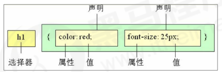
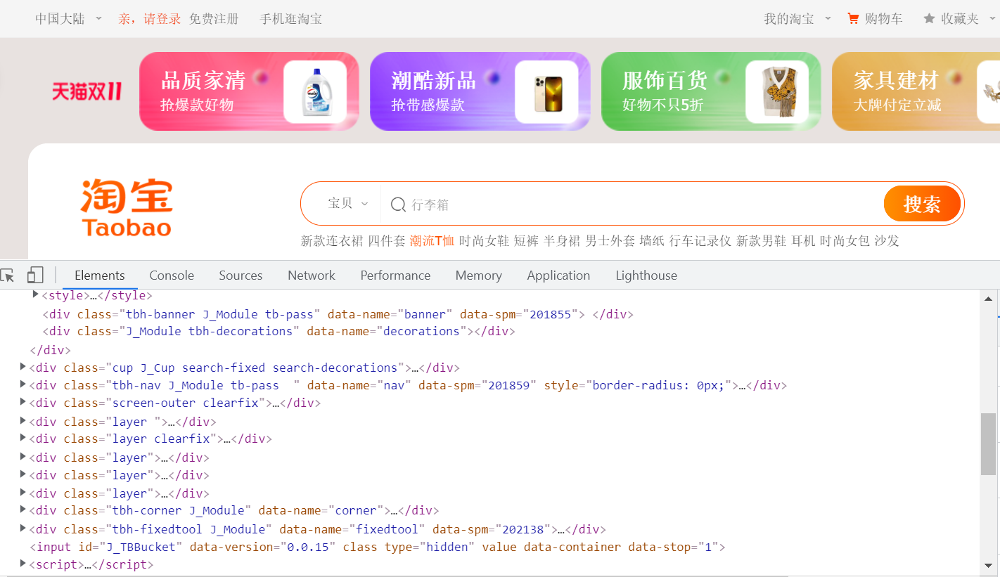
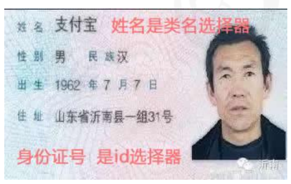
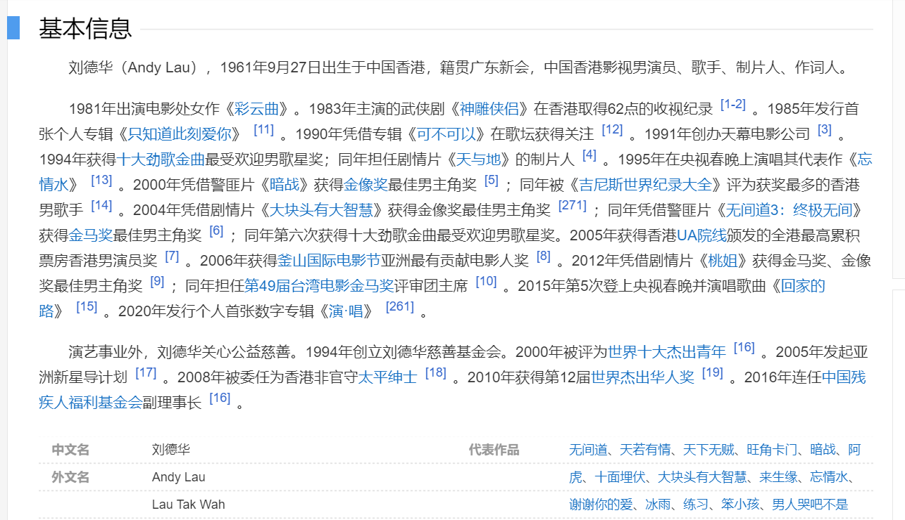
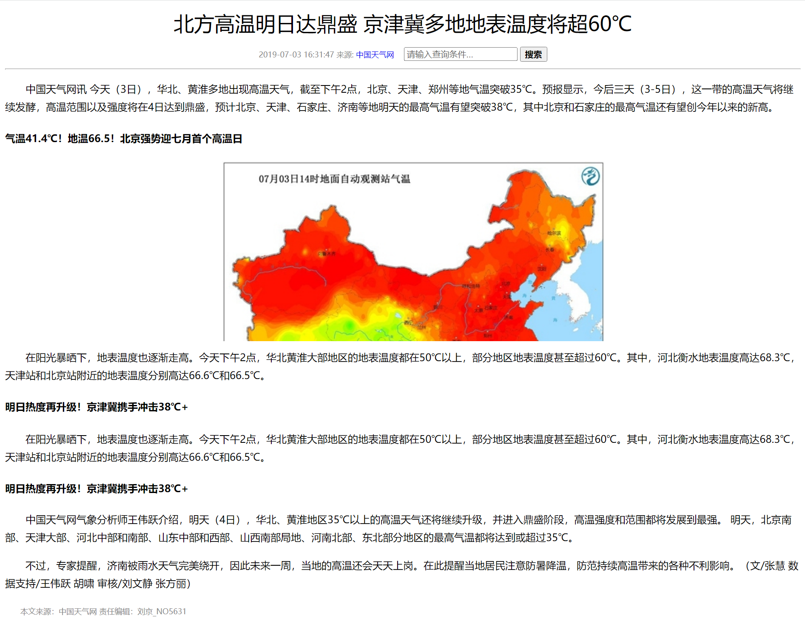
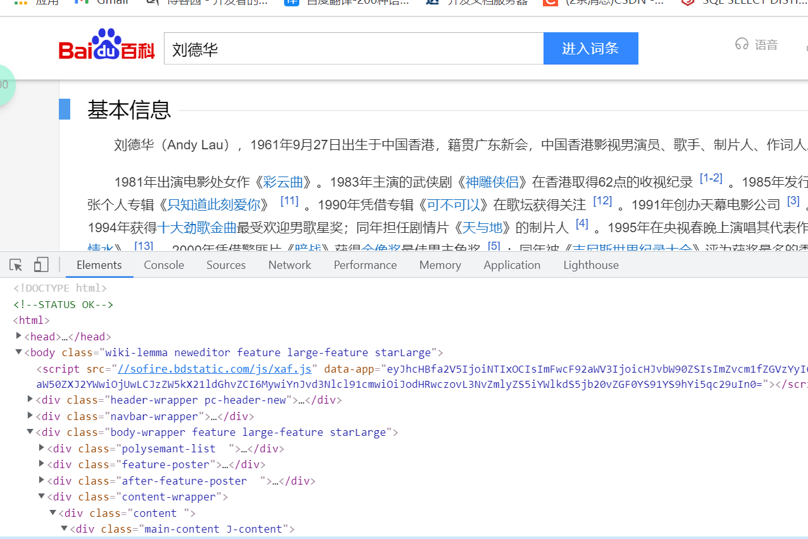

#  CSS（一）

## 1.CSS的简介

### 1.1.HTML的局限性

​		HTML只注重内容的语义，比如<h1>表明这是一个大标题，表示是一张图片，<a>表示是一个超链接。虽然HTML可以做一些简单的样式，但事实上是比较臃肿和繁琐的。


### 1.2.CSS-网页的美容师

​		**CSS是层叠样式表(Cascading Style Sheets)的简称。**有时候我们也会称之为**CSS样式表**或**级联样式表。**

并且**CSS也是一种标记语言**，它主要用于设置HTML中的**文本内容**(字体，大小，对齐方式等)、**图片的外形**(宽高、边框样式、边距等)以及**版面的布局和外观显示样式。**

​		CSS让我们的网页更加丰富多彩，布局更加灵活自如。我们可以理解为CSS可以美化HTML，让HTML网页更加漂亮，让页面布局更加简单。


## 2.CSS的语法规范

​		使用HTML时，需要遵循一定的规范，CSS也是如此。要想熟练的使用CSS对做网页修饰，就必须要对CSS的语法规范了解。

​		**CSS的规则由两个主要部分构成：选择器以及一条或多条声明。**



- **选择器**是用于指定CSS样式的HTML标签，大括号内是对该对象设置的具体样式。
- 属性和属性值以键值对(key-value)的形式出现。
- 属性是指对指定的对象设置的样式属性，例如字体大小，文本颜色等。
- 属性和属性值之间用":"分开。
- 多个键值对之间用英文中的";"分隔。


**所有的样式都包含在<style></style>标签内，表示样式表**。<style>一般写在<head>内。

```css
<head>
     <style>
         h4 {
             color: blue;
             font-size: 100px;
         }
     </style>
</head>
```

### 2.1.样式格式书写

1. 紧凑格式

```css
h3 { color: deeppink;font-size: 20px;}
```

   2.展开格式

```css
h3 {
 color: pink;
 font-size: 20px; 
}
```

推荐使用第二种写法，看起来更直观简介。

### 2.2.样式大小写

```css
h3 {
 color: pink;
}
```

```css
H3 {
 COLOR: PINK; 
}
```

强烈推荐样式选择器，属性名，属性值关键字**全部使用小写字母**，特殊情况除外。

### 2.3.空格规范

```css
h3 {
 color: pink; 
}
# 属性值前面，冒号后面，保留一个空格
# 选择器（标签）和大括号中间保留空格
```


## 3.CSS的选择器

```
<div>我是div</div>
<div>我是div</div>
<p>我是段落</p>
<ul>
 	<li>我是ul里面小li哦</li>
</ul> 
<ol>
 	<li>我是ol里面小li哦</li>
</ol>
```

以上代码我们想要如下的设计，该怎么办呢？

1. 我想把div里的文字改为红色；
2. 我想把第一个div里的文字改为红色；
3. 我想把ul里的li文字改为红色。

**选择器**(选择符)就是根据不同需求把不同的标签选出来这就是选择器的作用。 简单来说，就是选择标签用的。

**选择器**分为**基础选择器**和**复合选择器**两个大类，我们这里先讲解一下基础选择器。

基础选择器是由**单个选择器**组成的，基础选择器又包括：**标签选择器**、**类选择器**、**id 选择器**和**通配符**选择器。

### 3.1.标签选择器

**标签选择器**（元素选择器）是指**用 HTML 标签**名称作为选择器，按标签名称分类，为页面中某一类标签指定

统一的 CSS 样式。

**语法：**

```css
标签名 {
 属性1: 属性值1; 
 属性2: 属性值2; 
 属性3: 属性值3; 
 ...
}
```

**作用：**标签选择器可以把某一类标签全部选择出来，比如所有的 <div> 标签和所有的 <span> 标签。

**优点：**能快速为页面中同类型的标签统一设置样式。

**缺点：**不能设计差异化样式，只能选择全部的当前标签。

### 3.2.类选择器

如果想要差异化选择不同的标签，单独选一个或者某几个标签，可以使用**类选择器**。

**语法：结构需要用**class属性**来调用 class 类的意思**

```css
.类名 {
     属性1: 属性值1; 
     ...
}
```

例如，将所有拥有 red 类的 HTML 元素均为红色。

```css
.red {
 	color: red;
}
<div class=‘red’> 变红色 </div>
```

类选择器在 HTML 中以 class 属性表示，在 CSS 中，类选择器以一个点“**.**”号显示。

**注意：**

- 类选择器使用“.”（英文点号）进行标识，后面紧跟类名（自定义，我们自己命名的）；
- 可以理解为给这个标签起了一个名字.来表示；
- 长名称或词组可以使用中横线来为选择器命名；
- 不要使用纯数字、中文等命名，尽量使用英文字母来表示；
- 命名要有意义，尽量使别人一眼就知道这个类名的目的；
- 命名规范：见附件（ Web 前端开发规范手册.doc）。

**记忆口诀：**样式**点**定义，结构**类**调用。一个或多个，开发最常用。

**练习：**

1. 类选择器的使用；
2. div就是一个盒子，用来装饰网页内容。


**类选择器--多类名：**

我们可以给一个标签指定多个类名，从而达到更多的选择目的。 这些类名都可以选出这个标签。简单理解就是一个标签有多个名字。



- 多类名的使用方式：

```css
<div class="red font20">亚瑟</div>
#  在标签class 属性中写 多个类名
#  多个类名中间必须用空格分开
#  这个标签就可以分别具有这些类名的样式
```

- 多类名在开发中的具体使用场景：
  - 可以把一些标签元素相同的样式(共同的部分)放到一个类里面；
  - 这些标签都可以调用这个公共的类,然后再调用自己独有的类;
  - 从而节省CSS代码,统一修改也非常方便。

```css
<div class="pink fontWeight font20">亚瑟</div>
<div class="font20">刘备</div>
<div class="font14 pink">安其拉</div>
<div class="font14">貂蝉</div>
```

**注意：**

- 各个类名中间用空格隔开；
- 简单理解：就是给某个标签添加了多个类，或者这个标签有多个名字；
- 这个标签就可以分别具有这些类名的样式；
- 从而节省CSS代码,统一修改也非常方便；
- 多类名选择器在后期布局比较复杂的情况下，还是较多使用的。

### 3.3.id选择器

**id 选择器**可以为标有特定 id 的 HTML 元素指定特定的样式，HTML 元素以 id 属性来设置 id 选择器，CSS 中 id 选择器以“**\#**" 来定义。

**语法：**

```css
#id名 {
     属性1: 属性值1; 
     ...
}
```

例如：将 id 为 nav 元素中的内容设置为红色。

```css
#nav {
 	color:red; 
 }
```

**注意：id 属性只能在每个 HTML 文档中出现一次。**

**口诀: 样式#定义,结构id调用, 只能调用一次, 别人切勿使用**

**id选择器和类选择器的区别：**

1. 类选择器（class）好比人的名字，一个人可以有多个名字，同时一个名字也可以被多个人使用；
2. id 选择器好比人的身份证号码，全中国是唯一的，不得重复；
3. id 选择器和类选择器最大的不同在于使用次数上；
4. 类选择器在修改样式中用的最多，id 选择器一般用于页面唯一性的元素上，经常和 JavaScript 搭配使用。



### 3.4.通配符选择器

在 CSS 中，通配符选择器使用“*****”定义，它表示选取页面中所有元素（标签）。

**语法：**

```css
* {
     属性1: 属性值1; 
     ...
}
# 通配符选择器不需要调用， 自动就给所有的元素使用样式
# 特殊情况才使用，后面讲解使用场景(以下是清除所有的元素标签的内外边距,后期讲)
```

```css
* {
     margin: 0;
     padding: 0;
}
```

### 3.5.选择器总结

| 基础选择器   | 作用                      | 特点                               | 使用情况     | 用法              |
| ------------ | ------------------------- | ---------------------------------- | ------------ | ----------------- |
| 标签选择器   | 可以选出所有的标签，比如p | 不能差异化选择                     | 较多         | p {color: red}    |
| 类选择器     | 可以选出一个或多个标签    | 可以根据需求选择                   | 非常多       | .nav {color: red} |
| id选择器     | 一次只能选择一个标签      | id属性只能在每个HTML文档中出现一次 | 一般和js搭配 | #nav {color: red} |
| 通配符选择器 | 选择所有标签              | 选择的太多，部分不需要             | 特殊情况使用 | * {color: red}    |

- 每个基础选择器都有使用场景，都需要掌握
- 如果是修改样式， 类选择器是使用最多的

## 4.CSS字体属性

**CSS Fonts** (字体)属性用于定义**字体系列、大小、粗细、和文字样式**（如斜体）。

### 4.1.字体系列

CSS使用 **font-family** 属性定义文本的字体系列。

```css
p { 
	font-family:"微软雅黑";
} 
div {font-family: Arial,"Microsoft Yahei", "微软雅黑";}
```

- 各种字体之间必须使用英文状态下的逗号隔开;
-  一般情况下,如果有空格隔开的多个单词组成的字体,加引号;
- 尽量使用系统默认自带字体，保证在任何用户的浏览器中都能正确显示;
- 最常见的几个字体：body {font-family: 'Microsoft YaHei',tahoma,arial,'Hiragino Sans GB'; }.

### 4.2.字体大小

CSS 使用 **font-size** 属性定义字体大小。

```css
p { 
 font-size: 20px; 
}
```

- px（像素）大小是我们网页的最常用的单位；
- 谷歌浏览器默认的文字大小为16px；
- 不同浏览器可能默认显示的字号大小不一致，我们尽量给一个明确值大小，不要默认大小；
- 可以给 body 指定整个页面文字的大小。

### 4.3.字体粗细

CSS 使用 **font-weight** 属性设置文本字体的粗细。

```css
p { 
 font-weight: bold;
}
```

| 属性值  | 描述                                                     |
| ------- | -------------------------------------------------------- |
| normal  | 默认值（不加粗）                                         |
| bold    | 定义粗体（加粗）                                         |
| 100-900 | 400等同于normal，700等同于bold，注意这个数值后面不跟单位 |

- 学会让加粗标签（比如 h 和 strong 等) 不加粗，或者其他标签加粗
- **实际开发时，我们更喜欢用数字表示粗细**

### 4.4.文字样式

CSS 使用 **font-style** 属性设置文本的风格。

```css
p { 
 font-style: normal;
}
```

| 属性值 | 作用                                                |
| ------ | --------------------------------------------------- |
| normal | 默认值，浏览器会显示标准字体样式 font-style: normal |
| italic | 浏览器会显示斜体的样式                              |

**注意：** 平时我们很少给文字加斜体，反而要给斜体标签（em，i）改为不倾斜字体。

### 4.5.字体复合属性

字体属性可以把以上文字样式综合来写, 这样可以更节约代码:

```css
body { 
 font: font-style font-weight font-size/line-height font-family; 
 }
```

- 使用 font 属性时，必须按上面语法格式中的顺序书写，不能更换顺序，并且各个属性间以空格隔开
- 不需要设置的属性可以省略（取默认值），但必须保留 font-size 和 font-family 属性，否则 font 属性将不起作用

### 4.6.总结

| 属性        | 表示     | 注意点                                                   |
| ----------- | -------- | -------------------------------------------------------- |
| font-size   | 字号     | 我们通常必须跟单位像素px                                 |
| font-family | 字体     | 按实际开发的约定来写字体                                 |
| font-weight | 字体粗细 | 400等同于normal，700等同于bold，注意这个数值后面不跟单位 |
| font-style  | 字体样式 | 斜体是italic，正常时normal                               |
| font        | 字体连写 | 字体连写有一定顺序，其中字号和字体必须同时出现           |

- 字体复合属性如何写? 里面有什么注意细节? 
- 如果让加粗的文字不加粗显示, 如何让倾斜的文字不倾斜显示?


## 5.CSS文本属性

CSS Text（文本）属性可定义文本的**外观**，比如文本的颜色、对齐文本、装饰文本、文本缩进、行间距等

### 5.1.文本颜色

**color** 属性用于定义文本的颜色。

```css
div { 
 color: red;
}
```

| 表示       | 属性值                        |
| ---------- | ----------------------------- |
| 预定义颜色 | red,green,blue ,pink,black等  |
| 十六进制   | #FF0000,#FF6600,#29D479       |
| RGB代码    | rgb(255,0,0)或rgb(100%,0%,0%) |

- **开发中最常用的是十六进制**

### 5.2.文本对齐

**text-align** 属性用于设置元素内文本内容的水平对齐方式。

```css
div { 
 text-align: center;
}
```

| 属性值 | 说明             |
| ------ | ---------------- |
| left   | 左对齐（默认值） |
| right  | 右对齐           |
| center | 居中对齐         |

### 5.3.文本装饰

**text-decoration** 属性规定添加到文本的修饰。可以给文本添加下划线、删除线、上划线等。

```css
div { 
 text-decoration：underline；
 }
```

| 属性值       | 说明                              |
| ------------ | --------------------------------- |
| none         | 默认，没有装饰线-常用             |
| underline    | 下划线。常用超链接a标签自带下划线 |
| overline     | 上划线                            |
| line-through | 删除线                            |

### 5.4.文本缩进	

**text-indent** 属性用来指定文本的第一行的缩进，通常是将段落的首行缩进



```css
div { 
 text-indent: 10px;
}
```

通过设置该属性，所有元素的第一行都可以缩进一个给定的长度，甚至该长度可以是负值。

```css
p { 
 text-indent: 2em;
}
```

**em** 是一个相对单位，就是当前元素（font-size) 1 个文字的大小, 如果当前元素没有设置大小，则会按照父元

素的 1 个文字大小。

### 5.5.行间距

**line-height** 属性用于设置行间的距离（行高）。可以控制文字行与行之间的距离.

```css
p { 
 line-height: 26px;
} 
```


### 5.6.总结

| 属性            | 表示     | 注意点                                |
| --------------- | -------- | ------------------------------------- |
| color           | 文本颜色 | 通常采用十六进制，如#FFF              |
| text-align      | 文本对齐 | 设置文本水平对齐的方式                |
| text-indent     | 文本缩进 | 通常设置首行缩进2个字 text-indent:2em |
| text-decoration | 文本修饰 | 下划线underline,没有下划线none        |
| line-height     | 行高     | 控制行与行之间的距离                  |


## 6.CSS的引入方式

按照 CSS 样式书写的位置（或者引入的方式），CSS 样式表可以分为三大类：

- 行内样式表（行内式）
- 内部样式表（嵌入式）
- 外部样式表（链接式）

### 6.1.内部样式表

内部样式表（内嵌样式表）是写到html页面内部. 是将所有的 CSS 代码抽取出来，单独放到一个 <style> 标签中。

```css
<style>
 div {
     color: red;
     font-size: 12px;
 }
</style>
```

- style>标签理论上可以放在 HTML 文档的任何地方，但一般会放在文档的head标签中 
- 通过此种方式，可以方便控制当前整个页面中的元素样式设置
- 代码结构清晰，但是并没有实现结构与样式完全分离
- 使用内部样式表设定 CSS，通常也被称为嵌入式引入，这种方式是我们练习时常用的方式

### 6.2.行内样式表

行内样式表（内联样式表）是在元素标签内部的 style 属性中设定 CSS 样式。适合于修改简单样式.

- ```
  <div style="color: red; font-size: 12px;">网页设计是一门非常好学的科目</div>
  ```

- style 其实就是标签的属性
- 在双引号中间，写法要符合 CSS 规范
- 可以控制当前的标签设置样式
- 由于书写繁琐，并且没有体现出结构与样式相分离的思想，所以不推荐大量使用，只有对当前元素添加简单样式的时候，可以考虑使用
- 使用行内样式表设定 CSS，通常也被称为行内式引入


### 6.3.外部样式表

实际开发都是外部样式表. 适合于样式比较多的情况. 核心是:样式单独写到CSS 文件中，之后把CSS文件引入到 HTML 页面中使用.

**引入外部样式表分为两步：**

1. 新建一个后缀名为 .css 的样式文件，把所有 CSS 代码都放入此文件中。
2. 在 HTML 页面中，使用<link> 标签引入这个文件。

```html
<link rel="stylesheet" href="css文件路径">
```

| 属性 | 作用                                                         |
| ---- | ------------------------------------------------------------ |
| rel  | 定义当前文档与被链接文档的关系，在这里需要指定为"stylesheet"，表示被链接的文档是一个样式表文件 |
| href | 定义所链接外部样式表的URL，可以是相对路径，也可以是绝对路径  |

- 使用外部样式表设定 CSS，通常也被称为**外链式**或**链接式引入**，这种方式是开发中常用的方式。

### 6.4.总结

| 样式表     | 优点                   | 缺点         | 使用情况 | 控制范围     |
| ---------- | ---------------------- | ------------ | -------- | ------------ |
| 行内样式表 | 书写方便，权重高       | 结构样式混写 | 较少     | 控制一个标签 |
| 内部样式表 | 部分结构和样式相分离   | 没有彻底分离 | 较多     | 控制一个页面 |
| 外部样式表 | 完全实现结构与样式分离 | 需要引入     | 最多     | 控制多个页面 |

## 7.综合案例

制作页面整体可以分为两步:

1. 搭建html结构页面；
2. 修改CSS。
3. 


## 8.浏览器调试工具

Chrome 浏览器提供了一个非常好用的调试工具，可以用来调试我们的 HTML 结构和 CSS 样式。

### 8.1.打开调试工具

打开 Chrome 浏览器，按下 F12 键或者右击页面空白处-->检查。



### 8.2.使用调试

1. **Ctrl+滚轮** 可以放大开发者工具代码大小。
2. 左边是 HTML 元素结构，右边是 CSS 样式。 
3. 右边 CSS 样式可以改动数值（左右箭头或者直接输入）和查看颜色。 
4. **Ctrl + 0** 复原浏览器大小。 
5. 如果点击元素，发现右侧没有样式引入，极有可能是类名或者样式引入错误。
6. 如果有样式，但是样式前面有黄色叹号提示，则是样式属性书写错误。 
