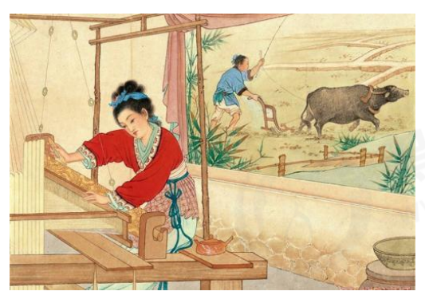

# CSS（二）


## 1.CSS的复合选择器

### 1.1.什么是复合选择器

在 CSS 中，可以根据选择器的类型把选择器分为**基础选择器**和**复合选择器**，复合选择器是建立在基础选择器之上，对基本选择器进行组合形成的。 

- 复合选择器可以更准确、更高效的选择目标元素（标签） ；
- 复合选择器是由两个或多个基础选择器，通过不同的方式组合而成的
- 常用的复合选择器包括：后代选择器、子选择器、并集选择器、伪类选择器等等

### 1.2.后代选择器-重要

**后代选择器**又称为包含选择器，可以选择父元素里面子元素。其写法就是把**外层标签写在前面**，**内层标签写在后面，中间用空格分隔**。当标签发生嵌套时，内层标签就成为外层标签的后代。

**语法：**

```css
元素1 元素2 { 样式声明 }
```

上述语法表示选择元素 1 里面的所有元素 2 (后代元素)。

**举例：**

```css
ul li { 
	样式声明 
} 
/* 选择 ul 里面所有的 li标签元素 */
```

- 元素1 和 元素2 中间用**空格隔开**
- 元素1 是父级，元素2 是子级，最终选择的是**元素2** 
- 元素2 可以是儿子，也可以是孙子等，只要是元素1 的后代即可
- 元素1 和 元素2 可以是任意基础选择器

### 1.3.子代选择器-重要

**子元素选择器**（子选择器）只能选择作为某元素的最近一级子元素。简单理解就是选亲儿子元素.

**语法：**

```css
元素1 > 元素2 { 样式声明 }
```

上述语法表示**选择元素1 里面的所有直接后代(子元素) 元素2。**

**举例：**

```
div > p { 
	样式声明
} 
/* 选择 div 里面所有最近一级 p 标签元素 */
```

- 元素1 和 元素2 中间用 **大于号** 隔开
- 元素1 是父级，元素2 是子级，最终选择的是**元素2** 
- 元素2 必须是**亲儿子，**其孙子、重孙之类都不归他管. 你也可以叫他 亲儿子选择器

```html
<div class="nav">
 	<ul>
         <li><a href="#">百度</a></li>
         <li><a href="#">百度</a></li>
 	</ul>
</div>
```

1.将链接中的文字改为红色：

```css
.nav ul li a {
 	color: red;
}
```


```html
<div class="hot">
 	<a href="#">大肘子</a>
     <ul>
         <li><a href="#">猪头</a></li>
         <li><a href="#">猪尾巴</a></li>
     </ul>
</div>
```

2.将文字“大肘子”改为红色：

```css
.hot>a {
 	color: red;
}
```

### 1.4.并集选择器-重要

**并集选择器**可以选择多组标签, 同时为他们定义相同的样式。通常用于集体声明. 

**并集选择器**是各选择器通过**英文逗号（,）连接而成**，任何形式的选择器都可以作为并集选择器的一部分。

**语法：**

```css
元素1,元素2 { 样式声明 }
```

上述语法表示选择元素1 和 元素2

**举例：**

```
ul,div {
	样式声明 
} 
/* 选择 ul 和 div标签元素 */
```

- 元素1 和 元素2 中间用逗号隔开
- 逗号可以理解为和的意思
- 并集选择器通常用于集体声明


### 1.5.伪选择器

**伪类选择器**用于向某些选择器添加特殊的效果，比如给链接添加特殊效果，或选择第1个，第n个元素。

伪类选择器书写最大的特点是**用冒号（:）表示**，比如 :hover 、 :first-child 。

因为伪类选择器很多，比如有链接伪类、结构伪类等，所以这里先给大家讲解常用的链接伪类选择器。


### 1.6.链接伪类选择器

**链接伪类选择器注意事项**：

- 为了确保生效，请按照 LVHA 的循顺序声明 :link－:visited－:hover－:active。
- 记忆法：love hate 或者 lv 包包 hao 。
- 因为 a 链接在浏览器中具有默认样式，所以我们实际工作中都需要给链接单独指定样式。

**链接伪类选择器实际工作开发中的写法：**

```css
 /* a 是标签选择器 所有的链接 */ 
 a { 
 	color: gray;
 }
 /* :hover 是链接伪类选择器 鼠标经过 */
 a:hover { 
 	color: red; /* 鼠标经过的时候，由原来的 灰色 变成了红色 */
 }
		a:link-表示链接未被访问时的样式
        a:visited-表示链接已经被访问过的样式
        a:hover-表示鼠标经过时的样式
        a:active-表示光标按下去还没有弹起来的样式
```

### 1.7.:focus伪类选择器

**:focus** 伪类选择器用于选取获得焦点的表单元素。

焦点就是光标，一般情况 <input> 类表单元素才能获取，因此这个选择器也主要针对于表单元素来说。

```css
input:focus { 
 background-color:yellow;
}
```

| 选择器         | 作用                   | 特征             | 使用情况 | 隔开符号及用法                     |
| -------------- | ---------------------- | ---------------- | -------- | ---------------------------------- |
| 后代选择器     | 用来选择后代元素       | 可以是子孙后代   | 较多     | 符号是空格，.nav a                 |
| 子代选择器     | 选择最近一级元素       | 只选亲儿子       | 较少     | 符号是大于,nav>a                   |
| 并集选择器     | 选择某些相同样式的元素 | 可以用于集体声明 | 较多     | 符号是逗号，.nav,.header           |
| 链接伪类选择器 | 选择不同状态的链接     | 跟链接相关       | 较多     | 重点记住a{}和a:hover实际开发的写法 |
| :focus选择器   | 选择获得光标的表单     | 跟表单相关       | 较少     | 记住input:focus的写法              |


## 2.CSS元素的显示模式

了解元素的显示模式可以更好的让我们布局页面.：

1. 什么是元素的显示模式；
2. 元素显示模式的分类
3. 元素显示模式的转换


### 2.1.什么是元素显示模式



世界上离不开男人女人,根据不同特点,通力合作共建美好家园.

作用：网页的标签非常多，在不同地方会用到不同类型的标签，了解他们的特点可以更好的**布局我们的网页。**

元素显示模式就是**元素（标签）以什么方式进行显示**，比如<div>自己占一行，比如一行可以放多个<span>。

HTML 元素一般分为**块元素**和**行内元素**两种类型。

#### 2.1.1.块元素

常见的块元素有<h1>~<h6>、<p>、<div>、<ul>、<ol>、<li>等，其中 <div> 标签是最典型的块元素。

**块级元素的特点：** 

1. 比较霸道，自己独占一行。
2. 高度，宽度、外边距以及内边距都可以控制。
3. 宽度默认是容器（父级宽度）的100%。
4. 是一个容器及盒子，里面可以放行内或者块级元素。

**注意：**

- 文字类的元素内不能使用块级元素
- p标签主要用于存放文字，因此 p 里面不能放块级元素，特别是不能放div
- 同理， <h1>~<h6>等都是文字类块级标签，里面也不能放其他块级元素

#### 2.1.2.行内元素

常见的行内元素有 <a>、<strong>、<b>、<em>、<i>、<del>、<s>、<ins>、<u>、<span>等，其中

<span> 标签是最典型的行内元素。有的地方也将行内元素称为**内联元素**。

**行内元素的特点：**

1. 相邻行内元素在一行上，一行可以显示多个。
2. 高、宽直接设置是无效的。
3. 默认宽度就是它本身内容的宽度。
4. 行内元素只能容纳文本或其他行内元素

**注意：**

- 链接里面不能再放链接
- 特殊情况链接 <a> 里面可以放块级元素，但是给 <a> 转换一下块级模式最安全

#### 2.1.3.行内块元素

在行内元素中有几个特殊的标签 —— 、<input />、<td>，它们同时具有块元素和行内元素的特点。

有些资料称它们为**行内块元素**。

**行内块元素的特点：**

1. 和相邻行内元素（行内块）在一行上，但是他们之间会有空白缝隙。一行可以显示多个（行内元素特点）。
2. 默认宽度就是它本身内容的宽度（行内元素特点）。
3. 高度，行高、外边距以及内边距都可以控制（块级元素特点）

#### 2.1.4.总结

| 元素模式   | 元素排列                 | 设置样式       | 默认宽度       | 包含                   |
| ---------- | ------------------------ | -------------- | -------------- | ---------------------- |
| 块级元素   | 一行只能放一个块级元素   | 可以设置宽高   | 容器的100%     | 可以包含任何标签       |
| 行内元素   | 一行可以放多个行内元素   | 不可以设置宽高 | 本身容器的宽度 | 容纳文本内侧或其他元素 |
| 行内块元素 | 一行可以放多个行内块元素 | 可以设置宽高   | 本身内容的宽度 |                        |

### 

### 2.2.元素显示模式的转换

特殊情况下，我们需要元素模式的转换，简单理解: 一个模式的元素需要另外一种模式的特性。

比如想要增加链接 <a> 的触发范围。 

-  **转换为块元素：display:block;**
- **转换为行内元素：display:inline;**
- **转换为行内块：display: inline-block;**

### 2.3.案例：简洁版小米侧边栏

案例的核心思路分为两步:

1. 把链接a 转换为块级元素, 这样链接就可以单独占一行,并且有宽度和高度
2. 鼠标经过a 给 链接设置背景颜色


## 3.CSS的背景

通过 CSS 背景属性，可以给页面元素添加背景样式。

背景属性可以设置背景颜色、背景图片、背景平铺、背景图片位置、背景图像固定等。


### 3.1.背景颜色

**background-color** 属性定义了元素的背景颜色。

```css
background-color:颜色值;
```

一般情况下元素背景颜色默认值是 transparent（透明），我们也可以手动指定背景颜色为透明色。

```css
background-color:transparent;
```


### 3.2.背景图片

**background-image** 属性描述了元素的背景图像。实际开发常见于 logo 或者一些装饰性的小图片或者是超

大的背景图片, 优点是非常便于控制位置. (精灵图也是一种运用场景)。

```css
background-image : none | url (url)
```

| 参数值 | 作用                               |
| ------ | ---------------------------------- |
| none   | 无背景图（默认）                   |
| url    | 使用绝对路径或相对路径引入背景图片 |

**注意：背景图片后面的地址，千万不要忘记加 URL， 同时里面的路径不要加引号。**


### 3.3.背景平铺

如果需要在 HTML 页面上对背景图像进行平铺，可以使用 **background-repeat** 属性。

```css
background-repeat: repeat | no-repeat | repeat-x | repeat-y
```

| 参数值    | 作用                 |
| --------- | -------------------- |
| repeat    | 背景图横向或纵向平铺 |
| no-repeat | 背景图不平铺         |
| repeat-x  | 背景图在横向上平铺   |
| repeat-y  | 背景图在纵向上平铺   |


### 3.4.背景图的位置

利用 **background-position** 属性可以改变图片在背景中的位置。

```css
background-position: x y;
```

参数代表的意思是：**x 坐标和 y 坐标**。 可以使用 方位名词 或者 精确单位.

| 参数值   | 作用                                              |
| -------- | ------------------------------------------------- |
| length   | 百分数\|由浮点数字和单位标识符组成的长度值        |
| position | top\|center\|bottom\|left\|center\|right 方位名词 |

1. 参数是方位名词

- 如果指定的两个值都是方位名词，则两个值前后顺序无关，比如 left top 和 top left 效果一致
-  如果只指定了一个方位名词，另一个值省略，则第二个值默认居中对齐

2. 参数是精确单位

- 如果参数值是精确坐标，那么第一个肯定是 x 坐标，第二个一定是 y 坐标
- 如果只指定一个数值，那该数值一定是 x 坐标，另一个默认垂直居中

3. 参数是混合单位

- 如果指定的两个值是精确单位和方位名词混合使用，则第一个值是 x 坐标，第二个值是 y 坐标


### 3.5.背景图像固定（背景附着）

**background-attachment** 属性设置背景图像是否固定或者随着页面的其余部分滚动。background-attachment 后期可以制作视差滚动的效果。

```css
background-attachment : scroll | fixed
```

| 参数   | 作用                 |
| ------ | -------------------- |
| scroll | 背景图像随着内容滚动 |
| fixed  | 背景图像固定         |


### 3.6.背景图像复合写法

为了简化背景属性的代码，我们可以将这些属性合并简写在同一个属性 background 中。从而节约代码量. 

当使用简写属性时，没有特定的书写顺序,一般习惯约定顺序为：

**background**: 背景颜色 背景图片地址 背景平铺 背景图像滚动 背景图片位置

```css
background: transparent url(image.jpg) repeat-y fixed top ;
```


### 3.7.背景色半透明

```css
background: rgba(0, 0, 0, 0.3)；
```

- 最后一个参数是 alpha 透明度，取值范围在 0~1之间;
- 我们习惯把 0.3 的 0 省略掉，写为 background: rgba(0, 0, 0, .3);
- 注意：背景半透明是指盒子背景半透明，盒子里面的内容不受影响;
- CSS3 新增属性，是 IE9+ 版本浏览器才支持的;
- 但是现在实际开发,我们不太关注兼容性写法了,可以放心使用.


## 4.综合案例：五彩导航栏


1. 链接属于行内元素, 但是此时需要宽度高度,因此需要模式转换.
2. 里面文字需要水平居中和垂直居中. 因此需要单行文字垂直居中的代码.
3. 链接里面需要设置背景图片.因此需要用到背景的相关属性设置.
4. 鼠标经过变化背景图片,因此需要用到链接伪类选择器.
