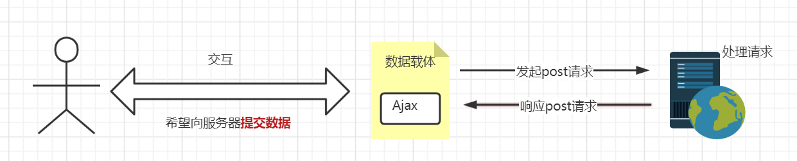

# Ajax


## 1.什么是Ajax

Asynchronous Javascript And Xml异步的 JS 和   xml(*EX*tensible *M*arkup *L*anguage)，通过 JS **异步的向服务器发送请求并接收响应数据**。

**什么是同步访问？什么是异步异步？**

- **同步访问：**当客户端向服务器发送请求时，服务器在处理的过程中，浏览器只能等待，效率较低；
- **异步访问：**当客户端向服务器发送请求时，服务器在处理的过程中，客户端可以做其他的操作，不需要一直等待

如今日头条、京东搜索框、百度地图等网页都明显使用了Ajax的技术。

Ajax的优点：

1. 异步访问
2. 局部刷新

使用场景：

1. 1搜索建议
2. 表单验证
3. 前后端分离


## 2.Ajax核心对象-异步对象（XMLHttpRequest）

XMLHttpRequest称为“异步对象”，代替浏览器向服务器发送异步请求并接收响应，xhr由JS提供。


### 2.1.创建xhr异步对象

​	1.IE7+,Chrome,Firefox,Safari,Opera)  -> 调用 XMLHttpRequest 生成 xhr对象

```javascript
variable = new XMLHttpRequest();
```


​	2.IE低版本浏览器中(IE6以及以下) -> 调用 ActiveXObject() 生成xhr

```javascript
variable = new ActiveXObject("Microsoft.XMLHTTP");
```

​	为了应对所有浏览器，包括 IE5 和 IE6，请检查浏览器是否支持 XMLHttpRequest 对象。如果支持，创建 XMLHttpRequest 对象，如果不支持，则创建 ActiveX 对象：

```javascript
var xmlhttp;
if (window.XMLHttpRequest)
{
    //  IE7+, Firefox, Chrome, Opera, Safari 浏览器执行代码
    xmlhttp=new XMLHttpRequest();
}
else
{
    // IE6, IE5 浏览器执行代码
    xmlhttp=new ActiveXObject("Microsoft.XMLHTTP");
}
```


浏览器中使用的XMLHttpRequest用法比较复杂，所以jQuery对XMLHttpRequest进行了封装，提供了一系列Ajax相关的函数，极大的降低了Ajax的使用难度。

jQuery中发起Ajax请求最常用的三个方法：

- **$.get():**从服务器获取数据
- **$.post():**提交数据到服务器
- **$.ajax():**既可提交，也可获取


### 2.2.$.get()函数

jQuery中$.get()函数的功能单一，专门用来发起get请求，将服务器上的资源请求到客户端来使用。其语法格式如下：

```javascript
$.get(url,[data],[callback]);
/*
必选参数url表示必选参数，类型为string，是要从服务器请求的资源
data为可选参数，类型object，表示请求资源期间要携带的参数
callbacnk表示请求成功时执行的回调函数
*/
```

- **发起不带参数的请求：**使用$.get()发起不带参数的请求时，直接提供请求的URL地址和请求成功时的回调函数即可：

```javascript
<!DOCTYPE html>
<html lang="en">
<head>
    <meta charset="UTF-8">
    <title>Document</title>
    <script src="lib/jquery.js"></script>
</head>
<body>
    <button id="btnGET">发起不带参数的get请求</button>
    <script>
        $(function() {
            $("#btnGET").on('click',function() {
                $.get('http://www.liulongbin.top:3006/api/getbooks',function(res) {
                        console.log(res); // res表示获取成功的信息
                })
            })
        })
    </script>
</body>
</html>
```


- **发起带参数的url请求：**发送带参数的请求，其需要在get()方法中传递data参数：

```javascript
<!DOCTYPE html>
<html lang="en">
<head>
    <meta charset="UTF-8">
    <title>Document</title>
    <script src="lib/jquery.js"></script>
</head>
<body>
    <button id="btnGET">发起带参数的get请求</button>
    <script>
        $(function() {
            $("#btnGET").on('click',function() {
                $.get('http://www.liulongbin.top:3006/api/getbooks',{id:1},function(res) {
                        console.log(res); // res表示获取成功的信息
                })
            })
        })
    </script>
</body>
</html>
```


### 2.3.$.post()函数

$.post()向服务器提交数据，其语法格式为：

```javascript
$.post(url,[data],[callback])
// 参数类型和get()函数一致
```

```javascript
<!DOCTYPE html>
<html lang="en">
<head>
    <meta charset="UTF-8">
    <title>Document</title>
    <script src="lib/jquery.js"></script>
</head>
<body>
    <button id="btnPOST">发起post请求</button>
    <script>
        $(function() {
            $("#btnPOST").on('click',function() {
                $.post('http://www.liulongbin.top:3006/api/addbook',
                {bookname:'论语',author:'孔子',publisher:'四川城市出版社'},
                function(res) {
                    console.log(res);
                })
            })
        })
    </script>
</body>
</html>
```


### 2.4.$.ajax()函数

相比于$.get()和$.post()函数，$.ajax()是一个功能比较综合的函数，它允许我们对Ajax请求进行更详细的配置。其语法格式为：

```javascript
$.ajax({
    type: '', // 请求的方式，如GET和POST
    url: '', // 请求的URL地址
    data: {}, // 请求要携带的参数
    success: function(res) {} // 请求成功后的回调函数
})
```

- **$.ajax()发起GET请求：**将type值设为GET。

```javascript
<!DOCTYPE html>
<html lang="en">
<head>
    <meta charset="UTF-8">
    <title>Document</title>
    <script src="lib/jquery.js"></script>
</head>
<body>
    <button id="btnGET">使用ajax发送get请求</button>
    <script>
        $(function() {
            $("#btnGET").on('click',function() {
                $.ajax({
                type:'get',
                url:'http://www.liulongbin.top:3006/api/getbooks',
                data:{
                    id:1
                },
                success: function(res) {
                    console.log(res);
                }
            })
            })
        })
    </script>
</body>
</html>
```


- **$.ajax()发起POST请求：**将type值设为POST。

```javascript
<!DOCTYPE html>
<html lang="en">
<head>
    <meta charset="UTF-8">
    <title>Document</title>
    <script src="lib/jquery.js"></script>
</head>
<body>
    <button id="btnGET">使用ajax发送post请求</button>
    <script>
        $(function() {
            $("#btnGET").on('click',function() {
                $.ajax({
                type:'post',
                url:'http://www.liulongbin.top:3006/api/addbook',
                data:{
                    bookname: '史记',
                    author: '司马迁',
                    publisher: '四川城市出版社'
                },
                success: function(res) {
                    console.log(res);
                }
            })
            })
        })
    </script>
</body>
</html>
```


## 3.接口

使用Ajax请求数据时，被请求的**URL**地址就叫做**数据接口（简称接口）**，同时，每个接口**必须有请求方式**。如：

```url
 url:'http://www.liulongbin.top:3006/api/getbooks'  // 为get请求，获取
 url:'http://www.liulongbin.top:3006/api/addbook'   // 为post请求，添加
```

- **通过get方式请求接口的过程：**


- **通过post方式请求接口的过程：**




### 3.1.postman工具的使用

​	为了验证接口能否被正常访问，我们常常会使用接口测试工具来对数据接口进行测试，接口测试工具能让我们不写任何代码的情况下，对接口进行调试和测试。