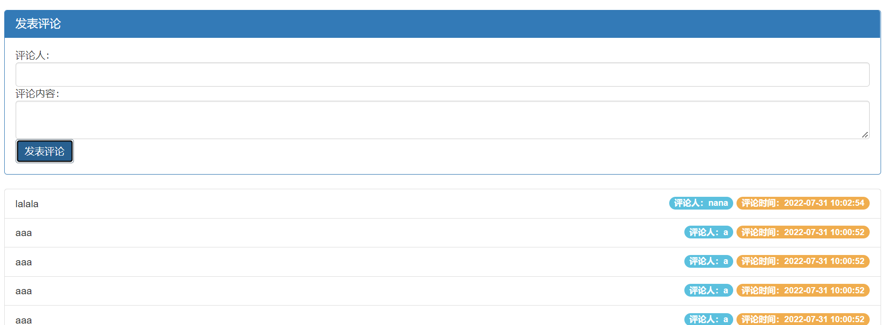
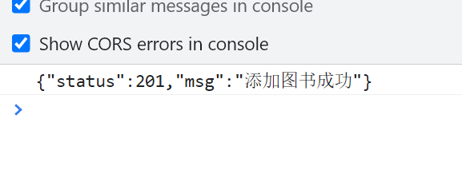

# Ajax


## 1.什么是Ajax

Asynchronous Javascript And Xml异步的 JS 和   xml(*EX*tensible *M*arkup *L*anguage)，通过 JS **异步的向服务器发送请求并接收响应数据**。

**什么是同步访问？什么是异步异步？**

- **同步访问：**当客户端向服务器发送请求时，服务器在处理的过程中，浏览器只能等待，效率较低；
- **异步访问：**当客户端向服务器发送请求时，服务器在处理的过程中，客户端可以做其他的操作，不需要一直等待

如今日头条、京东搜索框、百度地图等网页都明显使用了Ajax的技术。

Ajax的优点：

1. 异步访问
2. 局部刷新

使用场景：

1. 1搜索建议
2. 表单验证
3. 前后端分离


## 2.Ajax核心对象-异步对象（XMLHttpRequest）

XMLHttpRequest称为“异步对象”，代替浏览器向服务器发送异步请求并接收响应，xhr由JS提供。


### 2.1.创建xhr异步对象

​	1.IE7+,Chrome,Firefox,Safari,Opera)  -> 调用 XMLHttpRequest 生成 xhr对象

```javascript
variable = new XMLHttpRequest();
```


​	2.IE低版本浏览器中(IE6以及以下) -> 调用 ActiveXObject() 生成xhr

```javascript
variable = new ActiveXObject("Microsoft.XMLHTTP");
```

​	为了应对所有浏览器，包括 IE5 和 IE6，请检查浏览器是否支持 XMLHttpRequest 对象。如果支持，创建 XMLHttpRequest 对象，如果不支持，则创建 ActiveX 对象：

```javascript
var xmlhttp;
if (window.XMLHttpRequest)
{
    //  IE7+, Firefox, Chrome, Opera, Safari 浏览器执行代码
    xmlhttp=new XMLHttpRequest();
}
else
{
    // IE6, IE5 浏览器执行代码
    xmlhttp=new ActiveXObject("Microsoft.XMLHTTP");
}
```


浏览器中使用的XMLHttpRequest用法比较复杂，所以jQuery对XMLHttpRequest进行了封装，提供了一系列Ajax相关的函数，极大的降低了Ajax的使用难度。

jQuery中发起Ajax请求最常用的三个方法：

- **$.get():**从服务器获取数据
- **$.post():**提交数据到服务器
- **$.ajax():**既可提交，也可获取


### 2.2.$.get()函数

jQuery中$.get()函数的功能单一，专门用来发起get请求，将服务器上的资源请求到客户端来使用。其语法格式如下：

```javascript
$.get(url,[data],[callback]);
/*
必选参数url表示必选参数，类型为string，是要从服务器请求的资源
data为可选参数，类型object，表示请求资源期间要携带的参数
callbacnk表示请求成功时执行的回调函数
*/
```

- **发起不带参数的请求：**使用$.get()发起不带参数的请求时，直接提供请求的URL地址和请求成功时的回调函数即可：

```javascript
<!DOCTYPE html>
<html lang="en">
<head>
    <meta charset="UTF-8">
    <title>Document</title>
    <script src="lib/jquery.js"></script>
</head>
<body>
    <button id="btnGET">发起不带参数的get请求</button>
    <script>
        $(function() {
            $("#btnGET").on('click',function() {
                $.get('http://www.liulongbin.top:3006/api/getbooks',function(res) {
                        console.log(res); // res表示获取成功的信息
                })
            })
        })
    </script>
</body>
</html>
```


- **发起带参数的url请求：**发送带参数的请求，其需要在get()方法中传递data参数：

```javascript
<!DOCTYPE html>
<html lang="en">
<head>
    <meta charset="UTF-8">
    <title>Document</title>
    <script src="lib/jquery.js"></script>
</head>
<body>
    <button id="btnGET">发起带参数的get请求</button>
    <script>
        $(function() {
            $("#btnGET").on('click',function() {
                $.get('http://www.liulongbin.top:3006/api/getbooks',{id:1},function(res) {
                        console.log(res); // res表示获取成功的信息
                })
            })
        })
    </script>
</body>
</html>
```


### 2.3.$.post()函数

$.post()向服务器提交数据，其语法格式为：

```javascript
$.post(url,[data],[callback])
// 参数类型和get()函数一致
```

```javascript
<!DOCTYPE html>
<html lang="en">
<head>
    <meta charset="UTF-8">
    <title>Document</title>
    <script src="lib/jquery.js"></script>
</head>
<body>
    <button id="btnPOST">发起post请求</button>
    <script>
        $(function() {
            $("#btnPOST").on('click',function() {
                $.post('http://www.liulongbin.top:3006/api/addbook',
                {bookname:'论语',author:'孔子',publisher:'四川城市出版社'},
                function(res) {
                    console.log(res);
                })
            })
        })
    </script>
</body>
</html>
```


### 2.4.$.ajax()函数

相比于$.get()和$.post()函数，$.ajax()是一个功能比较综合的函数，它允许我们对Ajax请求进行更详细的配置。其语法格式为：

```javascript
$.ajax({
    type: '', // 请求的方式，如GET和POST
    url: '', // 请求的URL地址
    data: {}, // 请求要携带的参数
    success: function(res) {} // 请求成功后的回调函数
})
```

- **$.ajax()发起GET请求：**将type值设为GET。

```javascript
<!DOCTYPE html>
<html lang="en">
<head>
    <meta charset="UTF-8">
    <title>Document</title>
    <script src="lib/jquery.js"></script>
</head>
<body>
    <button id="btnGET">使用ajax发送get请求</button>
    <script>
        $(function() {
            $("#btnGET").on('click',function() {
                $.ajax({
                type:'get',
                url:'http://www.liulongbin.top:3006/api/getbooks',
                data:{
                    id:1
                },
                success: function(res) {
                    console.log(res);
                }
            })
            })
        })
    </script>
</body>
</html>
```


- **$.ajax()发起POST请求：**将type值设为POST。

```javascript
<!DOCTYPE html>
<html lang="en">
<head>
    <meta charset="UTF-8">
    <title>Document</title>
    <script src="lib/jquery.js"></script>
</head>
<body>
    <button id="btnGET">使用ajax发送post请求</button>
    <script>
        $(function() {
            $("#btnGET").on('click',function() {
                $.ajax({
                type:'post',
                url:'http://www.liulongbin.top:3006/api/addbook',
                data:{
                    bookname: '史记',
                    author: '司马迁',
                    publisher: '四川城市出版社'
                },
                success: function(res) {
                    console.log(res);
                }
            })
            })
        })
    </script>
</body>
</html>
```


## 3.接口

使用Ajax请求数据时，被请求的**URL**地址就叫做**数据接口（简称接口）**，同时，每个接口**必须有请求方式**。如：

```url
 url:'http://www.liulongbin.top:3006/api/getbooks'  // 为get请求，获取
 url:'http://www.liulongbin.top:3006/api/addbook'   // 为post请求，添加
```

- **通过get方式请求接口的过程：**


- **通过post方式请求接口的过程：**


### 3.1.postman工具的使用

​	为了验证接口能否被正常访问，我们常常会使用接口测试工具来对数据接口进行测试，接口测试工具能让我们不写任何代码的情况下，对接口进行调试和测试。postman是当下最常用的接口测试工具之一，其官方下载网站为：https://www.postman.com/，下载所需版本直接安装即可。


用这两个地址配合对应参数即可做测试：

http://www.liulongbin.top:3006/api/getbooks

http://www.liulongbin.top:3006/api/addbook


### 3.2.接口文档

接口文档就是接口的说明文档，它是我们调用接口的依据，好的接口文档包含了对接口url、参数以及输出内容的说明，我们参照接口文档就能方便知道接口的作用，以及接口如何调用。一个接口文档应该包含如下内容：

- **接口名称：**用来标识各个接口的简单说明，如登录接口、获取图书列表接口等；
- **接口url：**接口的调用地址；
- **调用方式：**接口调用的方式，如get,post等；
- **参数格式：**接口需要传递的参数，每个参数必须包含参数名称、参数类型、是否选定、参数说明这4项；
- **响应格式：**接口返回值的详细信息，一般包含数据名称、数据类型、说明3项内容；
- **返回实例（可选）：**通过对象的形式，列举服务器返回数据的结构。

示例：图书列表

- 接口url：http://www.liulongbin.top:3006/api/getbooks
- 调用方式：GET
- 参数格式：

| 参数名称  | 参数类型 | 是否必选 | 参数说明 |
| --------- | -------- | -------- | -------- |
| id        | Number   | 否       | 图书id   |
| bookname  | String   | 否       | 图书名称 |
| author    | String   | 否       | 作者     |
| publisher | String   | 否       | 出版社   |

- 响应格式：

| 数据名称   | 数据类型 | 说明                   |
| ---------- | -------- | ---------------------- |
| status     | Number   | 200成功；500失败       |
| msg        | String   | 对status字段的详细说明 |
| data       | Array    | 图书列表               |
| +id        | Number   | 图书id                 |
| +bookname  | String   | 图书名称               |
| +author    | String   | 作者                   |
| +publisher | String   | 出版社                 |

- 返回示例：

```json
{
 "status":200,
 "msg":"获取图书列表成功",
 "data":[
     {"id":1,"bookname":"西游记","author":"吴承恩","publisher":"北京图书出版社"}
 ]}
```


### 3.3.案例1：图书管理

- **UI界面使用bootstrap渲染：**


- **用到的库：**
  - css的bootstrap.css
  - js的jquery.js
  - cs code插件Bootstrap 3 Snippets-快捷键ps3即可快速生成模板

- **核心代码：**

```javascript
<script>
    $(function () {
    // 获取图书列表数据
    function getBookList() {
        $.get('http://www.liulongbin.top:3006/api/getbooks', function (res) {
            if (res.status !== 200) return alert('获取数据失败！')

            var rows = []
            $.each(res.data, function (i, item) {
                rows.push('<tr><td>' + item.id + '</td><td>' + item.bookname + '</td><td>' + item.author + '</td><td>' + item.publisher + '</td><td><a href="javascript:;" class="del" data-id="' + item.id + '">删除</a></td></tr>')
            })
            $('#tb').empty().append(rows.join(''))
        })
    }

    getBookList()

    /* $('.del').on('click', function () {
        console.log('ok')
      }) */

    // 通过代理的方式为动态添加的元素绑定点击事件
    $('tbody').on('click', '.del', function () {
        var id = $(this).attr('data-id')
        $.get('http://www.liulongbin.top:3006/api/delbook', { id: id }, function (res) {
            if (res.status !== 200) return alert('删除图书失败！')
            getBookList()
        })
    })

    $('#btnAdd').on('click', function () {
        var bookname = $('#iptBookname').val().trim()
        var author = $('#iptAuthor').val().trim()
        var publisher = $('#iptPublisher').val().trim()
        if (bookname.length <= 0 || author.length <= 0 || publisher.length <= 0) {
            return alert('请填写完整的图书信息！')
        }

        $.post('http://www.liulongbin.top:3006/api/addbook', { bookname: bookname, author: author, publisher: publisher }, function (res) {
            if (res.status !== 201) return alert('添加图书失败！')
            getBookList()
            $('#iptBookname').val('')
            $('#iptAuthor').val('')
            $('#iptPublisher').val('')
        })
    })
})
</script>
```

- **完整代码：**

```html
<!DOCTYPE html>
<html lang="en">

<head>
  <meta charset="UTF-8">
  <meta name="viewport" content="width=device-width, initial-scale=1.0">
  <meta http-equiv="X-UA-Compatible" content="ie=edge">
  <title>Document</title>
  <link rel="stylesheet" href="lib/bootstrap.css" />
  <script src="lib/jquery.js"></script>
</head>

<body style="padding: 15px;">
  <!-- 添加图书的Panel面板 直接输入ps3选择panel-primary即可-->
  <div class="panel panel-primary">
    <div class="panel-heading">
      <h3 class="panel-title">添加新图书</h3>
    </div>
    <!-- form-inline标识以下三行在一行显示 -->
    <div class="panel-body form-inline">

      <div class="input-group">
        <div class="input-group-addon">书名</div>
        <input type="text" class="form-control" id="iptBookname" placeholder="请输入书名">
      </div>

      <div class="input-group">
        <div class="input-group-addon">作者</div>
        <input type="text" class="form-control" id="iptAuthor" placeholder="请输入作者">
      </div>

      <div class="input-group">
        <div class="input-group-addon">出版社</div>
        <input type="text" class="form-control" id="iptPublisher" placeholder="请输入出版社">
      </div>

      <button id="btnAdd" class="btn btn-primary">添加</button>

    </div>
  </div>


  <!-- 图书的表格 -->
  <table class="table table-bordered table-hover">
    <thead>
      <tr>
        <th>Id</th>
        <th>书名</th>
        <th>作者</th>
        <th>出版社</th>
        <th>操作</th>
      </tr>
    </thead>
    <tbody id="tb"></tbody>
  </table>

  <script>
    $(function () {
      // 获取图书列表数据
      function getBookList() {
        $.get('http://www.liulongbin.top:3006/api/getbooks', function (res) {
          if (res.status !== 200) return alert('获取数据失败！')

          var rows = []
          $.each(res.data, function (i, item) {
            rows.push('<tr><td>' + item.id + '</td><td>' + item.bookname + '</td><td>' + item.author + '</td><td>' + item.publisher + '</td><td><a href="javascript:;" class="del" data-id="' + item.id + '">删除</a></td></tr>')
          })
          $('#tb').empty().append(rows.join(''))
        })
      }

      getBookList()

      /* $('.del').on('click', function () {
        console.log('ok')
      }) */

      // 通过代理的方式为动态添加的元素绑定点击事件
      $('tbody').on('click', '.del', function () {
        var id = $(this).attr('data-id')
        $.get('http://www.liulongbin.top:3006/api/delbook', { id: id }, function (res) {
          if (res.status !== 200) return alert('删除图书失败！')
          getBookList()
        })
      })

      $('#btnAdd').on('click', function () {
        var bookname = $('#iptBookname').val().trim()
        var author = $('#iptAuthor').val().trim()
        var publisher = $('#iptPublisher').val().trim()
        if (bookname.length <= 0 || author.length <= 0 || publisher.length <= 0) {
          return alert('请填写完整的图书信息！')
        }

        $.post('http://www.liulongbin.top:3006/api/addbook', { bookname: bookname, author: author, publisher: publisher }, function (res) {
          if (res.status !== 201) return alert('添加图书失败！')
          getBookList()
          $('#iptBookname').val('')
          $('#iptAuthor').val('')
          $('#iptPublisher').val('')
        })
      })
    })
  </script>

</body>

</html>
```


### 3.4.案例2：聊天机器人

- **UI界面：**


- **实现步骤：**
  - 梳理案例的代码结构-1.梳理UI布局；2，将业务代码抽取到chat.js中；3.了解resetui()的作用
  - 将用户输入的聊天内容渲染到聊天窗口
  - 发起请求获取聊天信息
  - 将机器人的聊天内容转换为语音
  - 通过<audio>播放语音
  - 使用回车键发送语音

- **核心代码：**

```javascript
$(function () {
  // 初始化右侧滚动条
  // 这个方法定义在scroll.js中
  resetui()

  // 为发送按钮绑定鼠标点击事件
  $('#btnSend').on('click', function () {
    var text = $('#ipt').val().trim()
    if (text.length <= 0) {
      return $('#ipt').val('')
    }
    // 如果用户输入了聊天内容，则将聊天内容追加到页面上显示
    $('#talk_list').append('<li class="right_word"> <span>' + text + '</span></li>')
    $('#ipt').val('')
    // 重置滚动条的位置
    resetui()
    // 发起请求，获取聊天内容
    getMsg(text)
  })

  // 获取聊天机器人发送回来的消息
  function getMsg(text) {
    $.ajax({
      method: 'GET',
      url: 'http://www.liulongbin.top:3006/api/robot',
      data: {
        spoken: text
      },
      success: function (res) {
        // console.log(res)
        if (res.message === 'success') {
          // 接收聊天消息
          var msg = res.data.info.text
          $('#talk_list').append('<li class="left_word"> <span>' + msg + '</span></li>')
          // 重置滚动条的位置
          resetui()
          // 调用 getVoice 函数，把文本转化为语音
          getVoice(msg)
        }
      }
    })
  }

  // 把文字转化为语音进行播放
  function getVoice(text) {
    $.ajax({
      method: 'GET',
      url: 'http://www.liulongbin.top:3006/api/synthesize',
      data: {
        text: text
      },
      success: function (res) {
        // console.log(res)
        if (res.status === 200) {
          // 播放语音
          $('#voice').attr('src', res.voiceUrl)
        }
      }
    })
  }

  // 为文本框绑定 keyup 事件
  $('#ipt').on('keyup', function (e) {
    // console.log(e.keyCode)
    if (e.keyCode === 13) {
      // console.log('用户弹起了回车键')
      $('#btnSend').click()
    }
  })
})
```


## 4.form表单


### 4.1.form表单的基本使用

- **什么是form表单：**

表单在网页中主要负责**数据采集功能**，HTML中的<form>标签，就是用于采集用户输入的信息，并通过<form>标签的提交操作，把采集到的信息提交到服务器端进行处理。


- **表单的三个基本组成部分：**
  - 表单标签<form>
  - 表单域
  - 表单按钮
- **<form>标签的属性：**规定以何种方式将采集到的数据发送到服务器。

| 属性    | 值                                                           | 描述                                      |
| ------- | ------------------------------------------------------------ | ----------------------------------------- |
| action  | url地址                                                      | 规定当提交表单时，向何处发送表单数据      |
| method  | get或post                                                    | 规定以何种方式把表单数据提交到action的url |
| enctype | application/x-www-form-urlencoded，multipart/form-data，text/plain | 规定在发送表单数据之前，如何对其进行编码  |
| target  | _blank/_self/_top/framename                                  | 规定在何处打开action的url                 |

1. **action:**规定向何处发送表单数据，属性值是后端提供的url地址，这个地址专门负责接收表单提交过来的数据，当未指定属性值的情况，默认为当前页面的url值。

2. **method:**以何种方式进行提交，默认为get，可选值post，get拼接参数，post不拼接参数。

3.  **enctype:**对数据进行编码。默认值为application/x-www-form-urlencoded，表示编码所有的字符串，multipart/form-data表示不对字符编码（文件上传必须使用该值），text/plain表示以纯文本形式进行编码。

4.  **target:**默认_self在当前页面打开；_blank在新窗口打开；_parent在父框架中集中打开；_top在整个窗口中打开；framename在指定框架中打开。

   

### 4.2.表单的同步提交

- **表单的同步提交：**通过点击submit按钮，触发表单提交的操作，从而使页面跳转到action url的行为，叫做表单的同步提交。但表单同步提交会使整个页面跳转到指定的url地址，使用户的体验变差，并且之前的页面状态和数据都会丢失。
- **解决表单同步提交的缺点：**让表单只负责采集数据，让Ajax负责将数据提交到服务器。


### 4.3.通过Ajax提交表单数据

- **监听表单提交事件：**

  - 在jquery中可以使用如下两种方式监听表单提交事件：

  ```javascript
  $('#form01').submit(function(e) {
      alert("监听到表单提交事件");
  })
  $('#form02').on('submit',function(e) {
      alert("监听到表单提交事件");
  })
  ```

  ```html
  <!DOCTYPE html>
  <html lang="en">
  <head>
      <meta charset="UTF-8">
      <meta http-equiv="X-UA-Compatible" content="IE=edge">
      <meta name="viewport" content="width=device-width, initial-scale=1.0">
      <title>Document</title>
      <script src="lib/jquery.js"></script>
  </head>
  <body>
      <form action="/login" id="form02">
          姓名：<input type="text">
          密码：<input type="password" name="" id="">
          <button type="submit">提交</button>
      </form>
      <script>
          $(function() {
              // 第一种方式
              // $('#form01').submit(function(e) {
              //     alert("监听到表单提交事件");
              // })
              // 第二种方式
              $('#form02').on('submit',function(e) {
                  alert("监听到表单提交事件");
              })
          })
      </script>
  </body>
  </html>
  ```

  

- **阻止表单默认提交行为：**当监听到表单提交事件后，可以调用事件对象event.preventDefault()函数，来阻止表单提交和页面的跳转，代码如下：

```html
// 第一种方式
$('#form01').submit(function(e) {
//     alert("监听到表单提交事件");
        // 阻止提交行为
        e.preventDefault();
})
// 第二种方式
$('#form02').on('submit',function(e) {
//   alert("监听到表单提交事件");
        // 阻止提交行为
        e.preventDefault();
})
```

- **快速获取表单中的数据：**用js获取数据都是以document.querySelector()的方式进行获取的，为了简化这种操作，jquery提供了serialize()函数，其语法格式如下：

```javascript
$(selector).serialize()
```

serialize()函数的好处是**可以一次性的获取表单中的所有数据**。

```html
<!DOCTYPE html>
<html lang="en">

<head>
  <meta charset="UTF-8">
  <meta name="viewport" content="width=device-width, initial-scale=1.0">
  <meta http-equiv="X-UA-Compatible" content="ie=edge">
  <title>Document</title>
  <script src="./lib/jquery.js"></script>
</head>

<body>

  <form action="/login" id="f1">
    <input type="text" name="user_name" />
    <input type="password" name="password" />
    <button type="submit">提交</button>
  </form>

  <script>
    $(function () {
      // 第一种方式
      /* $('#f1').submit(function (e) {
        e.preventDefault()
        var data = $(this).serialize()
        console.log(data)
      }) */

      // 第二种方式
      $('#f1').on('submit', function (e) {
        e.preventDefault()
        var data = $('#f1').serialize()
        console.log(data)
      })
    })
  </script>

</body>

</html>
```


### 4.4.案例：评论列表

- **UI界面：**



- **代码：**

```html
<!DOCTYPE html>
<html lang="en">

<head>
  <meta charset="UTF-8">
  <meta name="viewport" content="width=device-width, initial-scale=1.0">
  <meta http-equiv="X-UA-Compatible" content="ie=edge">
  <title>Document</title>
  <link rel="stylesheet" href="lib/bootstrap.css" />
  <script src="lib/jquery.js"></script>
  <script src="js/cmt.js"></script>
</head>

<body style="padding: 15px;">

  <!-- 评论面板 -->
  <div class="panel panel-primary">
    <div class="panel-heading">
      <h3 class="panel-title">发表评论</h3>
    </div>
    <form class="panel-body" id="formAddCmt">
      <div>评论人：</div>
      <input type="text" class="form-control" name="username" autocomplete="off" />
      <div>评论内容：</div>
      <textarea class="form-control" name="content"></textarea>

      <button type="submit" class="btn btn-primary">发表评论</button>
    </form>
  </div>


  <!-- 评论列表 -->
  <ul class="list-group" id="cmt-list">
    <li class="list-group-item">
      <span class="badge" style="background-color: #F0AD4E;">评论时间：</span>
      <span class="badge" style="background-color: #5BC0DE;">评论人：</span>
      Item 1
    </li>
  </ul>

</body>

</html>
```

cmt.js:

```javascript
function getCommentList() {
  $.ajax({
    method: 'GET',
    url: 'http://www.liulongbin.top:3006/api/cmtlist',
    success: function (res) {
      if (res.status !== 200) return alert('获取评论列表失败！')
      var rows = []
      $.each(res.data, function (i, item) {
        var str = '<li class="list-group-item"><span class="badge" style="background-color: #F0AD4E;">评论时间：' + item.time + '</span><span class="badge" style="background-color: #5BC0DE;">评论人：' + item.username + '</span>' + item.content + '</li>'
        rows.push(str)
      })
      $('#cmt-list').empty().append(rows.join(''))
    }
  })
}

getCommentList()

$(function () {
  $('#formAddCmt').submit(function (e) {
    e.preventDefault()
    var data = $(this).serialize()
    $.post('http://www.liulongbin.top:3006/api/addcmt', data, function (res) {
      if (res.status !== 201) {
        return alert('发表评论失败！')
      }
      getCommentList()
      $('#formAddCmt')[0].reset()
    })
  })
})
```


## 5.XMLHttpRequest对象

通过XMLHttpRequest就可以请求服务器上的资源，Ajax函数就是基于xhr进行封装的。


### 5.1.使用xhr发起get请求

步骤：

1. 创建xhr对象
2. 调用xhr.open()函数创建请求
3. 调用xhr.send()函数发起请求
4. 监听xhr.onreadystatechage事件

示例：

```javascript
<!DOCTYPE html>
<html lang="en">
<head>
    <meta charset="UTF-8">
    <title>Document</title>
</head>
<body>
    <script>
        // 1.创建xhr对象
        var xhr = new XMLHttpRequest();
        // 2.调用open()函数
        xhr.open('get','http://www.liulongbin.top:3006/api/getbooks');
        // 3.调用send()函数
        xhr.send();
        // 4.监听onreadystatechange事件
        xhr.onreadystatechange = function() {
            // 以下判断为固定写法
            if(xhr.readyState === 4 && xhr.status === 200) {
                // 获取服务器响应的数据
                console.log(xhr.responseText);
            }
        }
    </script>
</body>
</html>
```


XMLHttpRequest对象的readyState属性用来表示当前Ajax请求所处的状态，每个Ajax请求必然处于以下状态中的一个：

| 值   | 状态             | 描述                                             |
| ---- | ---------------- | ------------------------------------------------ |
| 0    | UNSENT           | XMLHttpRequest对象已被创建，但尚未调用open()方法 |
| 1    | OPEND            | open()方法已经被调用                             |
| 2    | HEADERS_RECEIVED | send()方法已经被调用，响应头已经被接收           |
| 3    | LOADING          | 数据接收中，此时response属性中已经包含部分属性   |
| 4    | DONE             | Ajax请求完成，意味着数据传输已经彻底完成或失败   |

使用xhr对象发起带参数的get请求时，只需要在调用open()函数时，为url地址指定参数即可：

```javascript
xhr.open('get','http://www.liulongbin.top:3006/api/getbooks?id=1');
```

这种在url地址后拼接的参数，叫做查询字符串。查询字符串用"?"拼接url地址，多个参数用&符号拼接，参数和值以k-v结构呈现。

```javascript
// 1.不带参数的url地址
xhr.open('get','http://www.liulongbin.top:3006/api/getbooks');
// 2.带一个参数的url地址
xhr.open('get','http://www.liulongbin.top:3006/api/getbooks?id=1');
// 3.带多个参数的url地址
xhr.open('get','http://www.liulongbin.top:3006/api/getbooks?id=1&bookname=西游记');
```


### 5.2.URL编码和解码

url地址中只允许出现英文相关的字母、标点符号、数字，因此在url地址中不允许出现中文字符。如果url中需要包含中文字符，则必须对中文进行编码（转义）。

**url编码的原则：**使用安全的字符(没有特殊用途和特殊意义的可打印字符)去表示那些不安全的字符。即使用英文字符去表示非英文字符。

```javascript
xhr.open('get','http://www.liulongbin.top:3006/api/getbooks?id=1&bookname=西游记');
// 经过url编码后的格式
xhr.open('get','http://www.liulongbin.top:3006/api/getbooks?id=1&bookname=%E8%A5%BF%E6%B8%B8%E8%AE%B0');
```

**怎样进行编码和解码呢？**

浏览器提供了url编码和解码的API，分别是：

- encodeURI()编码的函数
- decodeURI()解码的函数

```javascript
<!DOCTYPE html>
<html lang="en">
<head>
    <meta charset="UTF-8">
    <title>Document</title>
</head>
<body>
    <script>
        var str = '刘德华';
        // 1.编码
        var str2 = encodeURI(str);
        console.log(str2); // %E5%88%98%E5%BE%B7%E5%8D%8E

        console.log('---------------');

        var str3 = decodeURI(str2);
        console.log(str3); // 刘德华
    </script>
</body>
</html>
```

由于浏览器会自动帮助我们进行编码和解码，所以我们不必关心它的具体操作。


### 5.3.使用xhr发起post请求

步骤：

1. 创建xhr对象
2. 调用xhr.open()函数
3. 设置Content-Type属性（固定写法）
4. 调用xhr.send()函数，指定要发送的数据
5. 监听xhr.onreadystatechage事件

示例：

```javascript
<!DOCTYPE html>
<html lang="en">
<head>
    <meta charset="UTF-8">
    <title>Document</title>
</head>
<body>
    <script>
        // 1.创建xhr对象
        var xhr = new XMLHttpRequest();
        // 2.调用open()函数
        xhr.open('post','http://www.liulongbin.top:3006/api/addbook');
        // 3.设置Content-Type属性
        xhr.setRequestHeader('Content-Type','application/x-www-form-urlencoded');
        // 4.调用send()函数，同时将数据以查询字符串形式提交给服务器
        xhr.send('bookname=道德经&author=老子&publisher=四川城市出版社');
        // 5.监听onreadystatechange事件
        xhr.onreadystatechange = function() {
            // 以下判断为固定写法
            if(xhr.readyState === 4 && xhr.status === 200) {
                // 获取服务器响应的数据
                console.log(xhr.responseText);
            }
        }
    </script>
</body>
</html>
```



### 5.4.数据交换格式

数据交换格式就是**服务器端**与**客户端**之间进行**数据传输与交换的格式**，常见的两种格式为JSON和XML，现在的网页开发中最常用的数据交换格式为JSON。

JSON的全称是JavaScript Object Notation，即JavaScript的对象表示法，本质上说，JSON就是JS对象和数组的字符串表示，它使用文本表示对象和数组，所以JSON的本质就是字符串。相较于XML，JSON更小、更轻量。自2001年来JSON成为了主流的数据交换格式。

JSON一般由对象结构和数组结构组成

- **对象结构：**用{}来表示对象结构，数据结构为{key:value,key:value}的键值对结构。其中key必须是使用英文的双引号包裹的字符串，value的数据类型可以是数字、字符串、布尔值、null、数组、对象6种类型。

```json
{
    "name":"zs",
    "gender":"男",
    "address":"成都",
    "hobby":["吃饭","睡觉","打豆豆"]
}
```

- **数组结构：**用[]括起来的内容表示数组结构，数据结构为["java","javascript","python","php"]。数组种的数据可以是数字、字符串、布尔值、null、数组、对象6种数据类型。

```json
["java","javascript","python","php"]
[100,200,10.01]
[true,false,null]
[{"name":"zs","gender":"男"},{"name":"ls","gender":"男"}]
[["苹果","榴莲","香蕉"],[4,23,3]]
```

JSON语法注意事项：

1. 属性名必须使用双引号进行包裹；
2. 字符串类型的值必须使用双引号包裹；
3. JSON中不允许使用单引号包裹字符串；
4. JSON不能有注释；
5. JSON最外层必须是对象或数组结构；
6. 不能使用undifined或函数作为JSON的值。


JSON和JS对象的关系：JSON是JS对象的字符串表示法，它使用文本表示JS对象的信息，本质是一个字符串。如：

```javascript
// 这是对象
var obj = {a:'hello',b:'world'};

// 这是JSON，本质是字符串
var json = '{"a":"hello","b":"world"}'
```

要想将JSON还原为JS对象，可以使用JSON.parse()方法；要将JS对象转换为JSON字符串，可以调用JSON.stringify()方法：

```javascript
var obj = JSON.parse('{"a":"hello","b":"world"}')
// 输出结果为：{a:'hello',b:'world'};

var json = JSON.stringify({a:'hello',b:'world'})
// 输出结果为：'{"a":"hello","b":"world"}'
```


```javascript
<!DOCTYPE html>
<html lang="en">
<head>
    <meta charset="UTF-8">
    <title>Document</title>
</head>
<body>
    <script>
        // json转js对象
        var jsonStr = '{"a":"hello","b":"world"}';
        var obj = JSON.parse(jsonStr);
        console.log(obj);

        var obj2 = {a:"hello",b:"world",c:"false"};
        var json2 = JSON.stringify(obj2);
        console.log(typeof json2); // string
    </script>
</body>
</html>
```

在Ajax中得到的数据就是JSON格式的，我们可以通过以上方法进行转换，方便获取数据进行操作：

```javascript
<!DOCTYPE html>
<html lang="en">
<head>
    <meta charset="UTF-8">
    <title>Document</title>
</head>
<body>
    <script>
        // 1.创建xhr对象
        var xhr = new XMLHttpRequest();
        // 2.调用open()函数
        xhr.open('get','http://www.liulongbin.top:3006/api/getbooks');
        // 3.调用send()函数
        xhr.send();
        // 4.监听onreadystatechange事件
        xhr.onreadystatechange = function() {
            // 以下判断为固定写法
            if(xhr.readyState === 4 && xhr.status === 200) {
                // 获取服务器响应的数据
                console.log(xhr.responseText);
                console.log(typeof xhr.responseText); // string为一个json格式字符串
                // 拿到的数据是一个json,我们可以转换成js对象，方便操作
                var result = JSON.parse(xhr.responseText);
                console.log(result);
            }
        }
    </script>
</body>
</html>
```

**序列化和反序列化：**

把数据对象转换为字符串的过程，叫做序列化，如调用JSON.stringify()的操作就是JSON序列化；把字符串转换为数据对象，叫做反序列化，如调用JSON.parse()的操作叫做JSON的反序列化。


## 6.XMLHttpRequest Level2新特性

在之前的学习中，我们了解到旧版的XMLHttpRequest只支持文本数据的传输，无法用来读取和上传文件，并且在传输和接收数据时，没有进度信息，只能提示有没有完成。在Level2版本中，XMLHttpRequest可以设置HTTP请求的时限，也可以用FormData对象管理表单数据，并且可以实现文件上传和进度查看。


### 6.1.设置请求实现

有时，Ajax操作很耗时，而且无法预知要花多少时间，如果网速较慢，用户可能要等很久，而在Level2版本中，增加了timeout属性，可以设置HTTP请求的时限：

```javascript
xhr.timeout = 2000;// 单位为毫秒值
// 与之配套的是一个timeout回调函数,用于超时后进行处理
xhr.ontimeout = function(event) {
    alert("请求超时");
}
```

```javascript
<!DOCTYPE html>
<html lang="en">
<head>
    <meta charset="UTF-8">
    <title>Document</title>
</head>
<body>
    <script>
        // 1.创建xhr对象
        var xhr = new XMLHttpRequest();
        // 设置超时时间
        // xhr.timeout = 3000;
        xhr.timeout = 30;
        // 超时后的回调函数
        xhr.ontimeout = function() {
            alert("超时了！！！");
        }
        // 2.调用open()函数
        xhr.open('get','http://www.liulongbin.top:3006/api/getbooks');
        // 3.调用send()函数
        xhr.send();
        // 4.监听onreadystatechange事件
        xhr.onreadystatechange = function() {
            // 以下判断为固定写法
            if(xhr.readyState === 4 && xhr.status === 200) {
                // 获取服务器响应的数据
                console.log(xhr.responseText);
            }
        }
    </script>
</body>
</html>
```


### 6.2.FormData对象管理表单数据

Ajax操作往往用来提交表单数据，为了方便表单处理，HTML5新增了一个FormData对象，可以模拟表单操作：

```javascript
// 1.创建FormData对象
var fd = new FormData();
// 2.添加表单项
fd.append('uname','zs');
fd.append('upwd','123456');
// 3.创建xhr对象
var xhr = new XMLHttpRequest();
// 4.指定请求类型与url
xhr.open('post','http://www.liulongbin.top:3006/api/formdata');
// 5.提交fd对象
xhr.send(fd);
// 6.监听onreadystatechange事件
xhr.onreadystatechange = function() {
    // 以下判断为固定写法
    if(xhr.readyState === 4 && xhr.status === 200) {
        // 获取服务器响应的数据
        console.log(JSON.parse(xhr.responseText));
    }
}
```


```javascript
<!DOCTYPE html>
<html lang="en">
<head>
    <meta charset="UTF-8">
    <title>Document</title>
</head>
<body>
    <script>
        // 1.创建FormData对象
        var fd = new FormData();
        // 2.添加表单项
        fd.append('uname','zs');
        fd.append('upwd','123456');
        // 3.创建xhr对象
        var xhr = new XMLHttpRequest();
        // 4.指定请求类型与url
        xhr.open('post','http://www.liulongbin.top:3006/api/formdata');
        // 5.提交fd对象
        xhr.send(fd);
        // 6.监听onreadystatechange事件
        xhr.onreadystatechange = function() {
            // 以下判断为固定写法
            if(xhr.readyState === 4 && xhr.status === 200) {
                // 获取服务器响应的数据
                console.log(JSON.parse(xhr.responseText));
            }
        }
    </script>
</body>
</html>
```


FormData对象也可以直接获取表单数据的值：

```javascript
<!DOCTYPE html>
<html lang="en">
<head>
    <meta charset="UTF-8">
    <title>Document</title>
</head>
<body>
    <form id="form1">
        <!-- autocomplete="off"表示鼠标点击不填充 -->
        <input type="text" name="uname" autocomplete="off" />
        <input type="password" name="upwd" />
        <button type="submit">提交</button>
    </form>
    <script>
        // 1.获取表单元素
        var form = document.querySelector('#form1');
        // 2.监听提交行为
        form.addEventListener('submit', function (e) {
            // 3.阻止表单的默认提交行为
            e.preventDefault()

            // 4.创建 FormData，快速获取到 form 表单中的数据
            var fd = new FormData(form);

            var xhr = new XMLHttpRequest();
            xhr.open('POST', 'http://www.liulongbin.top:3006/api/formdata')
            xhr.send(fd)

            xhr.onreadystatechange = function () {
                if (xhr.readyState === 4 && xhr.status === 200) {
                console.log(JSON.parse(xhr.responseText))
                }
        }
        })
    </script>
</body>
</html>
```


### 6.3.文件上传

新版XMLHttpRequest对象不仅可以发送文本信息，还可以实现文件上传，其具体实现步骤为：

1. 定义UI结构；
2. 验证是否选择文件；
3. 向FormData中追加文件；
4. 使用xhr发起上传文件的请求
5. 监听onreadystatechange事件。

```javascript
<!DOCTYPE html>
<html lang="en">

<head>
  <meta charset="UTF-8">
  <meta name="viewport" content="width=device-width, initial-scale=1.0">
  <meta http-equiv="X-UA-Compatible" content="ie=edge">
  <title>Document</title>
</head>

<body>
  <!-- 1. 文件选择框 -->
  <input type="file" id="file1" />
  <!-- 2. 上传文件的按钮 -->
  <button id="btnUpload">上传文件</button>
  <br />
  <!-- 3. img 标签，来显示上传成功以后的图片 -->
  

  <script>
    // 1. 获取到文件上传按钮
    var btnUpload = document.querySelector('#btnUpload')
    // 2. 为按钮绑定单击事件处理函数
    btnUpload.addEventListener('click', function () {
      // 3. 获取到用户选择的文件列表
      var files = document.querySelector('#file1').files
      if (files.length <= 0) {
        return alert('请选择要上传的文件！')
      }
      var fd = new FormData()
      // 将用户选择的文件，添加到 FormData 中
      fd.append('avatar', files[0])

      var xhr = new XMLHttpRequest()
      xhr.open('POST', 'http://www.liulongbin.top:3006/api/upload/avatar')
      xhr.send(fd)

      xhr.onreadystatechange = function () {
        if (xhr.readyState === 4 && xhr.status === 200) {
          var data = JSON.parse(xhr.responseText)
          if (data.status === 200) {
            // 上传成功
            document.querySelector('#img').src = 'http://www.liulongbin.top:3006' + data.url
          } else {
            // 上传失败
            console.log('图片上传失败！' + data.message)
          }
        }
      }
    })
  </script>
</body>

</html>
```

如果文件比较大或网速比较慢，客户在等待的过程中可以看到文件上传的进度是最好的。XMLHttpRequest对象可以通过监听xhr.upload.onprogress事件来获取文件上传的进度，语法格式如下：

```javascript
// 1.创建xhr对象
var xhr = new XMLHttpRequest();
// 2.监听xhr.upload的onprogress事件
xhr.upload.onprogress = function(e) {
    // e.lengthComputable是一个布尔值，表示当前上传的资源是否具有可具有的长度
    if(e.lengthComputable) {
        // e.loaded是已传输的字节
        // e.total是需传输的总字节
        var percentComplete = Math.ceil((e.loaded / e.total) * 100 );
    }
}
```

示例：

```javascript
<!DOCTYPE html>
<html lang="en">

<head>
  <meta charset="UTF-8">
  <meta name="viewport" content="width=device-width, initial-scale=1.0">
  <meta http-equiv="X-UA-Compatible" content="ie=edge">
  <title>Document</title>
  <link rel="stylesheet" href="./lib/bootstrap.css" />
  <script src="./lib/jquery.js"></script>
</head>

<body>
  <!-- 1. 文件选择框 -->
  <input type="file" id="file1" />
  <!-- 2. 上传文件的按钮 -->
  <button id="btnUpload">上传文件</button>

  <!-- bootstrap 中的进度条 -->
  <div class="progress" style="width: 500px; margin: 15px 10px;">
    <div class="progress-bar progress-bar-striped active" style="width: 0%" id="percent">
      0%
    </div>
  </div>

  <br />
  <!-- 3. img 标签，来显示上传成功以后的图片 -->
  

  <script>
    // 1. 获取到文件上传按钮
    var btnUpload = document.querySelector('#btnUpload')
    // 2. 为按钮绑定单击事件处理函数
    btnUpload.addEventListener('click', function () {
      // 3. 获取到用户选择的文件列表
      var files = document.querySelector('#file1').files
      if (files.length <= 0) {
        return alert('请选择要上传的文件！')
      }
      var fd = new FormData()
      // 将用户选择的文件，添加到 FormData 中
      fd.append('avatar', files[0])

      var xhr = new XMLHttpRequest()

      // 监听文件上传的进度
      xhr.upload.onprogress = function (e) {
        if (e.lengthComputable) {
          // 计算出上传的进度
          var procentComplete = Math.ceil((e.loaded / e.total) * 100)
          console.log(procentComplete)
          // 动态设置进度条
          $('#percent').attr('style', 'width: ' + procentComplete + '%;').html(procentComplete + '%')
        }
      }

      xhr.upload.onload = function () {
        $('#percent').removeClass().addClass('progress-bar progress-bar-success')
      }

      xhr.open('POST', 'http://www.liulongbin.top:3006/api/upload/avatar')
      xhr.send(fd)

      xhr.onreadystatechange = function () {
        if (xhr.readyState === 4 && xhr.status === 200) {
          var data = JSON.parse(xhr.responseText)
          if (data.status === 200) {
            // 上传成功
            document.querySelector('#img').src = 'http://www.liulongbin.top:3006' + data.url
          } else {
            // 上传失败
            console.log('图片上传失败！' + data.message)
          }
        }
      }
    })
  </script>
</body>

</html>
```


jquery实现了封装，也能实现文件上传：

```javascript
<!DOCTYPE html>
<html lang="en">

<head>
  <meta charset="UTF-8">
  <meta name="viewport" content="width=device-width, initial-scale=1.0">
  <meta http-equiv="X-UA-Compatible" content="ie=edge">
  <title>Document</title>
  <script src="./lib/jquery.js"></script>
</head>

<body>

  <input type="file" id="file1" />
  <button id="btnUpload">上传文件</button>

  <br />
  

  <script>
    $(function () {
      // 监听到Ajax请求被发起了
      $(document).ajaxStart(function () {
        $('#loading').show()
      })

      // 监听到 Ajax 完成的事件
      $(document).ajaxStop(function () {
        $('#loading').hide()
      })

      $('#btnUpload').on('click', function () {
        var files = $('#file1')[0].files
        if (files.length <= 0) {
          return alert('请选择文件后再上传！')
        }

        var fd = new FormData()
        fd.append('avatar', files[0])

        // 发起 jQuery 的 Ajax 请求，上传文件
        $.ajax({
          method: 'POST',
          url: 'http://www.liulongbin.top:3006/api/upload/avatar',
          data: fd,
          processData: false,
          contentType: false,
          success: function (res) {
            console.log(res)
          }
        })
      })
    })
  </script>

</body>

</html>
```


### 6.4.axios库

Axios是一个专注于网络数据请求的库，相比于原生的XMLHttpRequest，Axios更加轻量，它只专注于网络数据的请求。

Axios发起请求的语法为：

```javascript
// get请求
axios.get('url',{params:{/*参数*/}}).then(callback)
// post请求
axios.post('url',{/*参数*/}).then(callback)
```

axios也提供了类似于jquery中$.ajax()的函数，其语法为：

```javascript
axios({
        method: '请求类型',
        url: 请求的url地址,
        params: {/*get请求参数*/}
    	data: {/*post请求参数*/}
      }).then(function (res) {
        console.log(res.data)
      })
```


```javascript
<!DOCTYPE html>
<html lang="en">

<head>
  <meta charset="UTF-8">
  <meta name="viewport" content="width=device-width, initial-scale=1.0">
  <meta http-equiv="X-UA-Compatible" content="ie=edge">
  <title>Document</title>
  <script src="lib/axios.js"></script>
</head>

<body>
  <button id="btn1">发起GET请求</button>
  <button id="btn2">发起POST请求</button>
  <button id="btn3">直接使用axios发起GET请求</button>
  <button id="btn4">直接使用axios发起POST请求</button>

  <script>
    document.querySelector('#btn1').addEventListener('click', function () {
      var url = 'http://www.liulongbin.top:3006/api/get'
      var paramsObj = { name: 'zs', age: 20 }
      axios.get(url, { params: paramsObj }).then(function (res) {
        console.log(res.data)
      })
    })

    document.querySelector('#btn2').addEventListener('click', function () {
      var url = 'http://www.liulongbin.top:3006/api/post'
      var dataObj = { address: '北京', location: '顺义区' }
      axios.post(url, dataObj).then(function (res) {
        console.log(res.data)
      })
    })

    document.querySelector('#btn3').addEventListener('click', function () {
      var url = 'http://www.liulongbin.top:3006/api/get'
      var paramsData = { name: '钢铁侠', age: 35 }
      axios({
        method: 'GET',
        url: url,
        params: paramsData
      }).then(function (res) {
        console.log(res.data)
      })
    })

    document.querySelector('#btn4').addEventListener('click', function () {
      axios({
        method: 'POST',
        url: 'http://www.liulongbin.top:3006/api/post',
        data: {
          name: '娃哈哈',
          age: 18,
          gender: '女'
        }
      }).then(function (res) {
        console.log(res.data)
      })
    })
  </script>
</body>

</html>
```


## 7.同源策略和跨域

- **同源：**如果两个页面的协议、域名和端口都相同，则两个页面具有相同的源。如下表给出了和http://www.test.com/index.html页面的同源检测：

| url                                | 是否同源 | 原因                   |
| ---------------------------------- | -------- | ---------------------- |
| http://www.test.com/other.html     | 是       | 协议，域名和端口都相同 |
| https://www.test.com/about.html    | 否       | 协议不同               |
| http://blog.test.com/movie.html    | 否       | 域名不同               |
| http://www.test.com:8080/home.html | 否       | 端口不同               |
| http://www.test.com/main.html      | 是       | 协议，域名和端口都相同 |

同源策略（Same origin policy）是浏览器提供的一个安全功能。MDN官方给定的一个概念：同源策略限制了从同一个源加载的文档或脚本如何与来自另一个源的资源交互。这是一个用于隔离潜在恶意文件的重要安全机制。通俗的理解为：浏览器规定，A网站的JS不允许和非同源的C网站之间进行资源交互。具体表现为：

- 无法读取非同源网页的cookie，LocalStorage和IndexedDB
- 无法接触非同源网页的DOM
- 无法向非同源地址发送Ajax请求


- **跨域：**只要有协议、域名或端口任意一项不一样就是跨域。出现跨域的根本原因是：浏览器不允许非同源的url之间进行资源交互。如：
  - 网页：http://www.test.com/index.html
  - 接口：http://www.api.com/userList


### 7.1.如何实现跨域请求

如果要实现跨域请求获取数据，肯定会因为同源策略而拦截。但这种现象还是可以被解决的，现如今最主要的两种解决方案分别是：JSONP和CORS。

JSONP：出现的比较早，兼容性好。是前端常用的解决跨域的一种技术，但JSONP也有明显的缺点，就是只支持get请求，不支持post请求。

CORS：出现的较晚，是W3C标准，属于跨域Ajax请求的根本解决方案，支持get和post请求，但不支持较低版本浏览器。


JSONP(JSON with Padding)是JSON的一种使用模式，可用于解决主流浏览器的跨域数据访问问题。它的原理是通过<script>标签的src属性不受同源策略限制的特性，通过函数调用的形式接收跨域接口响应回来的数据。

如下代码因和我们打开的Html文件所使用的file协议不同，所以是跨域的请求：

```html
<!DOCTYPE html>
<html lang="en">

<head>
  <meta charset="UTF-8">
  <meta name="viewport" content="width=device-width, initial-scale=1.0">
  <meta http-equiv="X-UA-Compatible" content="ie=edge">
  <title>Document</title>
  <script src="./lib/jquery.js"></script>
</head>

<body>
  <script>
    $.ajax({
      method: 'GET',
      url: 'https://ajax.frontend.itheima.net:3006/api/jsonp',
      data: {
        name: 'zs',
        age: 20
      },
      success: function (res) {
        console.log(res)
      }
    })  
  </script>
</body>

</html>
```

那么JSONP是怎么实现的呢？如下代码因出现两个script标签，他们之间的代码时共享的，所以他们能互相拿到数据：

```html
<!DOCTYPE html>
<html lang="en">

<head>
  <meta charset="UTF-8">
  <meta name="viewport" content="width=device-width, initial-scale=1.0">
  <meta http-equiv="X-UA-Compatible" content="ie=edge">
  <title>Document</title>
</head>

<body>
  <script>
    function success(data) {
      console.log('拿到了Data数据：')
      console.log(data)
    }
  </script>

  <script>
    success({ name: 'zs', age: 20 })
  </script>
</body>

</html>
```

无论出现多少个<script>标签，他们之间的数据都是共享的，所以我们将第二个<script>标签中的代码抽取到getdata.js中，通过src属性引入进来。

getdata.js:

```javascript
success({ name: 'zs', age: 20 })
```

抽取后的代码：

```html
<!DOCTYPE html>
<html lang="en">

<head>
  <meta charset="UTF-8">
  <meta name="viewport" content="width=device-width, initial-scale=1.0">
  <meta http-equiv="X-UA-Compatible" content="ie=edge">
  <title>Document</title>
</head>

<body>
  <script>
    function success(data) {
      console.log('拿到了Data数据：')
      console.log(data)
    }
  </script>

  <script src="lib/getdata.js"></script>
</body>

</html>
```

虽然以上方式也能实现，但如果getdata.js放在服务器中，而在我们自己的html文件中怎么知道该调用什么函数呢？我们可以使用查询字符串的形式来完成调用，当我们使用success函数，那就去getdata.js去查询success函数：

```javascript
<script src="lib/getdata.js?callback=success"></script>
```


**注意：**JSONP和Ajax之间是没有任何关系的，不能把JSONP请求数据的方式叫做Ajax，因为JSONP没有用到xhr这个对象。


### 7.2.jQuery中的JSONP

jQuery中不仅可以通过$.ajax()发起Ajax请求，还可以发起JSONP请求，请求方式如下：

```javascript
$.ajax({
    url: 'http://www.liulongbin.top:3006/api/jsonp?name=zs&age=20',
    // dataType的值必须为jsonp
    dataType: 'jsonp',
    success: function (res) {
        console.log(res);
    }
})
```

默认情况下，使用Jquery发起JSONP请求，会自动携带一个callback=jQueryxxx的参数，jQueryxxx是随机生成的一个回调函数的名称。

```html
<!DOCTYPE html>
<html lang="en">

<head>
  <meta charset="UTF-8">
  <meta name="viewport" content="width=device-width, initial-scale=1.0">
  <meta http-equiv="X-UA-Compatible" content="ie=edge">
  <title>Document</title>
  <script src="./lib/jquery.js"></script>
</head>

<body>
  <script>
    $(function () {
      // 发起JSONP的请求
      $.ajax({
        url: 'http://www.liulongbin.top:3006/api/jsonp?name=zs&age=20',
        // 代表我们要发起JSONP的数据请求
        dataType: 'jsonp',
        jsonp: 'callback',
        jsonpCallback: 'abc',
        success: function (res) {
          console.log(res)
        }
      })
    })
  </script>
</body>

</html>
```


在jquery中如果想要自定义Jquery的回调函数名称及JSONP的参数，可通过以下两个参数来指定：

```javascript
$.ajax({
    url: 'http://www.liulongbin.top:3006/api/jsonp?name=zs&age=20',
    dataType: 'jsonp',
    jsonp: 'callback', //自定义参数的名称  一般让它默认为callback 不会做修改
    jsonpCallback: 'abc',   //自定义回调函数的名称
    success: function (res) {
        console.log(res);
    }
})
```

```html
<!DOCTYPE html>
<html lang="en">

<head>
  <meta charset="UTF-8">
  <title>Document</title>
  <script src="./lib/jquery.js"></script>
</head>

<body>
  <button id="btnJSONP">发起JSONP数据请求</button>

  <script>
    $(function () {
      $('#btnJSONP').on('click', function () {
        $.ajax({
          url: 'http://www.liulongbin.top:3006/api/jsonp?name=zs&age=20',
          dataType: 'jsonp',
          jsonpCallback: 'abc',
          success: function (res) {
            console.log(res)
          }
        })
      })
    })
  </script>
</body>

</html>
```


jquery中JSONP的实现过程：

jquery中的jsonp也是通过script标签的src属性来实现跨域数据访问的，只不过，jquery采用的是动态创建和移除script标签的方式，来发起JSONP数据请求。

在发起JSONP请求的时候，动态向<header>中append一个script标签；

在JSONP请求成功以后，动态地移除刚刚append进去的script标签。


### 7.3.案例：淘宝搜索框

- **UI效果：**


- **主要代码：**

```html
<!DOCTYPE html>
<html lang="en">

<head>
  <meta charset="UTF-8" />
  <title>Document</title>
  <!-- 导入页面的基本样式 -->
  <link rel="stylesheet" href="./css/search.css" />
  <!-- 导入 jQuery -->
  <script src="./lib/jquery.js"></script>
  <!-- 导入模板引擎 -->
  <script src="./lib/template-web.js"></script>
</head>

<body>
  <div class="container">
    <!-- Logo -->
    

    <div class="box">
      <!-- tab 栏 -->
      <div class="tabs">
        <div class="tab-active">宝贝</div>
        <div>店铺</div>
      </div>
      <!-- 搜索区域（搜索框和搜索按钮） -->
      <div class="search-box">
        <input id="ipt" type="text" class="ipt" placeholder="请输入要搜索的内容" /><button class="btnSearch">
          搜索
        </button>
      </div>
      <!-- 搜索建议列表 -->
      <div id="suggest-list"></div>
    </div>
  </div>

  <!-- 模板结构 -->
  <script type="text/html" id="tpl-suggestList">
    {{each result}}
      <!--搜索建议项-->
      <div class="suggest-item">{{$value[0]}}</div>
    {{/each}}
  </script>

  <script>
    $(function () {
      // 1. 定义延时器的Id
      var timer = null
      // 定义全局缓存对象
      var cacheObj = {}

      // 2. 定义防抖的函数
      function debounceSearch(kw) {
        timer = setTimeout(function () {
          getSuggestList(kw)
        }, 500)
      }

      // 为输入框绑定 keyup 事件
      $('#ipt').on('keyup', function () {
        // 3. 清空 timer
        clearTimeout(timer)
        var keywords = $(this).val().trim()
        if (keywords.length <= 0) {
          return $('#suggest-list').empty().hide()
        }

        // 先判断缓存中是否有数据
        if (cacheObj[keywords]) {
          return renderSuggestList(cacheObj[keywords])
        }

        // TODO:获取搜索建议列表
        // console.log(keywords)
        // getSuggestList(keywords)
        debounceSearch(keywords)
      })

      function getSuggestList(kw) {
        $.ajax({
           // 淘宝提供的接口
          url: 'https://suggest.taobao.com/sug?q=' + kw,
          dataType: 'jsonp',
          success: function (res) {
            // console.log(res)
            renderSuggestList(res)
          }
        })
      }

      // 渲染UI结构
      function renderSuggestList(res) {
        if (res.result.length <= 0) {
          return $('#suggest-list').empty().hide()
        }
        var htmlStr = template('tpl-suggestList', res)
        $('#suggest-list').html(htmlStr).show()

        // 1. 获取到用户输入的内容，当做键
        var k = $('#ipt').val().trim()
        // 2. 需要将数据作为值，进行缓存
        cacheObj[k] = res
      }
    })
  </script>
</body>

</html>
```


### 7.4.防抖和节流

- **防抖策略(debounce)：**当事件被触发后，延迟n秒后再执行回调，如果在这n秒内事件又被触发，则重新计时。


- 防抖的应用策略：用户在输入框中连续输入一串字符时，可以通过防抖策略，只在输入完后，才执行查询请求，这样可以减少请求次数，节约请求资源。如上案例的以下代码就是防抖的实现：

```javascript
// 2. 定义防抖的函数
      function debounceSearch(kw) {
        timer = setTimeout(function () {
          getSuggestList(kw)
        }, 500)
      }

      // 为输入框绑定 keyup 事件
      $('#ipt').on('keyup', function () {
        // 3. 清空 timer
        clearTimeout(timer)
        var keywords = $(this).val().trim()
        if (keywords.length <= 0) {
          return $('#suggest-list').empty().hide()
        }

        // 先判断缓存中是否有数据
        if (cacheObj[keywords]) {
          return renderSuggestList(cacheObj[keywords])
        }

        // TODO:获取搜索建议列表
        // console.log(keywords)
        // getSuggestList(keywords)
        debounceSearch(keywords)
      })
```


- **节流策略(throttle)：**可以减少事件一段时间内触发的频率。


- 节流的应用场景：
  - 鼠标连续不断的触发某事件（如点击），只在单位时间内触发一次；
  - 懒加载时要监听计算滚动条的位置，但不必每次都触发，可以降低计算频率，而不必浪费CPU资源。

案例：鼠标跟随按钮：图片跟随鼠标滑动：


```html
<!DOCTYPE html>
<html lang="en">

<head>
  <meta charset="UTF-8">
  <meta name="viewport" content="width=device-width, initial-scale=1.0">
  <meta http-equiv="X-UA-Compatible" content="ie=edge">
  <title>Document</title>
  <script src="./lib/jquery.js"></script>
  <style>
    html,
    body {
      margin: 0;
      padding: 0;
      overflow: hidden;
    }

    #angel {
      position: absolute;
    }
  </style>
</head>

<body>
  

  <script>
    $(function () {
      // 1. 获取到图片
      var angel = $('#angel')
      // 步骤1. 定义节流阀
      var timer = null
      // 2. 绑定 mousemove 事件
      $(document).on('mousemove', function (e) {
        // 步骤3：判断节流阀是否为空
        if (timer) { return }
        // 3. 设置图片的位置
        // 步骤2：开启延时器
        timer = setTimeout(function () {
          $(angel).css('top', e.pageY + 'px').css('left', e.pageX + 'px')
          console.log('ok')
          timer = null
        }, 16)

      })
    })
  </script>
</body>

</html>
```

