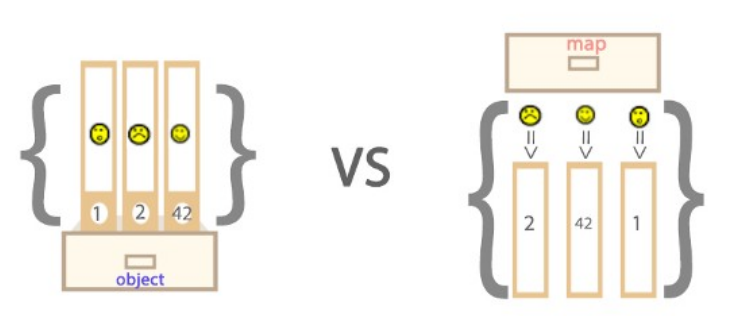

# ECMASscript6

## 1.了解ES

### 1.1.简介

ES6， 全称 ECMAScript 6.0 ，是 JavaScript 的下一个版本标准，2015.06 发版。

ES6 主要是为了解决 ES5 的先天不足，比如 JavaScript 里并没有类的概念，但是目前浏览器的 JavaScript 是 ES5 版本，大多数高版本的浏览器也支持 ES6，不过只实现了 ES6 的部分特性和功能。


### 1.2.ECMAScript 的背景

​	JavaScript 是大家所了解的语言名称，但是这个语言名称是商标（ Oracle 公司注册的商标）。因此，JavaScript 的正式名称是 ECMAScript 。1996年11月，JavaScript 的创造者网景公司将 JS 提交给国际化标准组织 ECMA（European computer manufactures association，欧洲计算机制造联合会），希望这种语言能够成为国际标准，随后 ECMA 发布了规定浏览器脚本语言的标准，即 ECMAScript。这也有利于这门语言的开放和中立。


### 1.3.ECMAScript历史

ES6 是 ECMAScript 标准十余年来变动最大的一个版本，为其添加了许多新的语法特性。

- 1997 年 ECMAScript 1.0 诞生。
- 1998 年 6 月 ECMAScript 2.0 诞生，包含一些小的更改，用于同步独立的 ISO 国际标准。
- 1999 年 12 月 ECMAScript 3.0诞生，它是一个巨大的成功，在业界得到了广泛的支持，它奠定了 JS 的基本语法，被其后版本完全继承。直到今天，我们一开始学习 JS ，其实就是在学 3.0 版的语法。
- 2000 年的 ECMAScript 4.0 是当下 ES6 的前身，但由于这个版本太过激烈，对 ES 3 做了彻底升级，所以暂时被"和谐"了。
- 2009 年 12 月，ECMAScript 5.0 版正式发布。ECMA 专家组预计 ECMAScript 的第五个版本会在 2013 年中期到 2018 年作为主流的开发标准。2011年6月，ES 5.1 版发布，并且成为 ISO 国际标准。
- 2013 年，ES6 草案冻结，不再添加新的功能，新的功能将被放到 ES7 中；2015年6月， ES6 正式通过，成为国际标准。


## 2.let和const

ES2015(ES6) 新增加了两个重要的 JavaScript 关键字: **let** 和 **const**。

let 声明的变量只在 let 命令所在的代码块内有效；const 声明一个只读的常量，一旦声明，常量的值就不能改变。

### 2.1.let

基本语法：

```javascript
{
  let a = 0;
  a   // 0
}
a   // 报错 ReferenceError: a is not defined
```

**代码块内有效。**

let 是在代码块内有效，var 是在全局范围内有效。

```javascript
{
  let a = 0;
  var b = 1;
}
a  // ReferenceError: a is not defined
b  // 1
```

**不能重复声明。**

let 只能声明一次 var 可以声明多次:

```javascript
let a = 1;
let a = 2;
var b = 3;
var b = 4;
a  // Identifier 'a' has already been declared
b  // 4
```

for 循环计数器很适合用 let:

```javascript
for (var i = 0; i < 10; i++) {
  setTimeout(function(){
    console.log(i);
  })
}
// 输出十个 10
for (let j = 0; j < 10; j++) {
  setTimeout(function(){
    console.log(j);
  })
}
// 输出 0123456789
```

​	变量 i 是用 var 声明的，在全局范围内有效，所以全局中只有一个变量 i, 每次循环时，setTimeout 定时器里面的 i 指的是全局变量 i ，而循环里的十个 setTimeout 是在循环结束后才执行，所以此时的 i 都是 10。

​	变量 j 是用 let 声明的，当前的 j 只在本轮循环中有效，每次循环的 j 其实都是一个新的变量，所以 setTimeout 定时器里面的 j 其实是不同的变量，即最后输出 12345。（若每次循环的变量 j 都是重新声明的，如何知道前一个循环的值？这是因为 JavaScript 引擎内部会记住前一个循环的值）。

**不存在变量提升。**

let 不存在变量提升，var 会变量提升:

```javascript
console.log(a);  //ReferenceError: a is not defined
let a = "apple";
 
console.log(b);  //undefined
var b = "banana";
```

​	变量 b 用 var 声明存在变量提升，所以当脚本开始运行的时候，b 已经存在了，但是还没有赋值，所以会输出 undefined。

变量 a 用 let 声明不存在变量提升，在声明变量 a 之前，a 不存在，所以会报错。


### 2.2.const

const 声明一个只读变量，声明之后不允许改变。意味着，一旦声明必须初始化，否则会报错。

基本用法:

```javascript
const PI = "3.1415926";
PI  // 3.1415926

const MY_AGE;  // SyntaxError: Missing initializer in const declaration
```

暂时性死区:

```javascript
var PI = "a";
if(true){
  console.log(PI);  // Cannot access 'PI' before initialization
  const PI = "3.1415926";
}
```

​	ES6 明确规定，代码块内如果存在 let 或者 const，代码块会对这些命令声明的变量从块的开始就形成一个封闭作用域。代码块内，在声明变量 PI 之前使用它会报错。

- **注意要点**

  ​	const 如何做到变量在声明初始化之后不允许改变的？其实 const 其实保证的不是变量的值不变，而是保证变量指向的内存地址所保存的数据不允许改动。此时，你可能已经想到，简单类型和复合类型保存值的方式是不同的。是的，对于简单类型（数值 number、字符串 string 、布尔值 boolean）,值就保存在变量指向的那个内存地址，因此 const 声明的简单类型变量等同于常量。而复杂类型（对象 object，数组 array，函数 function），变量指向的内存地址其实是保存了一个指向实际数据的指针，所以 const 只能保证指针是固定的，至于指针指向的数据结构变不变就无法控制了，所以使用 const 声明复杂类型对象时要慎重。


## 3.ES6解构赋值

解构赋值是对赋值运算符的扩展。他是一种针对数组或者对象进行模式匹配，然后对其中的变量进行赋值。在代码书写上简洁且易读，语义更加清晰明了；也方便了复杂对象中数据字段获取。

在解构中，有下面两部分参与：

- 解构的源，解构赋值表达式的右边部分。
- 解构的目标，解构赋值表达式的左边部分。

### 3.1.数组模型的解构（Array）

- **基本：**

```javascript
let [a, b, c] = [1, 2, 3];
// a = 1
// b = 2
// c = 3
```

- **可嵌套：**

```javascript
let [a, [[b], c]] = [1, [[2], 3]];
// a = 1
// b = 2
// c = 3
```

- **可忽略：**

```javascript
let [a, , b] = [1, 2, 3];
// a = 1
// b = 3
```

- **不完全解构：**

```javascript
let [a = 1, b] = []; // a = 1, b = undefined
```

- **剩余运算符：**

```javascript
let [a, ...b] = [1, 2, 3];
//a = 1
//b = [2, 3]
```

- **字符串等：**在数组的解构中，解构的目标若为可遍历对象，皆可进行解构赋值。可遍历对象即实现 Iterator 接口的数据。

```javascript
let [a, b, c, d, e] = 'hello';
// a = 'h'
// b = 'e'
// c = 'l'
// d = 'l'
// e = 'o'
```

- **结构默认值：**

```javascript
let [a = 2] = [undefined]; // a = 2
```

当解构模式有匹配结果，且匹配结果是 undefined 时，会触发默认值作为返回结果。

```javascript
let [a = 3, b = a] = [];     // a = 3, b = 3
let [a = 3, b = a] = [1];    // a = 1, b = 1
let [a = 3, b = a] = [1, 2]; // a = 1, b = 2
```

- a 与 b 匹配结果为 undefined ，触发默认值：**a = 3; b = a =3**;
- a 正常解构赋值，匹配结果：a = 1，b 匹配结果 undefined ，触发默认值：**b = a =1**;
- a 与 b 正常解构赋值，匹配结果：**a = 1，b = 2**。


### 3.2.对象模型的结构（Object）

- **基本：**

```javascript
let { foo, bar } = { foo: 'aaa', bar: 'bbb' };
// foo = 'aaa'
// bar = 'bbb'
 
let { baz : foo } = { baz : 'ddd' };
// foo = 'ddd'
```

- **可嵌套忽略：**

```javascript
let obj = {p: ['hello', {y: 'world'}] };
let {p: [x, { y }] } = obj;
// x = 'hello'
// y = 'world'
let obj = {p: ['hello', {y: 'world'}] };
let {p: [x, {  }] } = obj;
// x = 'hello'
```

- **不完全结构：**

```javascript
let obj = {p: [{y: 'world'}] };
let {p: [{ y }, x ] } = obj;
// x = undefined
// y = 'world'
```

- **剩余运算符：**

```javascript
let {a, b, ...rest} = {a: 10, b: 20, c: 30, d: 40};
// a = 10
// b = 20
// rest = {c: 30, d: 40}
```

- **结构默认值：**

```javascript
let {a = 10, b = 5} = {a: 3};
// a = 3; b = 5;
let {a: aa = 10, b: bb = 5} = {a: 3};
// aa = 3; bb = 5;
```


## 4.Symbol对象

ES6 引入了一种新的原始数据类型 Symbol ，表示独一无二的值，最大的用法是用来定义对象的唯一属性名。ES6 数据类型除了 Number 、 String 、 Boolean 、 Object、 null 和 undefined ，还新增了 Symbol 。


### 4.1.基本用法

​	Symbol 函数栈不能用 new 命令，因为 Symbol 是原始数据类型，不是对象。可以接受一个字符串作为参数，为新创建的 Symbol 提供描述，用来显示在控制台或者作为字符串的时候使用，便于区分。

```javascript
let sy = Symbol("KK");
console.log(sy);   // Symbol(KK)
typeof(sy);        // "symbol"
 
// 相同参数 Symbol() 返回的值不相等
let sy1 = Symbol("kk"); 
sy === sy1;       // false
```


### 4.2.使用场景

- **作为属性名：**

**用法：**由于每一个 Symbol 的值都是不相等的，所以 Symbol 作为对象的属性名，可以保证属性不重名。

```javascript
let sy = Symbol("key1");
 
// 写法1
let syObject = {};
syObject[sy] = "kk";
console.log(syObject);    // {Symbol(key1): "kk"}
 
// 写法2
let syObject = {
  [sy]: "kk"
};
console.log(syObject);    // {Symbol(key1): "kk"}
 
// 写法3
let syObject = {};
Object.defineProperty(syObject, sy, {value: "kk"});
console.log(syObject);   // {Symbol(key1): "kk"}
```

​	Symbol 作为对象属性名时不能用.运算符，要用方括号。因为.运算符后面是字符串，所以取到的是字符串 sy 属性，而不是 Symbol 值 sy 属性。

```javascript
let syObject = {};
syObject[sy] = "kk";
 
syObject[sy];  // "kk"
syObject.sy;   // undefined
```

**注意点：**

​	Symbol 值作为属性名时，该属性是公有属性不是私有属性，可以在类的外部访问。但是不会出现在 for...in 、 for...of 的循环中，也不会被 Object.keys() 、 Object.getOwnPropertyNames() 返回。如果要读取到一个对象的 Symbol 属性，可以通过 Object.getOwnPropertySymbols() 和 Reflect.ownKeys() 取到。

```javascript
let syObject = {};
syObject[sy] = "kk";
console.log(syObject);
 
for (let i in syObject) {
  console.log(i);
}    // 无输出
 
Object.keys(syObject);                     // []
Object.getOwnPropertySymbols(syObject);    // [Symbol(key1)]
Reflect.ownKeys(syObject);                 // [Symbol(key1)]
```


- **定义常量**

在 ES5 使用字符串表示常量。例如：

```javascript
const COLOR_RED = "red";
const COLOR_YELLOW = "yellow";
const COLOR_BLUE = "blue";
```

但是用字符串不能保证常量是独特的，这样会引起一些问题：

```javascript
const COLOR_RED = "red";
const COLOR_YELLOW = "yellow";
const COLOR_BLUE = "blue";
const MY_BLUE = "blue";
 
function ColorException(message) {
   this.message = message;
   this.name = "ColorException";
}
 
function getConstantName(color) {
    switch (color) {
        case COLOR_RED :
            return "COLOR_RED";
        case COLOR_YELLOW :
            return "COLOR_YELLOW ";
        case COLOR_BLUE:
            return "COLOR_BLUE";
        case MY_BLUE:
            return "MY_BLUE";         
        default:
            throw new ColorException("Can't find this color");
    }
}
 
try {
   
   var color = "green"; // green 引发异常
   var colorName = getConstantName(color);
} catch (e) {
   var colorName = "unknown";
   console.log(e.message, e.name); // 传递异常对象到错误处理
```


但是使用 Symbol 定义常量，这样就可以保证这一组常量的值都不相等。用 Symbol 来修改上面的例子。

```javascript
const COLOR_RED = Symbol("red");
const COLOR_YELLOW = Symbol("yellow");
const COLOR_BLUE = Symbol("blue");
 
function ColorException(message) {
   this.message = message;
   this.name = "ColorException";
}
function getConstantName(color) {
    switch (color) {
        case COLOR_RED :
            return "COLOR_RED";
        case COLOR_YELLOW :
            return "COLOR_YELLOW ";
        case COLOR_BLUE:
            return "COLOR_BLUE";
        default:
            throw new ColorException("Can't find this color");
    }
}
 
try {
   
   var color = "green"; // green 引发异常
   var colorName = getConstantName(color);
} catch (e) {
   var colorName = "unknown";
   console.log(e.message, e.name); // 传递异常对象到错误处理
}
```

Symbol 的值是唯一的，所以不会出现相同值得常量，即可以保证 switch 按照代码预想的方式执行。


- **Symbol.for()**

  ​	Symbol.for() 类似单例模式，首先会在全局搜索被登记的 Symbol 中是否有该字符串参数作为名称的 Symbol 值，如果有即返回该 Symbol 值，若没有则新建并返回一个以该字符串参数为名称的 Symbol 值，并登记在全局环境中供搜索。

```javascript
let yellow = Symbol("Yellow");
let yellow1 = Symbol.for("Yellow");
yellow === yellow1;      // false
 
let yellow2 = Symbol.for("Yellow");
yellow1 === yellow2;     // true
```


- **Symbol.keyFor()**

  ​	Symbol.keyFor() 返回一个已登记的 Symbol 类型值的 key ，用来检测该字符串参数作为名称的 Symbol 值是否已被登记。

```javascript
let yellow1 = Symbol.for("Yellow");
Symbol.keyFor(yellow1);    // "Yellow"
```


## 5.Map和Set


### 5.1.Map对象

Map 对象保存键值对。任何值(对象或者原始值) 都可以作为一个键或一个值。

- **Map对象和Objects对象的区别：**
  - 一个 Object 的键只能是字符串或者 Symbols，但一个 Map 的键可以是任意值；
  - Map 中的键值是有序的（FIFO 原则），而添加到对象中的键则不是；
  - Map 的键值对个数可以从 size 属性获取，而 Object 的键值对个数只能手动计算；
  - Object 都有自己的原型，原型链上的键名有可能和你自己在对象上的设置的键名产生冲突。



- **Map中的key**

  - key是字符串

  ```javascript
  var myMap = new Map();
  var keyString = "a string"; 
   
  myMap.set(keyString, "和键'a string'关联的值");
   
  myMap.get(keyString);    // "和键'a string'关联的值"
  myMap.get("a string");   // "和键'a string'关联的值"
                           // 因为 keyString === 'a string'
  ```

  

  -  key是对象

  ```javascript
  var myMap = new Map();
  var keyObj = {}, 
   
  myMap.set(keyObj, "和键 keyObj 关联的值");
  
  myMap.get(keyObj); // "和键 keyObj 关联的值"
  myMap.get({}); // undefined, 因为 keyObj !== {}
  ```

  

  -  key是函数

  ```javascript
  var myMap = new Map();
  var keyFunc = function () {}, // 函数
   
  myMap.set(keyFunc, "和键 keyFunc 关联的值");
   
  myMap.get(keyFunc); // "和键 keyFunc 关联的值"
  myMap.get(function() {}) // undefined, 因为 keyFunc !== function () {}
  ```

  

  -  key是NaN

  ```javascript
  var myMap = new Map();
  myMap.set(NaN, "not a number");
   
  myMap.get(NaN); // "not a number"
   
  var otherNaN = Number("foo");
  myMap.get(otherNaN); // "not a number"
  ```

  虽然 NaN 和任何值甚至和自己都不相等(NaN !== NaN 返回true)，NaN作为Map的键来说是没有区别的。


- **Map的迭代**

  对 Map 进行遍历，以下两个最高级。

  -  for...of

  ```javascript
  var myMap = new Map();
  myMap.set(0, "zero");
  myMap.set(1, "one");
   
  // 将会显示两个 log。 一个是 "0 = zero" 另一个是 "1 = one"
  for (var [key, value] of myMap) {
    console.log(key + " = " + value);
  }
  for (var [key, value] of myMap.entries()) {
    console.log(key + " = " + value);
  }
  /* 这个 entries 方法返回一个新的 Iterator 对象，它按插入顺序包含了 Map 对象中每个元素的 [key, value] 数组。 */
   
  // 将会显示两个log。 一个是 "0" 另一个是 "1"
  for (var key of myMap.keys()) {
    console.log(key);
  }
  /* 这个 keys 方法返回一个新的 Iterator 对象， 它按插入顺序包含了 Map 对象中每个元素的键。 */
   
  // 将会显示两个log。 一个是 "zero" 另一个是 "one"
  for (var value of myMap.values()) {
    console.log(value);
  }
  /* 这个 values 方法返回一个新的 Iterator 对象，它按插入顺序包含了 Map 对象中每个元素的值。 */
  ```

  

  - forEach()

  ```javascript
  var myMap = new Map();
  myMap.set(0, "zero");
  myMap.set(1, "one");
   
  // 将会显示两个 logs。 一个是 "0 = zero" 另一个是 "1 = one"
  myMap.forEach(function(value, key) {
    console.log(key + " = " + value);
  }, myMap)
  ```

  

- **Map对象的操作**

  -  Map和Array的转换

  ```javascript
  var kvArray = [["key1", "value1"], ["key2", "value2"]];
   
  // Map 构造函数可以将一个 二维 键值对数组转换成一个 Map 对象
  var myMap = new Map(kvArray);
   
  // 使用 Array.from 函数可以将一个 Map 对象转换成一个二维键值对数组
  var outArray = Array.from(myMap);
  ```

  

  -  Map的克隆

  ```javascript
  var myMap1 = new Map([["key1", "value1"], ["key2", "value2"]]);
  var myMap2 = new Map(myMap1);
   
  console.log(original === clone); 
  // 打印 false。 Map 对象构造函数生成实例，迭代出新的对象。
  ```

  

  -  Map的合并

  ```javascript
  var first = new Map([[1, 'one'], [2, 'two'], [3, 'three'],]);
  var second = new Map([[1, 'uno'], [2, 'dos']]);
   
  // 合并两个 Map 对象时，如果有重复的键值，则后面的会覆盖前面的，对应值即 uno，dos， three
  var merged = new Map([...first, ...second]);
  ```

### 5.2.Set对象

Set 对象允许你存储任何类型的唯一值，无论是原始值或者是对象引用。

- **Set对象中的特殊值**

  Set 对象存储的值总是唯一的，所以需要判断两个值是否恒等。有几个特殊值需要特殊对待：

  -  +0与-0在存储判断唯一性的时候是平等的，所以不重复；
  -  undefined与undefined是恒等的，所以不重复；
  - NaN与NaN是不恒等的，但是在Set中只能存在一个，不重复。

  代码：

  ```javascript
  let mySet = new Set();
   
  mySet.add(1); // Set(1) {1}
  mySet.add(5); // Set(2) {1, 5}
  mySet.add(5); // Set(2) {1, 5} 这里体现了值的唯一性
  mySet.add("some text"); 
  // Set(3) {1, 5, "some text"} 这里体现了类型的多样性
  var o = {a: 1, b: 2}; 
  mySet.add(o);
  mySet.add({a: 1, b: 2}); 
  // Set(5) {1, 5, "some text", {…}, {…}} 
  // 这里体现了对象之间引用不同不恒等，即使值相同，Set 也能存储
  ```

  

- **类型转换**

  - Array

  ```javascript
  // Array 转 Set
  var mySet = new Set(["value1", "value2", "value3"]);
  // 用...操作符，将 Set 转 Array
  var myArray = [...mySet];
  String
  // String 转 Set
  var mySet = new Set('hello');  // Set(4) {"h", "e", "l", "o"}
  // 注：Set 中 toString 方法是不能将 Set 转换成 String
  ```

- **Set对象的作用**

  -  数组去重

  ```javascript
  var mySet = new Set([1, 2, 3, 4, 4]);
  [...mySet]; // [1, 2, 3, 4]
  ```

  

  -  并集

  ```javascript
  var a = new Set([1, 2, 3]);
  var b = new Set([4, 3, 2]);
  var union = new Set([...a, ...b]); // {1, 2, 3, 4}
  ```

  

  -  交集

  ```javascript
  var a = new Set([1, 2, 3]);
  var b = new Set([4, 3, 2]);
  var intersect = new Set([...a].filter(x => b.has(x))); // {2, 3}
  ```

  

  -  差集

  ```javascript
  var a = new Set([1, 2, 3]);
  var b = new Set([4, 3, 2]);
  var difference = new Set([...a].filter(x => !b.has(x))); // {1}
  ```

  

**关于：**

差集计算：

```javascript
var a = new Set([1, 2, 3]);
var b = new Set([4, 3, 2]);
var difference =new Set([...[...a].filter(x => !b.has(x)),...[...b].filter(x => !a.has(x))]); // {1,4}
```

1 为 a 与 b 的差集；4 为 b 与 a 的差集。

理解这断程序确实有点难度。

```javascript
var a = new Set([1, 2, 3]); 
var b = new Set([4, 3, 2]); 
var intersect = new Set([...a].filter(x => b.has(x))); // {2, 3}
```

因为这段程序所需要了解的知识点有好几个:

- **[...a]：**[...a] 就是将 set 转换成 array。以后需要将 set 转换成 array 基本都使用这种方法；
- **[...a].filter()：**Array.filter(function(x)) 把传入的函数 function(x) 依次作用于每个元素，x 为元素的值，然后根据返回值是 true 还是 false 决定保留还是丢弃该元素。

意思就是遍历当前数组，当遍历到某个元素时，返回值为 false 就将该元素从数组中剔除。

filter() 方法创建一个新的数组，新数组中的元素是通过检查指定数组中符合条件的所有元素。

-  **=> 则是一种简写方法。**

```javascript
x => x * x 
等价于
function(x){return x*x}
```

所以 **x => b.has(x)** 本质是一个函数相当于 **function(x){return b.has（x)}**。

- **b.has(x)：**Set.has(x) 是 set 中的一个方法。即判断当前 set 中是否含有 x，如果有返回 true，没有返回 false。

所以这段程序也可以写成：

```javascript
var a = new Set([1, 2, 3]); 
var b = new Set([4, 3, 2]); 
var arr = [...a];            //将a转换成数组
var fArr = arr.filter(function(x){    //使用filter过滤数组，并将新数组返回到fArr
    return b.has(x);        //判断b中是否含有a中的元素，没有则返回false
})
var intersect = new Set(fArr);          //将fArr转换成set
console.log(fArr);
```


## 6.Reflect和Proxy

Proxy 与 Reflect 是 ES6 为了操作对象引入的 API 。

Proxy 可以对目标对象的读取、函数调用等操作进行拦截，然后进行操作处理。它不直接操作对象，而是像代理模式，通过对象的代理对象进行操作，在进行这些操作时，可以添加一些需要的额外操作。

Reflect 可以用于获取目标对象的行为，它与 Object 类似，但是更易读，为操作对象提供了一种更优雅的方式。它的方法与 Proxy 是对应的。