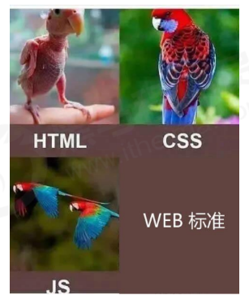
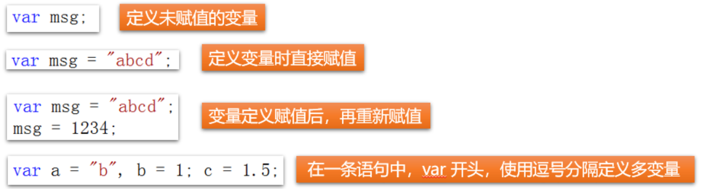
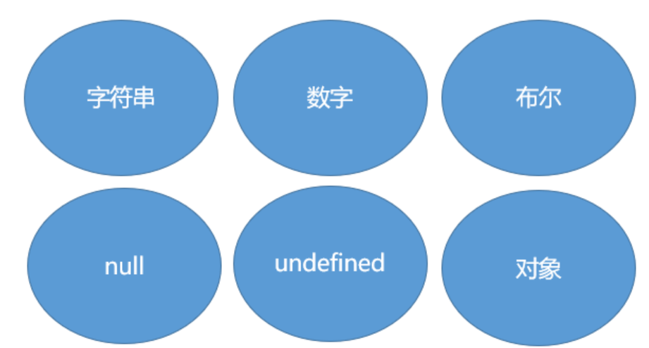
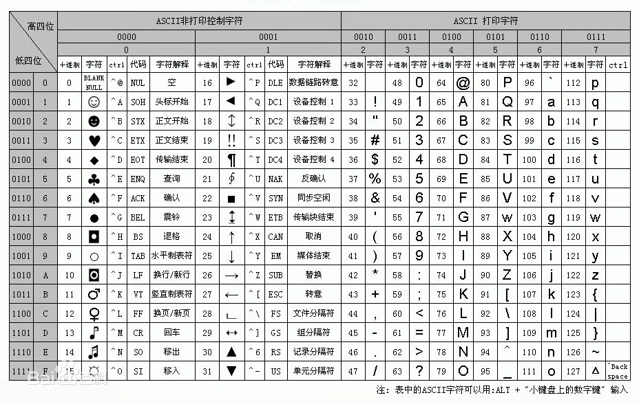

# JavaScript




## 1.初识JavaScript

​	JavaScript（简称“JS”） 是一种具有函数优先的轻量级，解释型或即时编译型的编程语言。虽然它是作为开发Web页面(客户端)的**脚本语言**而出名，但是它也被用到了很多非浏览器环境中，JavaScript 基于原型编程、多范式的动态脚本语言，并且支持面向对象、命令式、声明式、函数式编程范式。 

JavaScript在1995年由Netscape公司的Brendan Eich，在网景导航者浏览器上首次设计实现而成。因为Netscape与Sun合作，Netscape管理层希望它外观看起来像Java，因此取名为JavaScript。但实际上它的语法风格与Self及Scheme较为接近。 


JavaScript的标准是ECMAScript。截至 2012 年，所有浏览器都完整的支持ECMAScript 5.1，旧版本的浏览器至少支持ECMAScript 3 标准。2015年6月17日，ECMA国际组织发布了ECMAScript的第六版，该版本正式名称为 ECMAScript 2015，但通常被称为ECMAScript 6 或者ES2015。

JS的组成：

- **核心语法：**ECMAScript规范的一套JS的基本语法；
- **浏览器对象模型-BOM：**Browser Object Model，提供一系列操作浏览器的方法；
- **文档对象模型-DOM:**Document Object Model，提供了一些列操作文档的方法。


## 2.JS的引入

​	JS的引入分为**行内引入(元素绑定)、内部引入和外部引入**，行内引入直接以标签属性的方式进行加载，而行外引入的方式是以JS标签来设置，外部引入则需要添加JS文件，通过<script>标签的src属性来引入。

- **元素绑定事件：**
  - 事件：指用户的行为（单击、双击等）或元素的状态（输入框的焦点状态）
  - 事件处理：元素监听某种事件并在事件发生后自动执行事件处理函数；
  - 常用事件：onclick(点击事件)；
  - 语法：将事件名称以标签属性的方式绑定在元素上，自定义事件处理。

```javascript
<!--实现点击按钮在控制台输出-->
<button onclick="console.log('Hello World!!')">点击</button>
```

- **文档内嵌（内部引入）：**使用<script type="text/javascript"></script>标签书写JS代码，语法如下：

```javascript
<script type="text/javascript">
	alert("网页警告框");    
</script>
```

注意：标签可以书写在文档任意位置，也可书写多次。一旦加载到<script>标签就会立即执行其内部的JS代码，因此不同的位置会影响代码的最终执行效果。

- **外部引入：**创建外部JS文件xx.js，在HTML中使用如下语法引入：

```javascript
<script src="xx.js"></script>
```


```html
<!DOCTYPE html>
<html lang="en">

<head>
    <meta charset="UTF-8">
    <meta http-equiv="X-UA-Compatible" content="IE=edge">
    <meta name="viewport" content="width=device-width, initial-scale=1.0">
    <title>Document</title>
    <style>
        .box1 {
            width: 300px;
            height: 300px;
            background-color: red;
        }
        
        .box2 {
            width: 300px;
            height: 300px;
            background-color: yellow;
        }
        
        .box3 {
            width: 200px;
            height: 200px;
            background-color: green;
        }
    </style>
</head>

<body>
    <!-- 行内引入：onclick-添加点击事件
                    alert()-弹框输出
            优点：简单直接
            缺点：结构不分离，无复用性,维护性不强 -->
    <div class="box1" onclick="alert('你点我呀！！！')"></div>
    <div class="box2"></div>
    <div class="box3"></div>
    <!-- 内部引入 -->
    <script>
        // 单行注释
        /*
            多行注释
            优点：结构分离，增加维护性和复用性（只能在当前页面）
            缺点：多页面之间无法复用
        */
        document.querySelector('.box2').onclick = function() {
            alert('点你咋的！！！')
        }
    </script>
    <!-- 外部引入
            优点：结构彻底分离，维护性强
                    推荐使用 -->
    <script src="main.js"></script>
</body>

</html>
```

```js
document.querySelector('.box3').onclick = function() {
    alert('哈哈')
}
```


## 3.JS的输入输出

​	JS的输入输出语句分为以下三种：

| 方法                                 | 说明                                   |
| ------------------------------------ | -------------------------------------- |
| alert()                              | 浏览器弹出框输出                       |
| console.log()                        | 浏览器控制台输出                       |
| prompt()                             | 浏览器弹出输入框，用户输入信息会被保存 |
| document.**write**("<h1>Hello</h1>") | 实现在动态网页中写入内容               |

注意：document.write()可以识别HTML标签，脚本代码可以在文档任何地方书写，如果是普通写入（不涉及事件处理），区分代码的书写位置插入；文档渲染结束后，再次执行此方法，会重写网页内容。

```javascript
<body>
    <script>
        alert("浏览器弹出框。")
        console.log("这时控制台信息，供程序员使用。");
        a = prompt("用户输入的信息可以被保存起来。");
        alert(a)
    </script>
    <div>
        <script>
            // 在某一位置写入内容
            document.write("<h1>Hello</h1>")
        </script>
    </div>
    <!-- 执行document.write()后会重写网页 -->
    <input type="button" value="清除所有内容" onclick="document.write('清空后的文本')">
</body>
```


## 4.DOM事件处理

事件：指用户的行为或元素的状态。由指定元素监听相关的事件，并且绑定事件处理函数。
事件处理函数：元素监听事件，并在事件发生时自动执行的操作。

DOM: Document Object Model，文档对象模型，其实就是JS专门为访问html元素提供的一套API。

### 4.1.事件函数分类

1.鼠标事件

```javascript
onclick		//单击
ondblclick	//双击
onmouseover	//鼠标移入
onmouseout	//鼠标移出
onmousemove	//鼠标移动
```


2.文档或元素加载完毕

```javascript
onload		//元素或文档加载完毕再进行下一步操作
```


3.表单控件状态监听

```javascript
onfocus 	//文本框获取焦点
onblur		//文本框失去焦点
oninput		//实时监听输入
onchange	//两次输入内容发生变化时触发,或元素状态改变时触发，监听输入框前后内容是否发生变化，也可以监听按钮的选中状态
onsubmit	//form元素监听,点击提交按钮后触发,通过返回值控制数据是否可以发送给服务器，返回true表示可以发送，返回false表示不允许提交
```


### 4.2.获取节点元素

1.根据标签名获取元素节点列表

```javascript
var elems = document.getElementsByTagName("");
/*
参数 : 标签名
返回值 : 节点列表,需要从节点列表中获取具体的元素节点对象,添加相应下标。
*/
```


2.根据class属性值获取元素节点列表

```javascript
var elems = document.getElementsByClassName("");
/*
参数 : 类名(class属性值)
返回值 : 节点列表
*/
```


3.根据id属性值获取元素节点列表

```javascript
var elem = document.getElementById("");
/*
参数 : id属性值
返回值 : 元素节点
*/
```


4.根据 name 属性值取元素列表

```javascript
var elems = document.getElementsByName("");
/*
参数 : name属性值
返回 : 节点列表
*/
```


```javascript
<body>
    <!-- 点检按钮显示hello world -->
    <div id="tip">

    </div>
    <button onclick="var a = document.getElementById('tip');
                        a.innerText = 'hello world!';">
                        点我一下
    </button>
</body>
```


### 4.3.事件绑定方式

1.**内联方式**
将事件名称作为标签属性绑定到元素上
例 :

```javascript
<button onclick="alert()">点击</button>
```


2.**动态绑定**
获取元素节点，动态添加事件
例 :

```javascript
btn.onclick = function (){

};
```


### 4.4.DOM练习

**1.电灯开关**

需求：点击按钮，实现电灯开关

```javascript
<!DOCTYPE html>
<html lang="en">

<head>
    <meta charset="UTF-8">
    <meta http-equiv="X-UA-Compatible" content="IE=edge">
    <meta name="viewport" content="width=device-width, initial-scale=1.0">
    <title>Document</title>
    <style>
        body {
            padding: 20px;
            font-size: 20px;
        }
        
        #div1 {
            width: 30%;
            border: 1px solid red;
            padding: 5px;
            margin-bottom: 20px;
        }
    </style>
</head>

<body>
    <script>
        var flag = "off"; //flag表示灯的状态, off表示灯是关闭的!
        function changeImg() {
            //1.通过id获取img元素(返回是一个JS对象)
            var imgObj = document.getElementById("img1");
            if (flag == "off") { // 表明灯是关闭状态, 点击后则需要打开
                imgObj.src = "imgs/on.gif";
                flag = "on"; // 更新灯的状态为开灯
            } else { // flag="on" 表名灯是打开状态, 点击后则需要关闭
                imgObj.src = "imgs/off.gif";
                flag = "off";
            }
        }
    </script>

    <input type="button" value="开/关灯" onclick="changeImg()" /> <br/><br/>
    
</body>

</html>
```


## 5.基础语法

### 5.1.语法规范

1. JavaScript是由语句组成,语句由关键字，变量，常量，运算符，方法组成。
2. 分号可以作为语句结束的标志，也可以省略
3. JavaScript严格区分大小写
4. 注释语法
   单行注释使用 //
   多行注释使用 /* */


### 5.2.变量和常量

#### 5.2.1.变量

​	变量就是存放数据的容器，我们可以从这个容器中取出变量来使用，它实际是在内存中开辟了一块空间。如果要使用这个变量必须经过两个步骤：声明变量和赋值。



**声明变量的格式：**

```js
var 变量名;
let 变量名;
```

```js
<script>
        // 1.初始化变量
        var name = '姚明';
        console.log(name);
		a = 1; // 定义一个小写字母a的变量
        A = 1; // 定义一个大写字母A的变量
        a1 = 2; // 定义全局变量
        var a2 = 3; // 页面局部变量，只能在次页面使用
        var a3, a4, a5; // 定义多个变量未赋值
        a3 = 4, a4 = 5, a5 = 6; // 再进行赋值
        var a6 = a7 = a8 = 0; // 级联赋值
</script>
```

**命名规范：**

- 变量名，常量名，函数名，方法名自定义，可以由数字，字母，下划线，$组成，禁止以数字开头；
- 禁止与关键字冲突(var const function if else for while do break case switch return class)；
- 变量名严格区分大小写；
- 变量名尽量见名知意，多个单词组成采用小驼峰,例如："userName"

**使用注意：**

- 变量如果省略var关键字，并且未赋值，直接访问会报错
- 变量使用var关键字声明但未赋值，变量初始值为undefined
- 变量省略var关键字声明，已被赋值，可正常使用，影响变量作用域

**练习：用弹出框做一个计算器：**

```js
<script>
        // 1.初始化变量
        var name = '姚明';
        console.log(name);
        var num1 = prompt("请输入第一个数：");
        var num2 = prompt("请输入第二个数：");
        alert(parseInt(num1) + parseInt(num2));
    </script>
```

​	变量赋值之后即在内存中开辟了一块空间，并进行了引用，如果重新给这个变量赋值，那么这个变量原来的值就会被覆盖，所以变量的值以最后一次赋值为准，当然我们后面学习了函数之后，也会因变量的作用域而改变。

​	变量如果没有赋值将会被执行undifined，并且变量的命名方式和Java命名变量的规则相同。

**练习：交换两个变量的值**

```js
<script>
        var name1 = '姚明';
        var name2 = '刘翔';
        var name;
        name = name1;
        name1 = name2;
        name2 = name;
        console.log(name1);
        console.log(name2);
    </script>
```


ES2015引入了两个新的关键词：let和const。这两个关键词在JS中提供了**块作用域变量（和常量）**。但在ES2015之前，JS的作用域只有全局作用域和函数作用域。

全局声明的变量拥有全局作用域。全局变量可以在 JavaScript 程序中的任何位置访问。

局部声明的变量拥有函数作用域。局部变量只能在它声明的函数内访问。


#### 5.2.2.常量

常量用于存储已经定义就无法修改的数据，它必须在声明的同时进行赋值。

```javascript
const PI = 3.14;
```

**注意：**

- 常量一经定义，不能修改，强制修改会报错；
- 命名规范同变量，为了区分变量，常量名采用全大写字母


**操作小数位：**toFixed(n)； 保留小数点后 n 位，并且四舍五入。

```javascript
<script>
        const PI = 3.1415926;
        // 保留小数点后两位
        alert(PI.toFixed(2))
</script>
```


### 5.3.数据类型



 	在计算机中不同的数据类型占用的空间不同，因此我们要根据数据的需要把他们分为不同的数据类型。就如在Java中"你好"属于字符串类型，123属于整数类型。JS能保存的数据类型有：数值、字符串、数组、对象等。但JS不同于C、Java等语言，JS的数据类型是弱类型语言，它的变量数据类型是在程序运行过程中，**根据等号右边的值来判断该变量的数据类型。**

```javascript
var length = 7;                             // 数字
var lastName = "Gates";                      // 字符串
var cars = ["Porsche", "Volvo", "BMW"];         // 数组
var x = {firstName:"Bill", lastName:"Gates"};    // 对象
```


在JS中简单的数据类型包含数字型(Number)、布尔值类型(boolean)、字符串类型(String)、未定义型(Undefined)、空值类型(Null)。

- **number数值类型**

  - 整数

    - 十进制表示

    ```javascript
    var a = 100;
    ```

    - 八进制表示

    ```javascript
    var b = 021; // 结果为十进制17
    ```

    使用：整数可以采用不同进制表示，在控制台输出时一律按十进制输出。

  - 小数

    - 小数点表示

    ```javascript
    var m = 1.2345
    ```

    - 科学计数法

    ```javascript
    1.5e3
    e表示10为底，e后面的数值表示10的次方，1.5e3等价于1.5*10^3
    ```

    

- **string字符串类型**

字符串：由一个或多个字符组成，使用""或''表示，每一个字符都有对应的Unicode编码。

```javascript
var s1 = "100";
var s2 = '张三';
```


- **boolean布尔类型**

只有真或假两个值，布尔值和number值可以互相转换，true为1，false为0，可以用于逻辑判断。

```javascript
var isSave = true;
var isChecked = false;
```


- **undefined**

特殊值，变量声明未赋值时显示undefined。

```javascript
var a;
console.log(a); // undefined
```


- **null空类型**

定义对象引用时使用null，表示对象为空：

（1).引用数据类型，主要指对象、函数等；

（2).检测数据类型：typeof 变量或表达式   ；  typeof(变量或表达式)

```javascript
var n = "abcd"
console.log(typeof n);// string
console.log(typeof(n)); // string
```


### 5.4.数据类型的转换

不同类型的数据参与运算时，需要转换类型。

- **强制类型转换**

  - 转换成字符串类型：toString()，返回转换后的字符串

  ```javascript
  var a = 100;
  a = a.toString();
  console.log(a); // "100"
  var b = true;
  b = b.toString(); // "true"
  ```

  - 转换number类型：Number(param)。参数是待转换的变量或值，返回转换后的结果，如果转换成功，返回Number值，如果转换失败，返回NaN(Not a Number)，是非Number字符。
  - parseInt(param)：将数据解析成整数值，如果参数为非字符串类型会转换成字符串，从左向右一次对每位字符转成Number，转换失败则停止向后解析，并返回结果；
  - parseFloat(param)：将参数转换成小数类型。

  ```javascript
  var a = "100";
  console.log(Number(a)); // 100
  var b = "100abc";
  console.log(Number(b)); // NaN
  var c = true;
  console.log(Number(c)); // 1
  console.log(parseInt(b)); // 100
  var x = 10
  console.log(parseFloat(x)); // 10.00
  ```

- **隐式类型转换（自动转换）**

  - 当字符串与其他数据类型时进行“+”运算时，表示字符串的拼接，不再是数学运算；转换规则：将非字符串类型的数据转换成字符串之后再和字符串进行拼接；
  - 其他情况，一律将操作数转换成Number类型进行数学运算。

  ```javascript
  var d = 100
  var e = "qwer"
  console.log(d + e); // 100qwer
  var f = true
  console.log(d + f); // 101
  ```

  

### 5.5.运算符

```javascript

=					赋值运算符，将=右边的值赋给左边的变量
+ - * / %   		加 减 乘 除 取余
+= -= *= /= %=   	复合运算符
++ -- 				变量的自增和自减，指在本身的基础上+1或-1的操作

关系运算符
> <  大于 等于
>= <= 大于等于  小于等于
==(相等) !=(相等)
===(全等) !==(不全等)  值和类型都相等

逻辑运算符
&& 逻辑与 表达式同时成立，最终结果才为true；1则1
|| 逻辑或 表达式中只要有一个成立，最终结果即为true；有1则1
! 逻辑非  对已有表达式的结果取反，除零值以外，所有值都为真

三元运算符
表达式1 ? 表达式2 : 表达式3;
判断表达式1是否成立，返回布尔值；
如果表达式1成立，执行表达式2；
如果表达式1不成立，执行表达式3；
```

注意：

+ 自增或自减运算符在单独与变量结合时，放前和放后没有区别
+ 如果自增或自减运算符与其他运算符结合使用，要区分前缀和后缀，做前缀，那就先++/--，再进行赋值或其他运算，如果做后缀，就先结合其他运算符，再进行++ / --

1. 关系运算符用来判断表达式之间的关系，结果永远是布尔值 true/false

2. 使用

   + 字符串与字符串之间的比较
     依次比较每位字符的Unicode码，只要某位字符比较出结果，就返回最终结果

   + str.charCodeAt(index)

     方法可返回指定位置的字符的 Unicode 编码。这个返回值是 0 - 65535 之间的整数

     index必需。表示字符串中某个位置的数字，即字符在字符串中的下标。

3. 相等与全等

   + 相等：不考虑数据类型，只做值的比较(包含自动类型转换)
   + 全等：不会进行数据类型转换，要求数据类型一致并且值相等才判断全等

```javascript
var a = 2;
// 在前现变化，在后先运算
console.log(a++); // 2
console.log(++a); // 4

// 每一个字符在做比较时都是比较Unicode编码
var b = 'A',
    c = 'a';
console.log(b.charCodeAt(0)); // 查询Unicode编码对应值 65
console.log(b > c); // false

var x = 10,
    y = 20,
    z = 30;
// 运算优先级() ! && ||
console.log(!(x > y && y > z || x < y && z > y)); // false
// 三元运算符
var result = x > y ? x : y
console.log(result); // 20
```


### 5.6.练习

练习1：在文本框输入文字进行验证，如果是字符就提示验证成功，如果是数字就提示验证失败：

```javascript
<!DOCTYPE html>
<html lang="en">

<head>
    <meta charset="UTF-8">
    <meta http-equiv="X-UA-Compatible" content="IE=edge">
    <meta name="viewport" content="width=device-width, initial-scale=1.0">
    <title>Document</title>
    <style>
        #check .txt {
            padding: 5px;
        }
        
        #check .btn {
            margin: 8px 0;
        }
    </style>
</head>

<body>
    <div id="check">
        <h3>请输入文字验证：</h3>
        <input class="txt" type="text" id="txt" placeholder="请输入字符串内容">
        <div class="btn">
            <button onclick="check()">验证</button>
        </div>
        <div id="result"></div>
    </div>
    <script>
        function check() {
            // 分别获取元素对象，并保存在变量中
            var txt = document.getElementById("txt");
            var result = document.getElementById("result");
            // 根据文本框输入的值进行判断
            var num = txt.value;
            // isNaN()表示判断是否不是数字，如果不是返回true,否则返回false
            // Number(num) 如果是数字返回数字，如果不是返回NaN
            var isNum = isNaN(Number(num)) ? false : true; // 如果能转乘number就返回true
            result.innerText = isNum ? '验证成功' : '验证失败';
        }
    </script>
</body>

</html>
```


## 6.流程控制

​	JavaScript中的流程控制就是控制代码的执行顺序。


## Unicode

大多数计算机采用[ASCII](https://baike.baidu.com/item/ASCII/309296)码（[美国标准信息交换码](https://baike.baidu.com/item/美国标准信息交换码/1541479)），它是表示所有大小写字母、数字、标点符号和[控制字符](https://baike.baidu.com/item/控制字符/6913704)的7位编码方案。统一码（[Unicode](https://baike.baidu.com/item/Unicode/750500)）包含ASCII码，'\u0000'到'\u007F'对应全部128个ACSII字符。在[JAVA](https://baike.baidu.com/item/JAVA/85979)中可以使用统一码。



