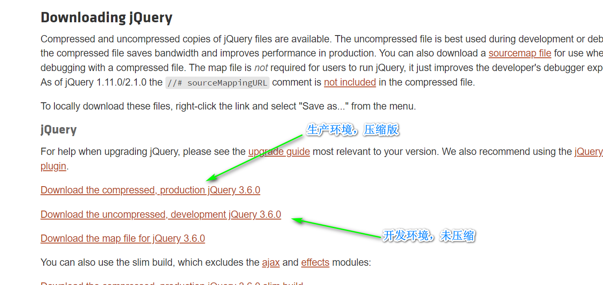

# jQuery

jQuery 是一个 JavaScript 库，它极大地简化了 JavaScript 编程，对原生JS中的DOM操作、事件处理、包括数据处理和Ajax技术等进行封装,提供更完善，更便捷的方法。jQuery的核心思想就是“写得更少，做得更多”。

**优点：**

- 轻量：核心文件只有几十kb，不会影响页面加载速度；
- 兼容多个浏览器；
- 链式编程、隐式迭代；
- 简化DOM操作；
- 支持插件开发，如tree、日期控件、轮播图等；
- 免费、开源。


## 1.初体验

要求：点击文字，逐行消失。

```javascript
<!DOCTYPE html>
<html>
<head>
<meta charset="utf-8"> 
<title></title> 
<script src="https://cdn.staticfile.org/jquery/1.10.2/jquery.min.js">
</script>
<script>
    $(document).ready(function(){
        $("p").click(function(){
            $(this).hide();
        });
    });
</script>
</head>
<body>
    <p>如果你点我，我就会消失。</p>
    <p>继续点我!</p>
    <p>接着点我!</p>
</body>
</html>
```


## 2.jQuery安装

我们可以通过多种方法在网页中添加jQuery，如：

- 从jquery.com下载jQuery库；
- 从CDN中载入jQuery，比如Google等加载。


当前版本为3.6.0，如需下载其他版本可在https://code.jquery.com进行下载。下载时会有两个版本的标准：一个是生产环境的，另一个是开发环境的，一般我们都是采用生产环境下的，因为其比较轻量，点击进入生产环境下的版本，全选中后粘贴到jquery.min.js文件中，在JS文件通过script标签引入这个文件即引入了jQuery函数库。



在HTML文件中使用<script></script>标签的src属性就可引入jquery：

```html
<head>
	<script src="jquery.min.js"></script>
</head>
```


**替代方案：**如不想下载并存放jquery，那么也可以使用CDN（内容发布网络）引用它。Staticfile CDN、百度、又拍云、新浪、谷歌和微软的服务器都存有 jQuery 。如果你的站点用户是国内的，建议使用百度、又拍云、新浪等国内CDN地址，如果你站点用户是国外的可以使用谷歌和微软。

Staticfile CDN：

```html
<head>
	<script src="https://cdn.staticfile.org/jquery/1.10.2/jquery.min.js"></script>
</head>
```

百度 CDN：

```html
<head>
	<script src="https://apps.bdimg.com/libs/jquery/2.1.4/jquery.min.js"></script>
</head>
```

又拍云 CDN：

```javascript
<head>
	<script src="https://upcdn.b0.upaiyun.com/libs/jquery/jquery-2.0.2.min.js"></script>
</head>
```

新浪 CDN：

```html
<head>
    <script src="https://lib.sinaapp.com/js/jquery/2.0.2/jquery-2.0.2.min.js"></script>
</head>
```

谷歌 CDN：

```html
<head>
	<script src="https://ajax.googleapis.com/ajax/libs/jquery/1.10.2/jquery.min.js>		     </script>
</head>
```

微软 CDN：

```html
<head>
	<script src="https://ajax.aspnetcdn.com/ajax/jquery/jquery-1.9.0.min.js"></script>
</head>
```

​	使用CDN加载jquery有一个很大的优势：许多用户在访问其他站点时，已经从百度、又拍云等网站加载过jquery，所以结果是，当他们访问你的网站时，会从缓存中加载jquery，这样可以减少加载时间，同时大多数CDN都可以确保当用户向其请求文件时，会从离用户最近的服务器上返回响应，这样也可以提高加载速度。


## 3.jQuery语法

通过 jQuery，您可以选取（查询，query） HTML 元素，并对它们执行"操作"（actions）。jQuery 语法是通过选取 HTML 元素，并对选取的元素执行某些操作。


### 3.1.基础语法

基础语法必须等着DOM元素加载完毕后才能加载jquery，基础语法结构为：

```javascript
$(selector).action()
/*
1.$定义jquery
2.选择符（selector）"查询"和"查找" HTML 元素
3.jQuery 的 action() 执行对元素的操作
*/
```

```javascript
$(this).hide() - 隐藏当前元素
$("p").hide() - 隐藏所有 <p> 元素
$("p.test").hide() - 隐藏所有 class="test" 的 <p> 元素
$("#test").hide() - 隐藏 id="test" 的元素
```

利用jquery隐藏div盒子：

```javascript
<!DOCTYPE html>
<html lang="en">
<head>
    <meta charset="UTF-8">
    <title>Document</title>
    <script src="jquery.min.js"></script>
    <style>
        div {
            width: 200px;
            height: 200px;
            background-color: red;
        }
    </style>
</head>
<body>
    <div></div>
    <script>
        $("div").hide();
    </script>
</body>
</html>
```


### 3.2.文档就绪事件

为了防止文档在完全加载（就绪）之前运行jquery代码，即在DOM加载完毕之后才可以对DOM进行操作，我们可以使用文档就绪事件函数，将jquery代码放在一个document.ready函数中：

```javascript
$(document).ready(function(){
 
   // 开始写 jQuery 代码...
 
});
```

```javascript
<!DOCTYPE html>
<html lang="en">
<head>
    <meta charset="UTF-8">
    <title>Document</title>
    <script src="jquery.min.js"></script>
    <style>
        div {
            width: 200px;
            height: 200px;
            background-color: red;
        }
    </style>
</head>
<body>
    <div></div>
    <script>
        $(document).ready(function() {
            $("div").hide();
        });
    </script>
</body>
</html>
```


**以上方式可以简写为：**

```javascript
$(function(){
 
   // 开始写 jQuery 代码...
 
});
```


### 3.3.jquery和原生JS入口函数的区别

jquery入口函数：

```javascript
$(document).ready(function(){
    // 执行代码
});
或者
$(function(){
    // 执行代码
});
```

原生JS入口函数：

```javascript
window.onload = function () {
    // 执行代码
}
```

-  jQuery 的入口函数是在 html 所有标签(DOM)都加载之后，就会去执行。
- JavaScript 的 window.onload 事件是等到所有内容，包括外部图片之类的文件加载完后，才会执行。

load和ready的区别：

|          | window.onload                                              | $(document).ready()                                 |
| -------- | ---------------------------------------------------------- | --------------------------------------------------- |
| 执行时机 | 必须等待网页全部加载完毕（包括图片等），然后再执行包裹代码 | 只需要等待网页中的DOM结构加载完毕，就能执行包裹代码 |
| 执行次数 | 只能执行一次，如果要执行第二次，那么第一次的执行就会被覆盖 | 可以执行多次，第N次不会被上一次覆盖                 |


### 3.4.顶级对象$

$是jQuery的别称，在代码中可以使用$代替jQuery，但一般为了方便，通常直接使用$。并且$是jQuery的顶级对象，相当于原生JS的window，把元素利用$包装成jQuery对象，就可以调用jQuery方法。

```javascript
jQuery(function() {
    $("div").hide();
});
```

另外，JS对象和jQuery对象是可以相互转换的，JS转jQuery对象是直接用$()。

```javascript
<!DOCTYPE html>
<html lang="en">
<head>
    <meta charset="UTF-8">
    <title>Document</title>
    <script src="jquery.min.js"></script>
</head>
<body>
    <video src="mov.mp4"></video>
    <script>
        // DOM对象转jQuery对象
    $("video");
    // 使用原生JS获取DOM对象，jQuery中没有play方法
    var vidio01 = document.getElementsByTagName("video");
    // $("vidio01").play(); // 没有play方法
	// 通过伪数组特点获取对象
    vidio01[0].play();
    // vidio01.get(0).play();
    </script>
</body>
</html>
```


## 4.jQuery选择器

jQuery 选择器允许你对 HTML 元素组或单个元素进行操作。jQuery 选择器基于元素的 id、类、类型、属性、属性值等"查找"（或选择）HTML 元素。 它基于已经存在的 CSS 选择器，除此之外，它还有一些自定义的选择器。

**jQuery 中所有选择器都以美元符号开头：$()。**


### 4.1.元素选择器

jQuery 元素选择器基于元素名选取元素。在页面中选取所有 <p> 元素:

```javascript
$("p");
```

案例：用户点击按钮后，所有p元素消失。

```javascript
<!DOCTYPE html>
<html>
<head>
<meta charset="utf-8"> 
<title></title> 
<script src="jquery.min.js">
</script>
<script>
    $(document).ready(function(){
    $("button").click(function(){
        $("p").hide();
    });
    });
</script>
</head>

<body>
    <h2>这是一个标题</h2>
    <p>这是一个段落。</p>
    <p>这是另一个段落。</p>
    <button>点我</button>
</body>
</html>
```


### 4.2.id选择器

jQuery #id 选择器通过 HTML 元素的 id 属性选取指定的元素。页面中元素的 id 应该是唯一的，所以您要在页面中选取唯一的元素需要通过 #id 选择器。通过 id 选取元素语法如下：

```javascript
$("#test")
```

案例：当用户点击按钮后，id为test的元素将被隐藏。

```javascript
<!DOCTYPE html>
<html>
<head>
<meta charset="utf-8"> 
<title></title> 
<script src="jquery.min.js">
</script>
<script>
    $(document).ready(function(){
    $("button").click(function(){
        $("#test").hide();
    });
    });
</script>
</head>

<body>
    <h2>这是一个标题</h2>
    <p>这是一个段落</p>
    <p id="test">这是另外一个段落</p>
    <button>点我</button>
</body>
```


### 4.3.class选择器

jQuery 类选择器可以通过指定的 class 查找元素。语法如下：

```javascript
$(".test")
```

案例：当用户点击按钮后，class="test"属性的元素隐藏。

```javascript
<!DOCTYPE html>
<html>
<head>
<meta charset="utf-8"> 
<title></title> 
<script src="jquery.min.js">
</script>
<script>
    $(document).ready(function(){
    $("button").click(function(){
        $(".test").hide();
    });
    });
</script>
</head>
<body>
    <h2 class="test">这是一个标题</h2>
    <p class="test">这是一个段落。</p>
    <p>这是另外一个段落。</p>
    <button>点我</button>
</body>
</html>
```


### 4.4.其他语法

| 语法                     | 描述                                                    |
| ------------------------ | ------------------------------------------------------- |
| $("*")                   | 选取所有元素                                            |
| $(this)                  | 选取当前 HTML 元素                                      |
| $("p.intro")             | 选取 class 为 intro 的 <p> 元素                         |
| $("p:first")             | 选取第一个 <p> 元素                                     |
| $("ul li:first")         | 选取第一个 <ul> 元素的第一个 <li> 元素                  |
| $("ul li:first-child")   | 选取每个 <ul> 元素的第一个 <li> 元素                    |
| $("[href]")              | 选取带有 href 属性的元素                                |
| $("a[target='_blank']")  | 选取所有 target 属性值等于 "_blank" 的 <a> 元素         |
| $("a[target!='_blank']") | 选取所有 target 属性值不等于 "_blank" 的 <a> 元素       |
| $(":button")             | 选取所有 type="button" 的 <input> 元素 和 <button> 元素 |
| $("tr:even")             | 选取偶数位置的 <tr> 元素                                |
| $("tr:odd")              | 选取奇数位置的 <tr> 元素                                |


```javascript
<!DOCTYPE html>
<html lang="en">
<head>
    <meta charset="UTF-8">
    <title>Document</title>
    <script src="jquery.min.js"></script>
</head>
<body>
    <div class="gf">
        <div class="father">
            <div class="son">儿子</div>
        </div>
    </div>
    <div class="nav">
        <p>p元素</p>
        <div>
            <p>这是第二个P元素</p>
        </div>
    </div>
    <script>
        $(function() {
            // 1.获取父元素parent()，返回最近一级的父元素
            console.log($(".son").parent());
            // 2.获取子元素
            $(".nav").children("p").css("color","red");
            // 3.获取所有子元素，包括儿子孙子-find()
            $(".nav").find("p").css("color","blue");


        });
    </script>
</body>
</html>
```


### 4.5.隐式迭代

jQuery可以实现隐式迭代，因为其DOM元素内部是以伪数组的形式存在的。

```javascript
<!DOCTYPE html>
<html lang="en">
<head>
    <meta charset="UTF-8">
    <title>Document</title>
    <script src="jquery.min.js"></script>
</head>
<body>
    <div>hello,jQuery</div>
    <div>hello,jQuery</div>
    <div>hello,jQuery</div>
    <div>hello,jQuery</div>
    <script>
        console.log($("div"));
        // 设置字体颜色为红色,通过隐式迭代获取全部div
        $("div").css("color","red");
    </script>
</body>
</html>
```


案例：新浪下拉菜单栏。


```javascript
<!DOCTYPE html>
<html lang="en">

<head>
    <meta charset="UTF-8">
    <meta name="viewport" content="width=device-width, initial-scale=1.0">
    <meta http-equiv="X-UA-Compatible" content="ie=edge">
    <title>Document</title>
    <style>
        * {
            margin: 0;
            padding: 0;
        }
        
        li {
            list-style-type: none;
        }
        
        a {
            text-decoration: none;
            font-size: 14px;
        }
        
        .nav {
            margin: 100px;
        }
        
        .nav>li {
            position: relative;
            float: left;
            width: 80px;
            height: 41px;
            text-align: center;
        }
        
        .nav li a {
            display: block;
            width: 100%;
            height: 100%;
            line-height: 41px;
            color: #333;
        }
        
        .nav>li>a:hover {
            background-color: #eee;
        }
        
        .nav ul {
            display: none;
            position: absolute;
            top: 41px;
            left: 0;
            width: 100%;
            border-left: 1px solid #FECC5B;
            border-right: 1px solid #FECC5B;
        }
        
        .nav ul li {
            border-bottom: 1px solid #FECC5B;
        }
        
        .nav ul li a:hover {
            background-color: #FFF5DA;
        }
    </style>
    <script src="jquery.min.js"></script>
</head>

<body>
    <ul class="nav">
        <li>
            <a href="#">微博</a>
            <ul>
                <li>
                    <a href="">私信</a>
                </li>
                <li>
                    <a href="">评论</a>
                </li>
                <li>
                    <a href="">@我</a>
                </li>
            </ul>
        </li>
        <li>
            <a href="#">微博</a>
            <ul>
                <li>
                    <a href="">私信</a>
                </li>
                <li>
                    <a href="">评论</a>
                </li>
                <li>
                    <a href="">@我</a>
                </li>
            </ul>
        </li>
        <li>
            <a href="#">微博</a>
            <ul>
                <li>
                    <a href="">私信</a>
                </li>
                <li>
                    <a href="">评论</a>
                </li>
                <li>
                    <a href="">@我</a>
                </li>
            </ul>
        </li>
        <li>
            <a href="#">微博</a>
            <ul>
                <li>
                    <a href="">私信</a>
                </li>
                <li>
                    <a href="">评论</a>
                </li>
                <li>
                    <a href="">@我</a>
                </li>
            </ul>
        </li>
    </ul>
    <script>
        $(function() {
            // 鼠标经过
            $(".nav>li").mouseover(function() {
                // $(this) jQuery 当前元素  this不要加引号
                // show() 显示元素  hide() 隐藏元素
                $(this).children("ul").show();
            });
            // 鼠标离开
            $(".nav>li").mouseout(function() {
                $(this).children("ul").hide();
            })
        })
    </script>
</body>

</html>
```


案例：jQuery具有排他性。

```javascript
<!DOCTYPE html>
<html lang="en">

<head>
    <meta charset="UTF-8">
    <meta name="viewport" content="width=device-width, initial-scale=1.0">
    <meta http-equiv="X-UA-Compatible" content="ie=edge">
    <title>Document</title>
    <script src="jquery.min.js"></script>
</head>

<body>
    <button>jQuery</button>
    <button>jQuery</button>
    <button>jQuery</button>
    <button>jQuery</button>
    <button>jQuery</button>
    <button>jQuery</button>
    <button>jQuery</button>
    <script>
        $(function() {
            // 1. 隐式迭代 给所有的按钮都绑定了点击事件
            $("button").click(function() {
                // 2. 当前的元素变化背景颜色
               // $(this).css("background", "pink");
                // 3. 其余的兄弟去掉背景颜色 隐式迭代
               // $(this).siblings("button").css("background", "");
               // 如上方式可以采用jQuery的链式编程来完成
               $(this).css("background", "pink").siblings("button").css("background", "");
            });
        })
    </script>
</body>

</html>
```


## 5.jQuery事件

jQuery是为事件处理做特别设计的。页面对不同访问者的响应叫做事件，事件处理程序是指当HTML中发生某些事件时所调用的方法。如：在元素上移动鼠标、选取单选按钮、点击元素等。

在事件中经常使用的术语：**触发（或激发**）。例如当按下按键时触发的"keypress"事件。

常见的DOM事件有：

| 鼠标事件          | 键盘事件 | 表单事件 | 文档/窗口事件 |
| ----------------- | -------- | -------- | ------------- |
| click             | keypress | submit   | load          |
| dblclick-双击事件 | keydown  | change   | resize        |
| mouseenter        | keyup    | focus    | scroll        |
| mouseleave        |          | blur     | unload        |
| hover             |          |          |               |

在jquery中，大多数DOM事件都有一个等效的jquery方法。页面中指定一个点击事件的语法为：

```javascript
$("p").click();
```

定义了点击后触发事件，你可以通过一个事件函数实现：

```javascript
$("p").click(function(){
    // 动作触发后执行的代码!!
});
```


### 5.1.常用的事件方法


#### 5.1.1.文档就绪事件

$(document).ready() 方法允许我们在文档完全加载完后执行函数。


#### 5.1.2.click()

click() 方法是当按钮点击事件被触发时会调用一个函数。该函数在用户点击 HTML 元素时执行。

```javascript
<!DOCTYPE html>
<html>
<head>
<meta charset="utf-8"> 
<title></title> 
<script src="jquery.min.js">
</script>
<script>
    $(document).ready(function(){
    $("p").click(function(){
        $(this).hide();
    });
    });
</script>
</head>
<body>

    <p>如果你点我，我就会消失。</p>
    <p>点我消失!</p>
    <p>点我也消失!</p>

</body>
</html>
```


#### 5.1.3.dblclick()

当双击元素时，会发生 dblclick 事件。dblclick() 方法触发 dblclick 事件，或规定当发生 dblclick 事件时运行的函数。

```javascript
<!DOCTYPE html>
<html>
<head>
<meta charset="utf-8"> 
<title></title> 
<script src="jquery.min.js">
</script>
<script>
    $(document).ready(function(){
        $("p").dblclick(function(){
            $(this).hide();
        });
    });
</script>
</head>
<body>

    <p>双击鼠标左键的，我就消失。</p>
    <p>双击我消失！</p>
    <p>双击我也消失！</p>

</body>
</html>
```


#### 5.1.4.mouseenter()

当鼠标指针穿过元素时，会发生 mouseenter 事件。mouseenter() 方法触发 mouseenter 事件，或规定当发生 mouseenter 事件时运行的函数。

```javascript
<!DOCTYPE html>
<html>
<head>
<meta charset="utf-8"> 
<title></title> 
<script src="jquery.min.js">
</script>
<script>
    $(document).ready(function(){
        $("#p1").mouseenter(function(){
            alert('您的鼠标移到了 id="p1" 的元素上!');
        });
    });
</script>
</head>
<body>

    <p id="p1">鼠标指针进入此处，会看到弹窗。</p>

</body>
</html>
```


#### 5.1.5.mouseleave()

当鼠标指针离开元素时，会发生 mouseleave 事件。mouseleave() 方法触发 mouseleave 事件，或规定当发生 mouseleave 事件时运行的函数。

```javascript
<!DOCTYPE html>
<html>
<head>
<meta charset="utf-8"> 
<title></title> 
<script src="jquery.min.js">
</script>
<script>
    $(document).ready(function(){
        $("#p1").mouseleave(function(){
            alert("再见，您的鼠标离开了该段落。");
        });
    });
</script>
</head>
<body>

    <p id="p1">这是一个段落。</p>

</body>
</html>
```


#### 5.1.6.mousedown()

当鼠标指针移动到元素上方，并按下鼠标按键时，会发生 mousedown 事件。mousedown() 方法触发 mousedown 事件，或规定当发生 mousedown 事件时运行的函数。

```javascript
<!DOCTYPE html>
<html>
<head>
<meta charset="utf-8"> 
<title></title> 
<script src="jquery.min.js">
</script>
<script>
    $(document).ready(function(){
        $("#p1").mousedown(function(){
            alert("鼠标在该段落上按下！");
        });
    });
</script>
</head>
<body>

    <p id="p1">这是一个段落</p>

</body>
</html>
```


#### 5.1.7.mouseup()

当在元素上松开鼠标按钮时，会发生 mouseup 事件。mouseup() 方法触发 mouseup 事件，或规定当发生 mouseup 事件时运行的函数。

```javascript
<!DOCTYPE html>
<html>
<head>
<meta charset="utf-8"> 
<title></title> 
<script src="jquery.min.js">
</script>
<script>
    $(document).ready(function(){
        $("#p1").mouseup(function(){
            alert("鼠标在段落上松开。");
        });
    });
</script>
</head>
<body>

    <p id="p1">这是一个段落。</p>

</body>
</html>
```


#### 5.1.8.hover()

hover()方法用于模拟光标悬停事件。当鼠标移动到元素上时，会触发指定的第一个函数(mouseenter);当鼠标移出这个元素时，会触发指定的第二个函数(mouseleave)。

```javascript
<!DOCTYPE html>
<html>
<head>
<meta charset="utf-8">
<script src="jquery.min.js">
</script>
<script>
$(document).ready(function(){
    $("#p1").hover(
		function(){
			alert("你进入了 p1!");
		},
		function(){
			alert("拜拜! 现在你离开了 p1!");
		}
    )
});
</script>
</head>
<body>

    <p id="p1">这是一个段落。</p>

</body>
</html>
```


#### 5.1.9.focus()

当元素获得焦点时，发生 focus 事件。当通过鼠标点击选中元素或通过 tab 键定位到元素时，该元素就会获得焦点。focus() 方法触发 focus 事件，或规定当发生 focus 事件时运行的函数。

```javascript
<!DOCTYPE html>
<html>
<head>
<meta charset="utf-8"> 
<title></title> 
<script src="jquery.min.js">
</script>
<script>
    $(document).ready(function(){
        $("input").focus(function(){
            $(this).css("background-color","#cccccc");
        });
        $("input").blur(function(){
            $(this).css("background-color","#ffffff");
        });
    });
</script>
</head>
<body>

    Name: <input type="text" name="fullname"><br>
    Email: <input type="text" name="email">

</body>
</html>
```


#### 5.1.10.blur()

当元素失去焦点时，发生 blur 事件。blur() 方法触发 blur 事件，或规定当发生 blur 事件时运行的函数。

```javascript
<!DOCTYPE html>
<html>
<head>
<meta charset="utf-8"> 
<title></title> 
<script src="jquery.min.js">
</script>
<script>
    $(document).ready(function(){
        $("input").focus(function(){
            $(this).css("background-color","#cccccc");
        });
        $("input").blur(function(){
            $(this).css("background-color","#ffffff");
        });
    });
</script>
</head>
<body>

    Name: <input type="text" name="fullname"><br>
    Email: <input type="text" name="email">

</body>
</html>
```


## 6.jQuery效果


### 6.1.隐藏和显示

通过jquery的hide()和show()方法就可以实现HTML元素的隐藏和显示。其语法格式为：

```javascript
$(selector).hide(speed,easing,callback);
$(selector).show(speed,easing,callback);
/*
可选的 speed 参数规定隐藏/显示的速度，可以取以下值："slow"、"fast"、"normal" 或毫秒。
可选easing参数用来指定切换效果，默认是"swing"-快慢结合，可选"linear"-匀速
可选的 callback 参数是隐藏或显示完成后所执行的函数名称。
*/
```

```javascript
<!DOCTYPE html>
<html>
<head>
<meta charset="utf-8">
<script src="jquery.min.js">
</script>
<script>
    $(document).ready(function(){
        $("#hide").click(function(){
            $("p").hide();
        });
        $("#show").click(function(){
            $("p").show();
        });
    });
</script>
</head>
<body>
    <p>如果你点击“隐藏” 按钮，我将会消失。</p>
    <button id="hide">隐藏</button>
    <button id="show">显示</button>
</body>
</html>
```


**案例1：**speed参数表示显示或隐藏的事件毫秒值。

```javascript
<html>
<head>
<meta charset="utf-8">
<script src="jquery.min.js"></script>
    <script>
        $(document).ready(function(){
          $("button").click(function(){
            $("p").hide(1000);
          });
        });
    </script>
</head>
<body>
    <button>隐藏</button>
    <p>这是个段落，内容比较少。</p>
    <p>这是另外一个小段落</p>
</body>
</html>
```


**案例2：**easing参数表示隐藏和显示的过渡方式。

```javascript
<!DOCTYPE html>
<html>
<head>
<meta charset="utf-8">
<script src="jquery.min.js">
</script>
    <style>
        div{
        width: 130px;
        height: 50px;
        padding: 15px;
        margin: 15px;
        background-color: green;
        }
	</style>

    <script>
        $(document).ready(function(){
          $(".hidebtn").click(function(){
            $("div").hide(1000,"linear",function(){
              alert("Hide() 方法已完成!");
            });
          });
        });
    </script>
</head>
<body>
	
    <div>隐藏及设置回调函数</div>
    <button class="hidebtn">隐藏</button>
	
</body>
</html>
```


**toggle()方法：**在实际的开发过程中，我们想要HTML元素在隐藏和显示中可以随意切换，toggle()方法就可以显示被隐藏的元素，并隐藏已显示的元素。语法格式为：

```javascript
$(selector).toggle(speed,callback);
/*
可选的 speed 参数规定隐藏/显示的速度，可以取以下值："slow"、"fast" 或毫秒。
可选的 callback 参数是隐藏或显示完成后所执行的函数名称。
*/
```

```javascript
<!DOCTYPE html>
<html>
<head>
<meta charset="utf-8">
<script src="jquery.min.js">
</script>
<script>
    $(document).ready(function(){
        $("button").click(function(){
            $("p").toggle();
        });
    });
</script>
</head>
<body>

    <button>隐藏/显示</button>
    <p>这是一个文本段落。</p>
    <p>这是另外一个文本段落。</p>
</body>
</html>
```


### 6.2.淡入淡出

jQuery封装了4个方法：fadeIn([s],[e],[fn])淡入，fadeOut([s],[e],[fn])淡出，fadeToggle([s],[e],[fn])切换，fadeTo([s],o,[e],[fn])修改淡出淡入的透明度。

- **fadeIn():**用于淡入已隐藏的效果，其语法结构为：

```javascript
$(selector).fadeIn(speed,easing,callback);
// 参数作用和隐藏显示一样
```

- **fadeOut():**用于淡出已显示的效果，其语法结构为：

```javascript
$(selector).fadeOut(speed,easing,callback);
// 参数作用和隐藏显示一样
```

- **fadeToggle():**用于在淡入和淡出之间切换，其语法结构为：

```javascript
$(selector).fadeToggle(speed,easing,callback);
// 参数作用和隐藏显示一样
```

- **fadeTo():**允许渐变为给定的透明度，值介于0和1之间，其语法结构为：

```javascript
$(selector).fadeTo(speed,opacity,callback);
// 必需的 opacity 参数将淡入淡出效果设置为给定的不透明度（值介于 0 与 1 之间）
```

```javascript
<!DOCTYPE html>
<html lang="en">

<head>
    <meta charset="UTF-8">
    <meta name="viewport" content="width=device-width, initial-scale=1.0">
    <meta http-equiv="X-UA-Compatible" content="ie=edge">
    <title>Document</title>
    <style>
        div {
            width: 150px;
            height: 300px;
            background-color: pink;
            display: none;
        }
    </style>
    <script src="jquery.min.js"></script>
</head>

<body>
    <button>淡入效果</button>
    <button>淡出效果</button>
    <button>淡入淡出切换</button>
    <button>修改透明度</button>
    <div></div>
    <script>
        $(function() {
            $("button").eq(0).click(function() {
                // 淡入 fadeIn()
                $("div").fadeIn(1000);
            })
            $("button").eq(1).click(function() {
                // 淡出 fadeOut()
                $("div").fadeOut(1000);

            })
            $("button").eq(2).click(function() {
                // 淡入淡出切换 fadeToggle()
                $("div").fadeToggle(1000);

            });
            $("button").eq(3).click(function() {
                //  修改透明度 fadeTo() 这个速度和透明度要必须写
                $("div").fadeTo(1000, 0.5);

            });


        });
    </script>
</body>

</html>
```

**案例：**高亮突出显示。

```javascript
<!DOCTYPE html>
<html>

<head lang="en">
    <meta charset="UTF-8">
    <title></title>
    <style type="text/css">
        * {
            margin: 0;
            padding: 0;
        }
        
        ul {
            list-style: none;
        }
        
        body {
            background: #000;
        }
        
        .wrap {
            margin: 100px auto 0;
            width: 630px;
            height: 394px;
            padding: 10px 0 0 10px;
            background: #000;
            overflow: hidden;
            border: 1px solid #fff;
        }
        
        .wrap li {
            float: left;
            margin: 0 10px 10px 0;
        }
        
        .wrap img {
            display: block;
            border: 0;
        }
    </style>
    <script src="jquery.min.js"></script>
    <script>
        $(function() {
            //鼠标进入的时候,其他的li标签透明度：0.5
            $(".wrap li").hover(function() {
                $(this).siblings().stop().fadeTo(400, 0.5);
            }, function() {
                // 鼠标离开，其他li 透明度改为 1
                $(this).siblings().stop().fadeTo(400, 1);
            })

        });
    </script>
</head>

<body>
    <div class="wrap">
        <ul>
            <li>
                <a href="#"></a>
            </li>
            <li>
                <a href="#"></a>
            </li>
            <li>
                <a href="#"></a>
            </li>
            <li>
                <a href="#"></a>
            </li>
            <li>
                <a href="#"></a>
            </li>
            <li>
                <a href="#"></a>
            </li>
        </ul>
    </div>
</body>

</html>
```


### 6.3.滑动

jQuery封装的隐藏和显示太过直接，影响了页面的美观效果。所以我们可以使用滑动来使得HTML元素隐藏和显示更加美观，jQuery封装了几个方法：slideDown()-下滑，slideUp()-上滑，slideToggle()-切换滑动。其语法结构为：

```javascript
$(selector).slideDown(speed,callback);
$(selector).slideUp(speed,callback);
$(selector).slideToggle(speed,callback);
/*
可选的 speed 参数规定效果的时长。它可以取以下值："slow"、"fast" 或毫秒。
可选的 callback 参数是滑动完成后所执行的函数名称。
*/
```


```javascript
<!DOCTYPE html>
<html lang="en">

<head>
    <meta charset="UTF-8">
    <meta name="viewport" content="width=device-width, initial-scale=1.0">
    <meta http-equiv="X-UA-Compatible" content="ie=edge">
    <title>Document</title>
    <style>
        div {
            width: 150px;
            height: 300px;
            background-color: pink;
            display: none;
        }
    </style>
    <script src="jquery.min.js"></script>
</head>

<body>
    <button>下拉滑动</button>
    <button>上拉滑动</button>
    <button>切换滑动</button>
    <div></div>
    <script>
        $(function() {
            $("button").eq(0).click(function() {
                // 下滑动 slideDown()
                $("div").slideDown();
            })
            $("button").eq(1).click(function() {
                // 上滑动 slideUp()
                $("div").slideUp(500);


            })
            $("button").eq(2).click(function() {
                // 滑动切换 slideToggle()

                $("div").slideToggle(500);

            });

        });
    </script>
</body>

</html>
```


### 6.4.动画

jQuery的animate() 方法用于创建自定义动画。其语法结构为：

```javascript
$(selector).animate({params},speed,easing,callback);
/*
必需的 params 参数定义形成动画的 CSS 属性。
可选的 speed 参数规定效果的时长。它可以取以下值："slow"、"fast" 或毫秒。
可选easing参数用来指定切换效果，默认是"swing"-快慢结合，可选"linear"-匀速
可选的 callback 参数是动画完成后所执行的函数名称。
*/
```

```javascript
<!DOCTYPE html>
<html>
<head>
<meta charset="utf-8">
<script src="jquery.min.js">
</script>
    <script> 
        $(document).ready(function(){
            $("button").click(function(){
                $("div").animate({
                // 往左移动250，透明度0.5，高宽150
                left:'250px',
                opacity:'0.5',
                height:'150px',
                width:'150px'
                });
            });
        });
    </script> 
</head>
 
<body>
<button>开始动画</button>
<p>默认情况下，所有的 HTML 元素有一个静态的位置，且是不可移动的。 
如果需要改变，我们需要将元素的 position 属性设置为 relative, fixed, 或 absolute!</p>
<div style="background:#98bf21;height:100px;width:100px;position:absolute;">
</div>

</body>
</html>
```

**animate()也可以定义相对值（该值相对于元素的当前值）。需要在值的前面加上 += 或 -=：**-相对于原来位置变化，一直点击一直有效：

```javascript
$("button").click(function(){
  $("div").animate({
    left:'250px',
    height:'+=150px',
    width:'+=150px'
  });
});
```


你甚至可以把属性的动画值设置为 "show"、"hide" 或 "toggle"，这些值都属于animate的预定义值：

```javascript
<script> 
$(document).ready(function(){
  $("button").click(function(){
    $("div").animate({
      // height:'toggle'
      // height:'show' // 默认展示值
     // height:'hide'
    });
  });
});
</script> 
```


**默认的，jQuery针对动画提供了排队功能，这意味着你可以编写多个animate()调用，jQuery会创建他们内部队列，然后逐一运行这些animate()调用：**

```javascript
<!DOCTYPE html>
<html>
<head>
<meta charset="utf-8">
<script src="jquery.min.js">
</script>
<script> 
    $(document).ready(function(){
        $("button").click(function(){
            var div=$("div");
            div.animate({height:'300px',opacity:'0.4'},"slow");
            div.animate({width:'300px',opacity:'0.8'},"slow");
            div.animate({height:'100px',opacity:'0.4'},"slow");
            div.animate({width:'100px',opacity:'0.8'},"slow");
        });
    });
</script> 
</head>
 
<body>
<button>开始动画</button>
<p>默认情况下，所有的 HTML 元素有一个静态的位置，且是不可移动的。 
如果需要改变为，我们需要将元素的 position 属性设置为 relative, fixed, 或 absolute!</p>
<div style="background:#98bf21;height:100px;width:100px;position:absolute;">
</div>

</body>
</html>
```


**案例：将div元素右移100px，然后增加文字的字号：**

```javascript
<!DOCTYPE html>
<html>
<head>
<meta charset="utf-8">
<script src="jquery.min.js">
</script>
<script> 
$(document).ready(function(){
  $("button").click(function(){
    var div=$("div");  
    div.animate({left:'100px'},"slow");
    div.animate({fontSize:'3em'},"slow");
  });
});
</script> 
</head>
 
<body>
<button>开始动画</button>
<p>默认情况下，所有的 HTML 元素有一个静态的位置，且是不可移动的。 
如果需要改变为，我们需要将元素的 position 属性设置为 relative, fixed, 或 absolute!</p>
<div style="background:#98bf21;height:100px;width:200px;position:absolute;">HELLO</div>

</body>
</html>
```


### 6.5.停止动画

jQuery的 stop() 方法用于停止动画或效果，在它们完成之前。stop() 方法适用于所有 jQuery 效果函数，包括滑动、淡入淡出和自定义动画。其语法格式为：

```javascript
$(selector).stop(stopAll,goToEnd);
/*
可选的 stopAll 参数规定是否应该清除动画队列。默认是 false，即仅停止活动的动画，允许任何排入队列的动画向后执行。
可选的 goToEnd 参数规定是否立即完成当前动画。默认是 false。
因此，默认地，stop() 会清除在被选元素上指定的当前动画。
*/
```

案例：


```javasscript
<!DOCTYPE html>
<html lang="en">
<head>
    <meta charset="UTF-8">
    <title>Document</title>
    <script src="jquery.min.js"></script>
    <style>
        #panel,#flip{
                    padding:5px;
                    text-align:center;
                    background-color:#e5eecc;
                    border:solid 1px #c3c3c3;
                }
        #panel{
            padding:50px;
            display:none;
        }
    </style>
    <script>
        $(document).ready(function(){
            $("#flip").click(function(){
                $("#panel").slideDown(5000);
                $("#panel").slideUp(5000);
            });
            $("#stop").click(function(){
                $("#panel").stop();
            });
    });
    </script>
</head>
<body>
    
    <button id="stop">停止滑动</button>
    <div id="flip">点我向下滑动面板</div>
    <div id="panel">Hello world!</div>
</body>
</html>
```


**综合案例：**王者荣耀手风琴。

```javascript
<!doctype html>
<html>

<head>
    <meta charset="utf-8">
    <title>手风琴案例</title>

    <style type="text/css">
        * {
            margin: 0;
            padding: 0;
        }
        
        img {
            display: block;
        }
        
        ul {
            list-style: none;
        }
        
        .king {
            width: 852px;
            margin: 100px auto;
            background: url(images/bg.png) no-repeat;
            overflow: hidden;
            padding: 10px;
        }
        
        .king ul {
            overflow: hidden;
        }
        
        .king li {
            position: relative;
            float: left;
            width: 69px;
            height: 69px;
            margin-right: 10px;
        }
        
        .king li.current {
            width: 224px;
        }
        
        .king li.current .big {
            display: block;
        }
        
        .king li.current .small {
            display: none;
        }
        
        .big {
            width: 224px;
            display: none;
        }
        
        .small {
            position: absolute;
            top: 0;
            left: 0;
            width: 69px;
            height: 69px;
            border-radius: 5px;
        }
    </style>
	<script src="jquery.min.js"></script>
</head>

<body>
    
        $(function() {
            // 鼠标经过某个小li 有两步操作：
            $(".king li").mouseenter(function() {
                // 1.当前小li 宽度变为 224px， 同时里面的小图片淡出，大图片淡入
                $(this).stop().animate({
                    width: 224
                }).find(".small").stop().fadeOut().siblings(".big").stop().fadeIn();
                // 2.其余兄弟小li宽度变为69px， 小图片淡入， 大图片淡出
                $(this).siblings("li").stop().animate({
                    width: 69
                }).find(".small").stop().fadeIn().siblings(".big").stop().fadeOut();
            })

        });
    </script>
    <div class="king">
        <ul>
            <li class="current">
                <a href="#">
                    
                    
                </a>
            </li>
            <li>
                <a href="#">
                    
                    
                </a>
            </li>
            <li>
                <a href="#">
                    
                    
                </a>
            </li>
            <li>
                <a href="#">
                    
                    
                </a>
            </li>
            <li>
                <a href="#">
                    
                    
                </a>
            </li>
            <li>
                <a href="#">
                    
                    
                </a>
            </li>
            <li>
                <a href="#">
                    
                    
                </a>
            </li>
        </ul>

    </div>

</body>

</html>
```


### 6.6.回调函数callback()

Callback 函数在当前动画 100% 完成之后执行。使用和不使用回调函数的动画效果是完全不一样的。

- 使用回调函数：

```javascript
<!DOCTYPE html>
<html>
<head>
<meta charset="utf-8">
<script src="jquery.min.js">
</script>
<script>
    // 使用回调函数
    $(document).ready(function(){
        $("button").click(function(){
            $("p").hide("slow",function(){
            alert("段落现在被隐藏了");
            });
        });
    });
</script>
</head>
<body>
    <button>隐藏</button>
    <p>我们段落内容，点击“隐藏”按钮我就会消失</p>
</body>
</html>
```

- 不使用回调函数：

```javascript
$("button").click(function(){
  $("p").hide(1000);
  alert("段落现在被隐藏了");
});
```


## 7.jQuery操作HTML

jQuery 拥有可操作 HTML 元素和属性的强大方法。

### 7.1.捕获和设置

三个简单实用的用于 DOM 操作的 jQuery 方法：

- **text():**设置或返回所选元素的文本内容
- **html():**设置或返回所选元素的内容（包括 HTML 标签）
- **val():**设置或返回表单字段的值
- **attr():**获取属性

**案例1：**获取页面中的”粗体“两个字：

```javascript
<!DOCTYPE html>
<html>
<head>
<meta charset="utf-8">
<script src="jquery.min.js">
</script>
<script>
    $(document).ready(function(){
        // 显示文本-纯文本
        $("#btn1").click(function(){
            alert("Text: " + $("#test").text());
        });
        // 显示文本+标签
        $("#btn2").click(function(){
            alert("HTML: " + $("#test").html());
        });
    });
</script>
</head>

<body>
    <p id="test">这是段落中的 <b>粗体</b> 文本。</p>
    <button id="btn1">显示文本</button>
    <button id="btn2">显示 HTML</button>
</body>
</html>
```


**案例2：**显示输入框的值：

```javascript
<body>
    <script>
        $(document).ready(function(){
          $("button").click(function(){
            alert("值为: " + $("#test").val());
          });
        });
        </script>
    <p>名称: <input type="text" id="test" value="请输入名称"></p>
    <button>显示值</button>
</body>
```


**案例3：**显示HTML标签的属性：

```javascript
<body>
    <script>
        // 通过attr()显示属性
        $(document).ready(function(){
          $("button").click(function(){
            alert($("#baidu").attr("href"));
          });
      	});
    </script>
    <p><a href="https://www.baidu.com" id="baidu">百度</a></p>
    <button>显示 href 属性的值</button>
</body>
```


**案例4：**点击按钮，将原有段落文本替换：

```javascript
<!DOCTYPE html>
<html>
<head>
<meta charset="utf-8">
<script src="jquery.min.js">
</script>
<script>
    $(document).ready(function(){
      $("#btn1").click(function(){
        $("#test1").text("Hello world!");
      });
      $("#btn2").click(function(){
        $("#test2").html("<b>Hello world!</b>");
      });
      $("#btn3").click(function(){
        $("#test3").val("Baidu");
      });
    });
</script>
</head>

<body>
    <p id="test1">这是一个段落。</p>
    <p id="test2">这是另外一个段落。</p>
    <p>输入框: <input type="text" id="test3" value="百度"></p>
    <button id="btn1">设置文本</button>
    <button id="btn2">设置 HTML</button>
    <button id="btn3">设置值</button>
</body>
</html>
```


**案例5：**修改属性-将原有的百度链接修改为京东：

```javascript
<!DOCTYPE html>
<html>
<head>
<meta charset="utf-8">
<script src="jquery.min.js">
</script>
<script>
    $(document).ready(function(){
      $("button").click(function(){
        $("#baidu").attr({
          "href" : "https://www.jd.com",
          "title" : "京东两下"
        });
        // 通过修改的 title 值来修改链接名称
        title =  $("#baidu").attr('title');
        $("#baidu").html(title);
      });
    });
</script>
</head>

<body>
    <p><a href="https://www.baidu.com" id="baidu">百度一下</a></p>
    <button>修改 href 和 title</button>
    <p>点击按钮修改后，可以查看 href 和 title 是否变化。</p>
</body>
</html>
```


### 7.2.创建、添加、删除元素

- 创建元素：

```javascript
$("<li></li>");
```

- 添加元素：

```javascript
append() - 在被选元素的结尾插入内容
prepend() - 在被选元素的开头插入内容
after() - 在被选元素之后插入内容
before() - 在被选元素之前插入内容
```

- 删除元素：

```javascript
remove() - 删除被选元素（及其子元素）
empty() - 从被选元素中删除子元素
```


```javascript
<!DOCTYPE html>
<html lang="en">

<head>
    <meta charset="UTF-8">
    <title>Document</title>
    <script src="jquery.min.js"></script>
</head>

<body>
    <ul>
        <li>原先的li</li>
    </ul>
    <div class="test">我是原先的div</div>
    <script>
        $(function() {
            // 1. 创建元素
            var li = $("<li>我是后来创建的li</li>");
            // 2. 添加元素

            // (1) 内部添加
            // $("ul").append(li);  内部添加并且放到内容的最后面 
            $("ul").prepend(li); // 内部添加并且放到内容的最前面

            // (2) 外部添加
            var div = $("<div>我是后妈生的</div>");
            // $(".test").after(div);
            $(".test").before(div);
            // 3. 删除元素
            // $("ul").remove(); 可以删除匹配的元素 自杀
            // $("ul").empty(); // 可以删除匹配的元素里面的子节点 孩子
            $("ul").html(""); // 可以删除匹配的元素里面的子节点 孩子

        })
    </script>
</body>

</html>
```


### 7.3.css类和方法

jQuery拥有若干进行操作css的方法，如：

- addClass()：向被选元素添加一个或多个类；
- removeClass()：从被选元素删除一个或多个类；
- toggleClass()：对被选元素进行添加/删除类的切换操作;
- css()：设置或返回样式属性。

```javascript
<!DOCTYPE html>
<html lang="en">
<head>
    <meta charset="UTF-8">
    <title>Document</title>
    <script src="jquery.min.js"></script>
    <style>
        div {
            width: 200px;
            height: 200px;
            background-color: red;
        }
    </style>
</head>
<body>
    <div></div>
    <script>
        // 操作css样式
        $(function() {
            console.log($("div").css("width")); // 200px
            // 将宽设置为300px，必须有引号，或数字不加单位
            // $("div").css("width",300)
            // $("div").css("width","300px")
            /*可更改多个样式,多个样式用{}包裹,
            属性和属性值之间为k-v结构
            多个属性之间用逗号间隔
            纯数字不用加引号，复合属性必须用驼峰命名法
            */
            $("div").css({
                width:400,
                height:400,
                backgroundColor: "yellow"
            })
        })
    </script>
</body>
</html>
```

如上方式书写css样式太过冗余，在实际开发中我们尽量用增删类名的方式进行更改：

```javascript
<!DOCTYPE html>
<html lang="en">

<head>
    <meta charset="UTF-8">
    <meta name="viewport" content="width=device-width, initial-scale=1.0">
    <meta http-equiv="X-UA-Compatible" content="ie=edge">
    <title>Document</title>
    <style>
        div {
            width: 150px;
            height: 150px;
            background-color: pink;
            margin: 100px auto;
            /* 过渡效果-配合旋转 */
            transition: all 0.5s;
        }
        
        .current {
            background-color: red;
            /* 旋转 */
            transform: rotate(360deg);
        }
    </style>
    <script src="jquery.min.js"></script>
</head>

<body>
    <div class="current"></div>
    <script>
        $(function() {
            // 1. 添加类 addClass()
            // $("div").click(function() {
            //     // $(this).addClass("current");
            // });
            // 2. 删除类 removeClass()
            // $("div").click(function() {
            //     $(this).removeClass("current");
            // });
            // 3. 切换类 toggleClass()
            $("div").click(function() {
                $(this).toggleClass("current");
            });
        })
    </script>
</body>

</html>
```


### 7.4.尺寸和位置的操作

jQuery拥有众多操作尺寸和位置的方法

| 语法                               | 用法                                                         |
| ---------------------------------- | ------------------------------------------------------------ |
| width()/height()                   | 取得匹配元素高度和宽度的值，只算width和height                |
| innerWidth()/innerHeight()         | 取得匹配元素的高度和宽度的值，包含padding                    |
| outerWidth()/outerHeight()         | 取得元素高度和宽度值，包含padding,border                     |
| outerWidth(true)/outerHeight(true) | 取得元素高度和宽度值，包含padding,border,margin              |
| offset()                           | 获取设置距离文档的位置偏移量，该方法有两个属性left,top是距离上，左的距离 |
| position()                         | 获取距离带有定位父级位置的偏移量，如果没有定位父级则以文档为准，只能获取不能设置 |
| scrollTop()/scrollLeft()           | 获取或设置被卷去的头部/左部                                  |


```javascript
<!DOCTYPE html>
<html lang="en">

<head>
    <meta charset="UTF-8">
    <meta name="viewport" content="width=device-width, initial-scale=1.0">
    <meta http-equiv="X-UA-Compatible" content="ie=edge">
    <title>Document</title>
    <style>
        div {
            width: 200px;
            height: 200px;
            background-color: pink;
            padding: 10px;
            border: 15px solid red;
            margin: 20px;
        }
    </style>
    <script src="jquery.min.js"></script>
</head>

<body>
    <div></div>
    <script>
        $(function() {
            // 1. width() / height() 获取设置元素 width和height大小 
            console.log($("div").width());
            // $("div").width(300);

            // 2. innerWidth() / innerHeight()  获取设置元素 width和height + padding 大小 
            console.log($("div").innerWidth());

            // 3. outerWidth()  / outerHeight()  获取设置元素 width和height + padding + border 大小 
            console.log($("div").outerWidth());

            // 4. outerWidth(true) / outerHeight(true) 获取设置 width和height + padding + border + margin
            console.log($("div").outerWidth(true));


        })
    </script>
</body>

</html>
```


```javascript
<!DOCTYPE html>
<html lang="en">

<head>
    <meta charset="UTF-8">
    <meta name="viewport" content="width=device-width, initial-scale=1.0">
    <meta http-equiv="X-UA-Compatible" content="ie=edge">
    <title>Document</title>
    <style>
        * {
            margin: 0;
            padding: 0;
        }
        
        .father {
            width: 400px;
            height: 400px;
            background-color: pink;
            margin: 100px;
            overflow: hidden;
            position: relative;
        }
        
        .son {
            width: 150px;
            height: 150px;
            background-color: purple;
            position: absolute;
            left: 10px;
            top: 10px;
        }
    </style>
    <script src="jquery.min.js"></script>
</head>

<body>
    <div class="father">
        <div class="son"></div>
    </div>
    <script>
        $(function() {
            // 1. 获取设置距离文档的位置（偏移） offset
            console.log($(".son").offset());
            console.log($(".son").offset().top);
            // $(".son").offset({
            //     top: 200,
            //     left: 200
            // });
            // 2. 获取距离带有定位父级位置（偏移） position   如果没有带有定位的父级，则以文档为准
            // 这个方法只能获取不能设置偏移
            console.log($(".son").position());
            // $(".son").position({
            //     top: 200,
            //     left: 200
            // });
        })
    </script>
</body>

</html>
```


```javascript
<!DOCTYPE html>
<html lang="en">

<head>
    <meta charset="UTF-8">
    <title>Document</title>
    <style>
        body {
            height: 2000px;
        }
        
        .back {
            position: fixed;
            width: 50px;
            height: 50px;
            background-color: pink;
            right: 30px;
            bottom: 100px;
            display: none;
        }
        
        .container {
            width: 900px;
            height: 500px;
            background-color: skyblue;
            margin: 400px auto;
        }
    </style>
    <script src="jquery.min.js"></script>
</head>

<body>
    <div class="back">返回顶部</div>
    <div class="container">
    </div>
    <script>
        $(function() {
            $(document).scrollTop(100);
            // 被卷去的头部 scrollTop()  / 被卷去的左侧 scrollLeft()
            // 页面滚动事件
            var boxTop = $(".container").offset().top;
            $(window).scroll(function() {
                // console.log(11);
                console.log($(document).scrollTop());
                if ($(document).scrollTop() >= boxTop) {
                    $(".back").fadeIn();
                } else {
                    $(".back").fadeOut();
                }
            });
            // 返回顶部
            $(".back").click(function() {
                // $(document).scrollTop(0);
                $("body, html").stop().animate({
                    scrollTop: 0
                });
                // $(document).stop().animate({
                //     scrollTop: 0
                // }); 不能是文档而是 html和body元素做动画
            })
        })
    </script>
</body>

</html>
```


## 8.jQuery遍历

jQuery 遍历，意为"移动"，用于根据其相对于其他元素的关系来"查找"（或选取）HTML 元素。以某项选择开始，并沿着这个选择移动，直到抵达您期望的元素为止。

下图展示了一个家族树。通过 jQuery 遍历，您能够从被选（当前的）元素开始，轻松地在家族树中向上移动（祖先），向下移动（子孙），水平移动（同胞）。这种移动被称为对 DOM 进行遍历。


图示解析：

- <div> 元素是 <ul> 的父元素，同时是其中所有内容的祖先。
- <ul> 元素是 <li> 元素的父元素，同时是 <div> 的子元素
- 左边的 <li> 元素是 <span> 的父元素，<ul> 的子元素，同时是 <div> 的后代。
- <span> 元素是 <li> 的子元素，同时是 <ul> 和 <div> 的后代。
- 两个 <li> 元素是同胞（拥有相同的父元素）。
- 右边的 <li> 元素是 <b> 的父元素，<ul> 的子元素，同时是 <div> 的后代。
- <b> 元素是右边的 <li> 的子元素，同时是 <ul> 和 <div> 的后代。

| 向上遍历树                                           | 向下遍历树                      | 中水平遍历树                                                 | 过滤                                                         |
| ---------------------------------------------------- | ------------------------------- | ------------------------------------------------------------ | ------------------------------------------------------------ |
| parent()-父元素                                      | children()-返回所有子元素       | siblings()-返回选中元素所有同胞元素                          | first()-返回被选元素的首个元素                               |
| parents()-所有祖先元素                               | find()-返回被选中元素直至下一代 | next()-返回下一个同胞元素                                    | last()-返回被选元素的最后一个元素                            |
| parentsUtil()-返回介于两个给定元素之间的所有祖先元素 |                                 | nextAll()-返回所有跟随的同胞元素                             | eq(index)-返回带指定索引号的元素                             |
|                                                      |                                 | nextUtil()-返回两个给定参数之间的所有跟随元素                | filter()-规定标准，不匹配元素会从这个集合中删除，匹配的元素会被返回 |
|                                                      |                                 | prev(),prevAll(),prevUtil()-沿DOM树之前的元素遍历，而不是沿之后元素遍历，与上述方法相反 | not()-返回不匹配标准的所有元素，与filter()相反               |

示例：

```javascript
<!DOCTYPE html>
<html>
<head>
<meta charset="utf-8">
<style>
    .siblings *{ 
        display: block;
        border: 2px solid lightgrey;
        color: lightgrey;
        padding: 5px;
        margin: 15px;
    }
</style>
<script src="jquery.min.js">
</script>
<script>
    $(document).ready(function(){
        $("h2").parent().css({"color":"red","border":"2px solid red"});
        $("h2").nextAll().css({"color":"red","border":"2px solid red"});
        $("body").children().css({"color":"yellow","border":"2px solid red"});
    });
</script>
</head>
<body class="siblings">

    <div>div (父元素)
    <p>p</p>
    <span>span</span>
    <h2>h2</h2>
    <h3>h3</h3>
    <p>p</p>
    </div>

</body>
</html>
```


**jQuery封装了一个遍历的方法each()，其语法结构为：**

```javascript
$("div").each(function(index,domElement){
    代码块;
})
/*
index表示每个元素的索引号，domElement是每个DOM元素对象，不是jquery对象
所以要使用each()遍历，需要将DOM对象转换为jquery对象$(domElement)
*/

// 以下方式可以遍历任何对象
$.each(function(index,domElement){
    代码块;
})
```

```javascript
<!DOCTYPE html>
<html lang="en">

<head>
    <meta charset="UTF-8">
    <meta name="viewport" content="width=device-width, initial-scale=1.0">
    <meta http-equiv="X-UA-Compatible" content="ie=edge">
    <title>Document</title>
    <style>

    </style>
    <script src="jquery.min.js"></script>
</head>

<body>
    <div>1</div>
    <div>2</div>
    <div>3</div>
    <script>
        // 要求将三个div内容变为红绿蓝
        $(function() {
            // 隐式迭代的方式只能让全部变红
            // $("div").css("color", "red");
            // 如果针对于同一类元素做不同操作，需要用到遍历元素（类似for，但是比for强大）
            var sum = 0;
            // 1. each() 方法遍历元素 
            var arr = ["red", "green", "blue"];
            $("div").each(function(i, domEle) {
                // 回调函数第一个参数一定是索引号  可以自己指定索引号号名称
                // console.log(index);
                // console.log(i);
                // 回调函数第二个参数一定是 dom元素对象 也是自己命名
                // console.log(domEle);
                // domEle.css("color"); // dom对象没有css方法
                $(domEle).css("color", arr[i]);
                sum += parseInt($(domEle).text());
            })
            console.log(sum);
            // 2. $.each() 方法遍历元素 主要用于遍历数据，处理数据
            // $.each($("div"), function(i, ele) {
            //     console.log(i);
            //     console.log(ele);

            // });
            // $.each(arr, function(i, ele) {
            //     console.log(i);
            //     console.log(ele);


            // })
            $.each({
                name: "Micheal",
                age: 18
            }, function(i, ele) {
                console.log(i); // 输出的是 name age 属性名
                console.log(ele); // 输出的是 Micheal  18 属性值


            })
        })
    </script>
</body>

</html>
```


## 9.noConflict()方法

jQuery 使用 $ 符号作为 jQuery 的简写。**如果其他 JavaScript 框架也使用 $ 符号作为简写怎么办？**

其他一些 JavaScript 框架包括：MooTools、Backbone、Sammy、Cappuccino、Knockout、JavaScript MVC、Google Web Toolkit、Google Closure、Ember、Batman 以及 Ext JS。

其中某些框架也使用 $ 符号作为简写（就像 jQuery），如果您在用的两种不同的框架正在使用相同的简写符号，有可能导致脚本停止运行。

jQuery 的团队考虑到了这个问题，并实现了 noConflict() 方法。

noConflict() 方法会释放对 $ 标识符的控制，这样其他脚本就可以使用它了。当然，您仍然可以通过全名替代简写的方式来使用 jQuery：

```javascript
<!DOCTYPE html>
<html>
<head>
<meta charset="utf-8">
<script src="jquery.min.js">
</script>
    <script>
        $.noConflict();
        jQuery(document).ready(function(){
        jQuery("button").click(function(){
            jQuery("p").text("jQuery 仍然在工作!");
        });
        });
    </script>
</head>

<body>
    <p>这是一个段落。</p>
    <button>点我</button>
</body>
</html>
```

你也可以创建自己的简写。noConflict() 可返回对 jQuery 的引用，您可以把它存入变量，以供稍后使用：

```javascript
var jq = $.noConflict();
jq(document).ready(function(){
  jq("button").click(function(){
    jq("p").text("jQuery 仍然在工作!");
  });
});
```


## 10.Bootstrap框架

前端常用的框架有：bootstrap,vue,angular,react等，他们既能开发PC端，也能开发移动端，而移动端常用的插件有：swiper,superslide,iscroll等。因插件小而专一，依靠它来解决某个功能没有问题，但如果有成套的问题出现，就得依靠框架了。

Bootstrap框架是一个简洁、直观、强悍的前端开发框架，让web开发更迅速、简单。中文官网为：https://v3.bootcss.com/，点击进入下载使用Bootstrap。


Bootstrap框架也是依赖jQuery开发的，因此里面的js插件使用也必须引入jQuery文件。在组件中找到任意你需要的组件复制粘贴到你的HTML文件中即可，但加入组件前需要一个盒子进行包裹，如以下代码，我们就是在组件中复制的导航条代码：

```javascript
<!DOCTYPE html>
<html lang="en">
<head>
    <meta charset="UTF-8">
    <title>Document</title>
    <!-- 引入bootstrap的css,jquery,bootstrap组件 -->
    <link rel="stylesheet" href="bootstrap/css/bootstrap.min.css">
    <script src="bootstrap/js/jquery.min.js"></script>
    <script src="bootstrap/js/bootstrap.min.js"></script>
</head>
<body>
    <div id="container">
        <nav class="navbar navbar-default">
            <div class="container-fluid">
              <!-- Brand and toggle get grouped for better mobile display -->
              <div class="navbar-header">
                <button type="button" class="navbar-toggle collapsed" data-toggle="collapse" data-target="#bs-example-navbar-collapse-1" aria-expanded="false">
                  <span class="sr-only">Toggle navigation</span>
                  <span class="icon-bar"></span>
                  <span class="icon-bar"></span>
                  <span class="icon-bar"></span>
                </button>
                <a class="navbar-brand" href="#">Brand</a>
              </div>
          
              <!-- Collect the nav links, forms, and other content for toggling -->
              <div class="collapse navbar-collapse" id="bs-example-navbar-collapse-1">
                <ul class="nav navbar-nav">
                  <li class="active"><a href="#">Link <span class="sr-only">(current)</span></a></li>
                  <li><a href="#">Link</a></li>
                  <li class="dropdown">
                    <a href="#" class="dropdown-toggle" data-toggle="dropdown" role="button" aria-haspopup="true" aria-expanded="false">Dropdown <span class="caret"></span></a>
                    <ul class="dropdown-menu">
                      <li><a href="#">Action</a></li>
                      <li><a href="#">Another action</a></li>
                      <li><a href="#">Something else here</a></li>
                      <li role="separator" class="divider"></li>
                      <li><a href="#">Separated link</a></li>
                      <li role="separator" class="divider"></li>
                      <li><a href="#">One more separated link</a></li>
                    </ul>
                  </li>
                </ul>
                <form class="navbar-form navbar-left">
                  <div class="form-group">
                    <input type="text" class="form-control" placeholder="Search">
                  </div>
                  <button type="submit" class="btn btn-default">Submit</button>
                </form>
                <ul class="nav navbar-nav navbar-right">
                  <li><a href="#">Link</a></li>
                  <li class="dropdown">
                    <a href="#" class="dropdown-toggle" data-toggle="dropdown" role="button" aria-haspopup="true" aria-expanded="false">Dropdown <span class="caret"></span></a>
                    <ul class="dropdown-menu">
                      <li><a href="#">Action</a></li>
                      <li><a href="#">Another action</a></li>
                      <li><a href="#">Something else here</a></li>
                      <li role="separator" class="divider"></li>
                      <li><a href="#">Separated link</a></li>
                    </ul>
                  </li>
                </ul>
              </div><!-- /.navbar-collapse -->
            </div><!-- /.container-fluid -->
          </nav>
    </div>
</body>
</html>
```


Bootstrap的js组件也是可以直接复制过来使用的，使用方式和组件一样，如下代码，我们复制了模态框进行演示：

```javascript
 <!-- Large modal -->
        <button type="button" class="btn btn-primary" data-toggle="modal" data-target=".bs-example-modal-lg">Large modal</button>

        <div class="modal fade" tabindex="-1" role="dialog" aria-labelledby="myLargeModalLabel">
            <div class="modal-dialog modal-lg" role="document">
                <div class="modal-content">
                    大的模态框
                </div>
            </div>
        </div>
```


## 11.Echarts


### 11.1.数据可视化

数据可视化可以把数据从冰冷的数字转换成图形，揭示蕴含在数据中的规律和道理。数据可视化的树妖目的是：借助于图形化手段，清晰有效的传达和沟通信息。而Echarts就可以提供直观、交互丰富、可高度个性化的数据可视化图表。其官网为https://echarts.apache.org/zh/index.html或https://echartsjs.com/。Echarts最初由百度开发，现由阿帕奇软件基金会托管，所以是开源免费的。

Echarts可以流畅的运行在PC和移动端，兼容大部分浏览器，底层依赖矢量图形库ZRender。


### 11.2.Echarts快速入门

Echarts使用的五个步骤：

1. **下载并引入echarts.min.js文件；**
2. **准备一个具备大小的DOM容器来装图标；**
3. **初始化echarts实例；**
4. **指定配置项和数据（option）；**
5. **将配置项设置给echarts实例对象。**

需求：做如下柱状图标：


```javascript
<!DOCTYPE html>
<html lang="en">
<head>
    <meta charset="UTF-8">
    <title>Document</title>
    <!-- 1.引入echarts.min.js文件 -->
    <script src="echarts.min.js"></script>
</head>
<body>
    <!-- 2.必须是一个有大小的盒子 -->
    <div id="main" style="width: 600px;height:400px;"></div>
    <script>
        // 3.实例化echarts对象
        var myChart = echarts.init(document.querySelector("#main"));
        // 4.指定配置项和数据 
         // 指定图表的配置项和数据
      var option = {
        title: {
          text: 'ECharts 入门示例'
        },
        tooltip: {},
        legend: {
          data: ['销量']
        },
        xAxis: {
          data: ['衬衫', '羊毛衫', '雪纺衫', '裤子', '高跟鞋', '袜子']
        },
        yAxis: {},
        series: [
          {
            name: '销量',
            type: 'bar',
            data: [5, 20, 36, 10, 10, 20]
          }
        ]
      };
      // 5.使用刚指定的配置项和数据显示图表。
      myChart.setOption(option);
    </script>
</body>
</html>
```


除了上述示例外，官网https://echarts.apache.org/examples/zh/index.html#chart-type-pie示例中还有很多可以定义的图形，如折线图、柱状图、饼图、散点图等。如果我们要做如下圆角环形图，我们直接点击进去，按Echarts的5个步骤来操作就行了：


```javascript
<!DOCTYPE html>
<html lang="en">
<head>
    <meta charset="UTF-8">
    <title>Document</title>
    <!-- 1.引入echarts.min.js -->
    <script src="echarts.min.js"></script>
</head>
<body>
    <!-- 2.定义一个盒子 -->
    <div id="container" style="width: 600px;height:600px;"></div>
    <script>
        // 3.实例化echarts对象
        var myEcharts = echarts.init(document.querySelector("#container"));
        // 4.指定配置项和数据
       var option = {
  tooltip: {
    trigger: 'item'
  },
  legend: {
    top: '5%',
    left: 'center'
  },
  series: [
    {
      name: 'Access From',
      type: 'pie',
      radius: ['40%', '70%'],
      avoidLabelOverlap: false,
      itemStyle: {
        borderRadius: 10,
        borderColor: '#fff',
        borderWidth: 2
      },
      label: {
        show: false,
        position: 'center'
      },
      emphasis: {
        label: {
          show: true,
          fontSize: '40',
          fontWeight: 'bold'
        }
      },
      labelLine: {
        show: false
      },
      data: [
        { value: 1048, name: 'Search Engine' },
        { value: 735, name: 'Direct' },
        { value: 580, name: 'Email' },
        { value: 484, name: 'Union Ads' },
        { value: 300, name: 'Video Ads' }
      ]
    }
  ]
};
    // 5.将数据交给echarts对象
    myEcharts.setOption(option);
    </script>
</body>
</html>
```


### 11.3.Echarts配置

在实际的开发中，我们的需求要比在官网中的示例多得多，并且复杂得多。所以我们必须学会自己来配置Echarts图表。配置的核心就是对option变量进行操作。option表示使用json数据格式的配置来绘制图标，步骤如下：

- **标题：**为图标配置标题

```json
title: {
    text: '第一个 ECharts 实例'
}
```

- **提示信息：**鼠标经过时的配置提示信息

```json
tooltip: {},
```

- **图例组件：**展现不同类型的标记(symbool)，颜色和名字。可以通过点击图例控制哪些系列不显示。

```json
legend: {
    data: [{
        name: '系列1',
        // 强制设置图形为圆。
        icon: 'circle',
        // 设置文本为红色
        textStyle: {
            color: 'red'
        }
    }]
}
```

- **grid:**直角坐标系内绘图网格，单个grid内最多可以放置上下两个X轴，左右两个Y轴，并可以在网格上绘制折线图、柱状图、散点图等。

```json
grid:{
    left:'x%',  // 距离左边的距离
    right:'x%', // 距离右边的距离
    bottom:'x%', // 距离下边的距离
    top:'x%', // 距离上边的距离
	containLabel:true // 要不要显示左侧和下侧刻度，防止标签设置0%后溢出
}
```


- **X轴：**配置要在X轴显示的项

```json
xAxis: {
    data: ["衬衫","羊毛衫","雪纺衫","裤子","高跟鞋","袜子"]
}
```

- **Y轴：**配置要在Y轴显示的项

```json
yAxis: {}
```

- **toolbox:**工具栏，内置有导出图片，数据视图，动态类型切换，数据区域缩放，重置五个工具。

```json
toolbox:{
   feature:{
       saveAsImage:{} // 将图标保存为图片
       
   }
}
```


- **系列列表：**每个系列通过type决定自己的图标类型

```json
series: [{
    name: '销量',  // 系列名称
    type: 'bar',  // 系列图表类型
    data: [5, 20, 36, 10, 10, 20]  // 系列中的数据内容
}]
```

type类型决定图标类型，常用的类型有：

- **type: 'bar'**：柱状/条形图
- **type: 'line'**：折线/面积图
- **type: 'pie'**：饼图
- **type: 'scatter'**：散点（气泡）图
- **type: 'effectScatter'**：带有涟漪特效动画的散点（气泡）
- **type: 'radar'**：雷达图
- **type: 'tree'**：树型图
- **type: 'treemap'**：树型图
- **type: 'sunburst'**：旭日图
- **type: 'boxplot'**：箱形图
- **type: 'candlestick'**：K线图
- **type: 'heatmap'**：热力图
- **type: 'map'**：地图
- **type: 'parallel'**：平行坐标系的系列
- **type: 'lines'**：线图
- **type: 'graph'**：关系图
- **type: 'sankey'**：桑基图
- **type: 'funnel'**：漏斗图
- **type: 'gauge'**：仪表盘
- **type: 'pictorialBar'**：象形柱图
- **type: 'themeRiver'**：主题河流
- **type: 'custom'**：自定义系列


- **color:**调色盘颜色列表。如果系列没有设置颜色，则会依次循环从该列表中取颜色作为系列颜色。 默认为：

```json
color:['#5470c6', '#91cc75', '#fac858', '#ee6666', '#73c0de', '#3ba272', '#fc8452', '#9a60b4', '#ea7ccc']
```


**以上配置为常用配置，其余配置需要借助文档进行操作。文档在https://echarts.apache.org/文档--配置项手册中。**

!()

案例：请制作如下图标：


```javascript
<!DOCTYPE html>
<html lang="en">
<head>
    <meta charset="UTF-8">
    <title>Document</title>
    <!-- 1.引入echarts.min.js文件 -->
    <script src="echarts.min.js"></script>
</head>
<body>
    <!-- 2.创建一个有大小的盒子 -->
    <div class="myCharts" style="width: 300px;height: 300px;"></div>
    <script>
        // 3.实例化echarts对象
        var myEcharts = echarts.init(document.querySelector(".myCharts"));
        // 4.指定图标的配置项和数据
        var option = {
            title:{
                text:"2021级同学身高比例"
            },
            tooltip:{
            },
            legend:{
                data:["身高"]
            },
            xAxis:{
                data:["张萍","张浩","张榕珊","张陈鑫","张昌伟","张红坪","张江淋"]
            },
            yAxis:{},
            series:[{
                name:"身高",
                type:'bar',
                data:[175,165,160,190,185,200,226]
            }]
        };
        myEcharts.setOption(option);
    </script>
</body>
</html>
```

